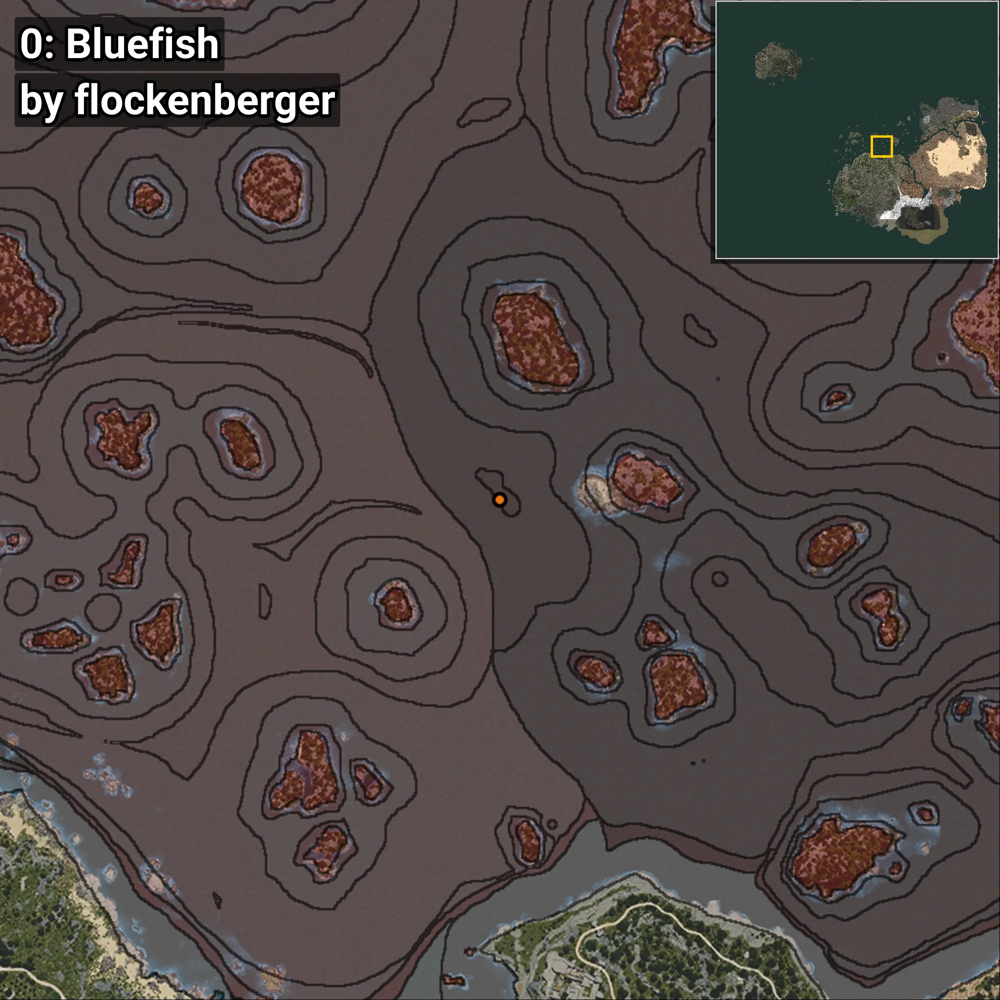
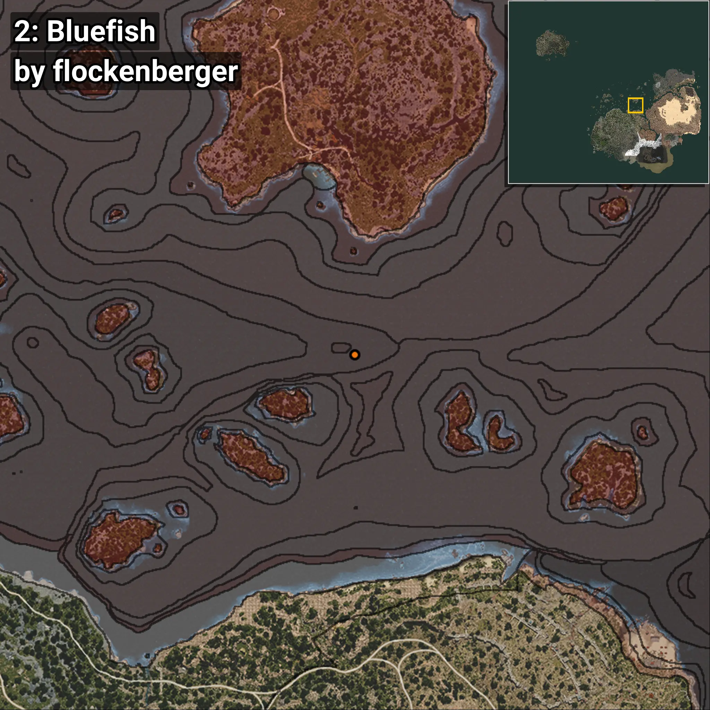
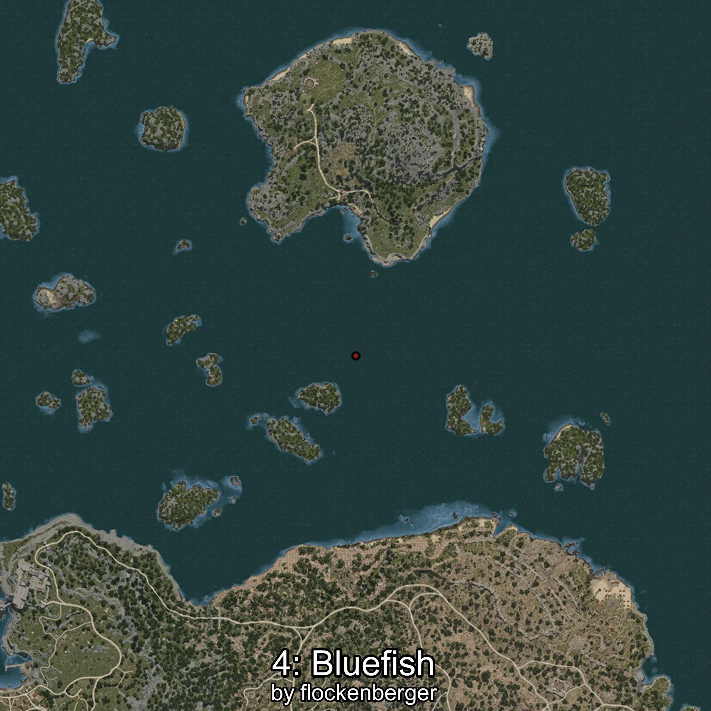

# Bluefish
```xml
<!--
    Waypoints for: Bluefish
    Created by: flockenberger
-->
<WorldmapBookMark>
    <BookMark BookMarkName="0: Bluefish" PosX="36.74298" PosY="-7790.6064" PosZ="251600.75" />
    <BookMark BookMarkName="1: Bluefish" PosX="764.5027" PosY="-7559.614" PosZ="251034.55" />
    <BookMark BookMarkName="2: Bluefish" PosX="166281.28" PosY="-7626.554" PosZ="227912.16" />
    <BookMark BookMarkName="3: Bluefish" PosX="952.0896" PosY="-7542.6943" PosZ="251242.88" />
    <BookMark BookMarkName="4: Bluefish" PosX="-47276.0" PosY="-8208.0" PosZ="202207.0" />
</WorldmapBookMark>
```

## ⚠️ Disclaimer
Waypoints are generated based on the __**character’s position**__ — __not__ where the fishing float landed.
Fish are determined by where your **float** lands!
In ocean spots especially, the direction you cast your rod can place your float in a **different fishing zone**, which may result in catching the wrong type of fish.
Please pay attention to the preview images showing where each location is in relation to the outlined zones.

- You can verify your float’s position using the guide [**HERE**](https://flockenberger.github.io/bdo-fish-position/)
- Or watch the video guide [**HERE**](https://youtu.be/t-VXcRoNojk)

## Previews
      