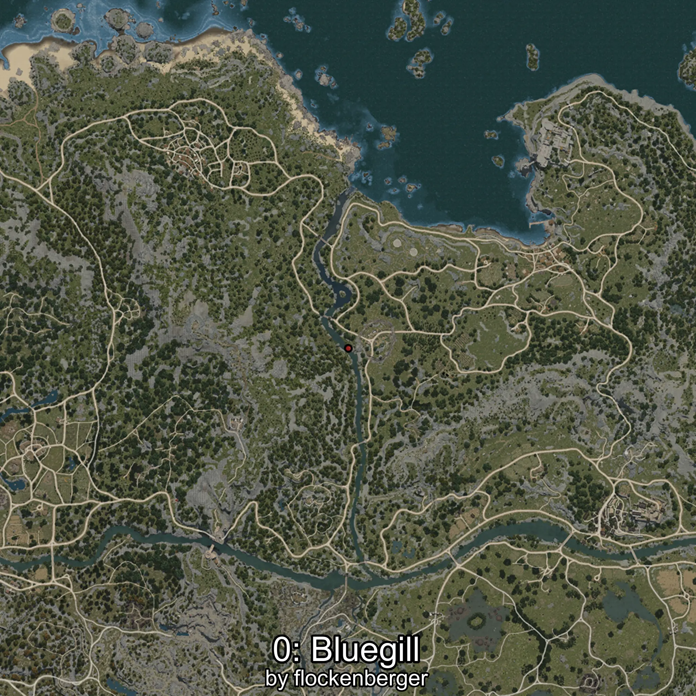
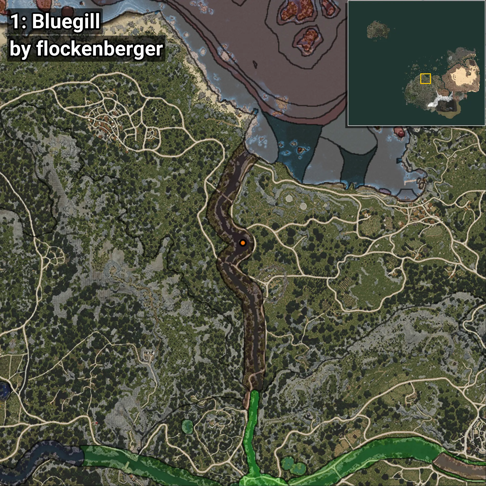
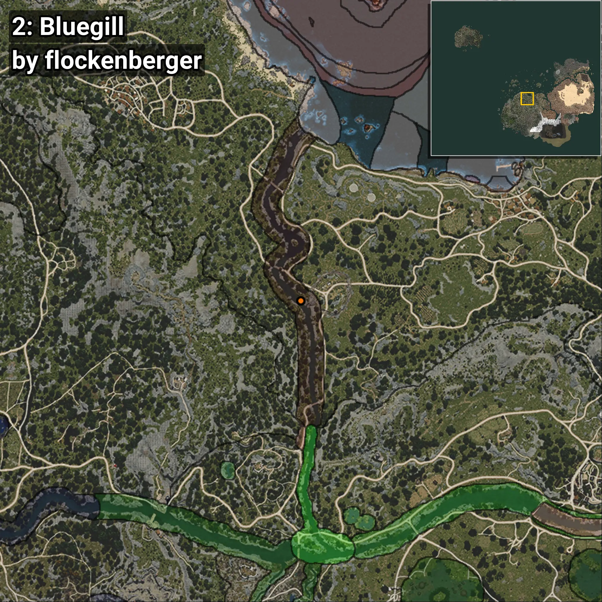
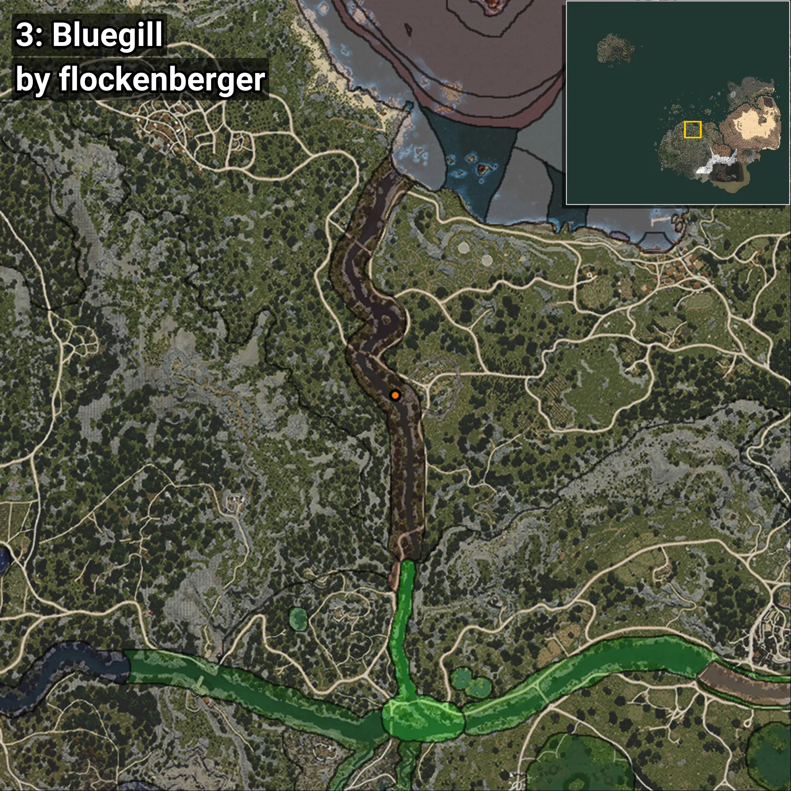

# Bluegill
```xml
<!--
    Waypoints for: Bluegill
    Created by: flockenberger
-->
<WorldmapBookMark>
    <BookMark BookMarkName="0: Bluegill" PosX="-75701.0" PosY="-4425.0" PosZ="62356.0" />
    <BookMark BookMarkName="1: Bluegill" PosX="-75669.82" PosY="-4451.5645" PosZ="62338.043" />
    <BookMark BookMarkName="2: Bluegill" PosX="-73814.0" PosY="-4372.0" PosZ="38548.0" />
    <BookMark BookMarkName="3: Bluegill" PosX="-73767.17" PosY="-4383.038" PosZ="38578.72" />
    <BookMark BookMarkName="4: Bluegill" PosX="-81385.0" PosY="-5166.0" PosZ="94460.0" />
</WorldmapBookMark>
```

## ⚠️ Disclaimer
Waypoints are generated based on the __**character’s position**__ — __not__ where the fishing float landed.
Fish are determined by where your **float** lands!
In ocean spots especially, the direction you cast your rod can place your float in a **different fishing zone**, which may result in catching the wrong type of fish.
Please pay attention to the preview images showing where each location is in relation to the outlined zones.

- You can verify your float’s position using the guide [**HERE**](https://flockenberger.github.io/bdo-fish-position/)
- Or watch the video guide [**HERE**](https://youtu.be/t-VXcRoNojk)

## Previews
      