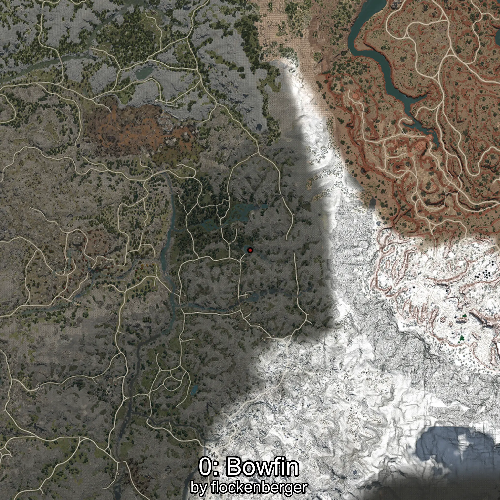
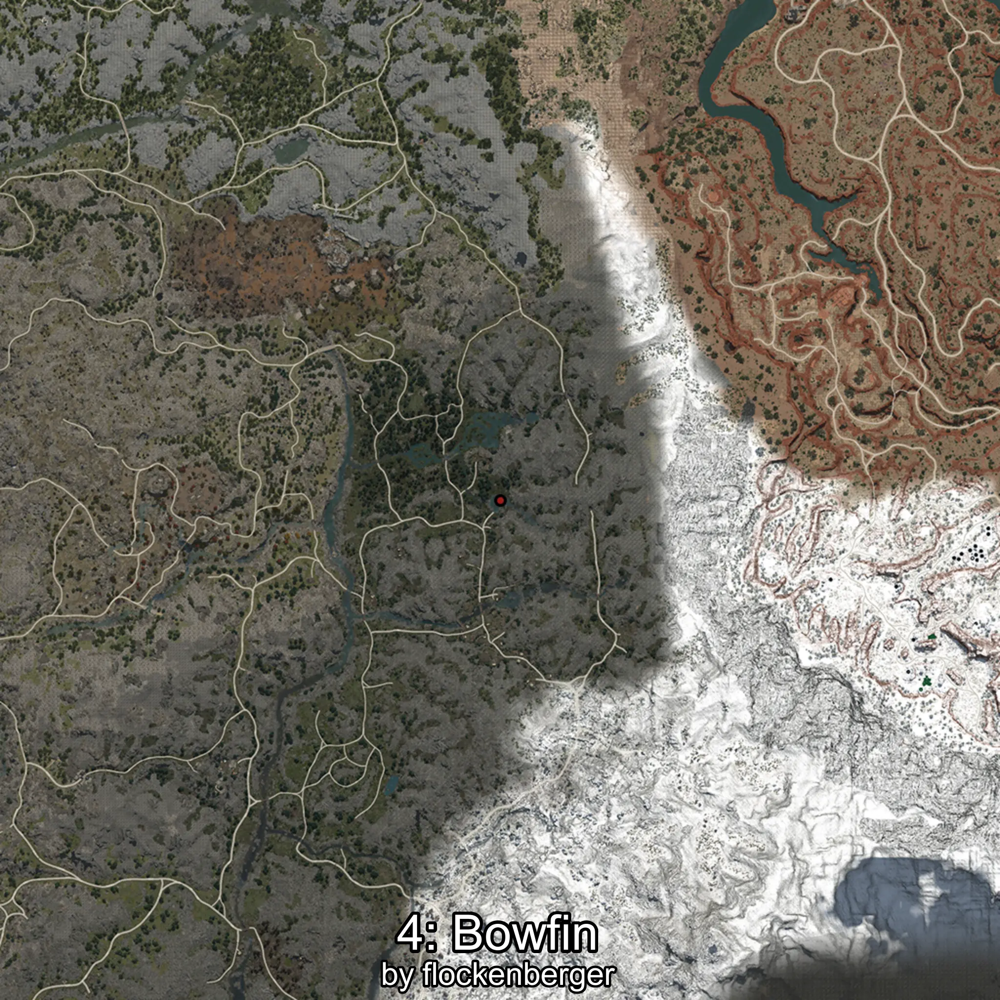
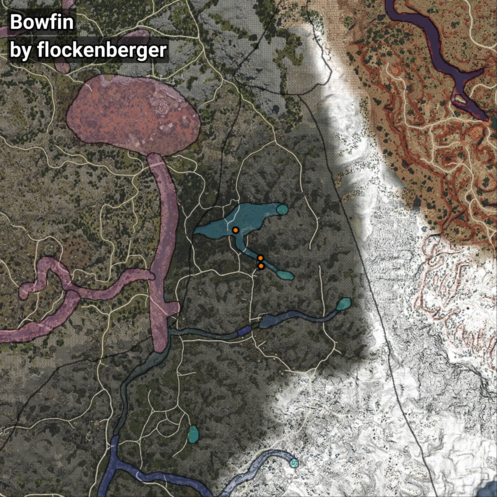

# Bowfin
```xml
<!--
    Waypoints for: Bowfin
    Created by: flockenberger
-->
<WorldmapBookMark>
    <BookMark BookMarkName="0: Bowfin" PosX="172313.42" PosY="13756.83" PosZ="-354854.2" />
    <BookMark BookMarkName="1: Bowfin" PosX="172446.0" PosY="13832.0" PosZ="-354885.0" />
    <BookMark BookMarkName="2: Bowfin" PosX="159829.44" PosY="11602.422" PosZ="-337161.66" />
    <BookMark BookMarkName="3: Bowfin" PosX="172554.27" PosY="13855.577" PosZ="-354898.16" />
    <BookMark BookMarkName="4: Bowfin" PosX="172027.98" PosY="13801.676" PosZ="-351011.0" />
</WorldmapBookMark>
```

## ⚠️ Disclaimer
Waypoints are generated based on the __**character’s position**__ — __not__ where the fishing float landed.
Fish are determined by where your **float** lands!
In ocean spots especially, the direction you cast your rod can place your float in a **different fishing zone**, which may result in catching the wrong type of fish.
Please pay attention to the preview images showing where each location is in relation to the outlined zones.

- You can verify your float’s position using the guide [**HERE**](https://flockenberger.github.io/bdo-fish-position/)
- Or watch the video guide [**HERE**](https://youtu.be/t-VXcRoNojk)

## Previews
      