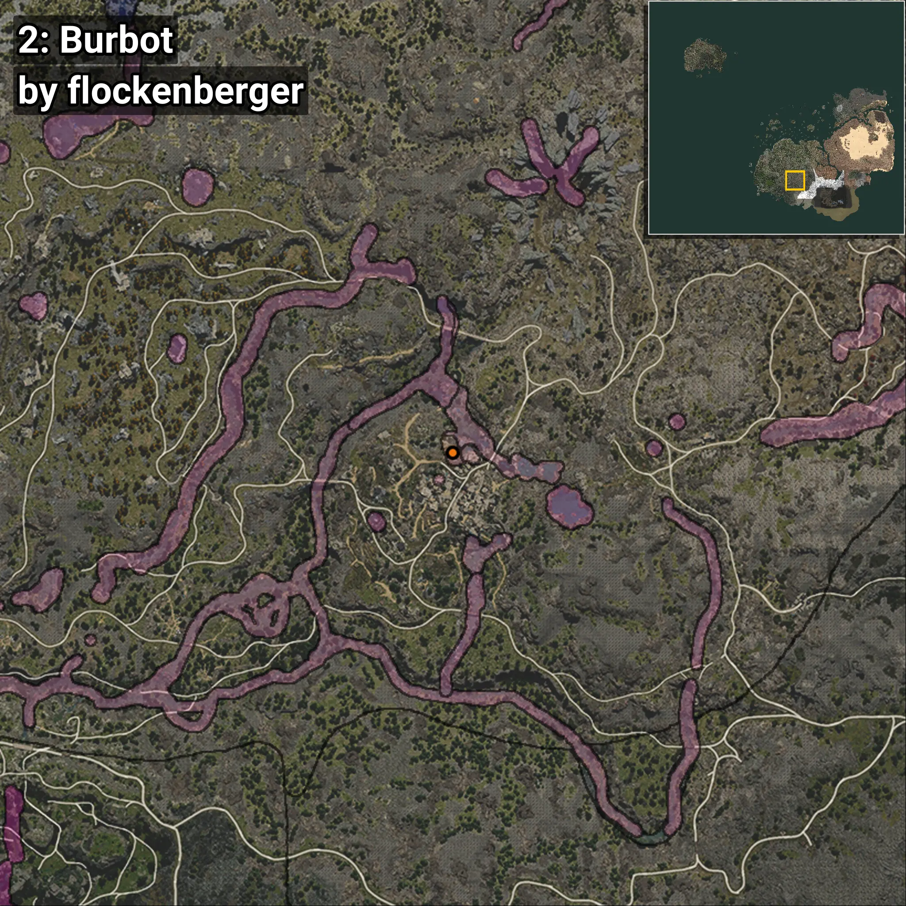
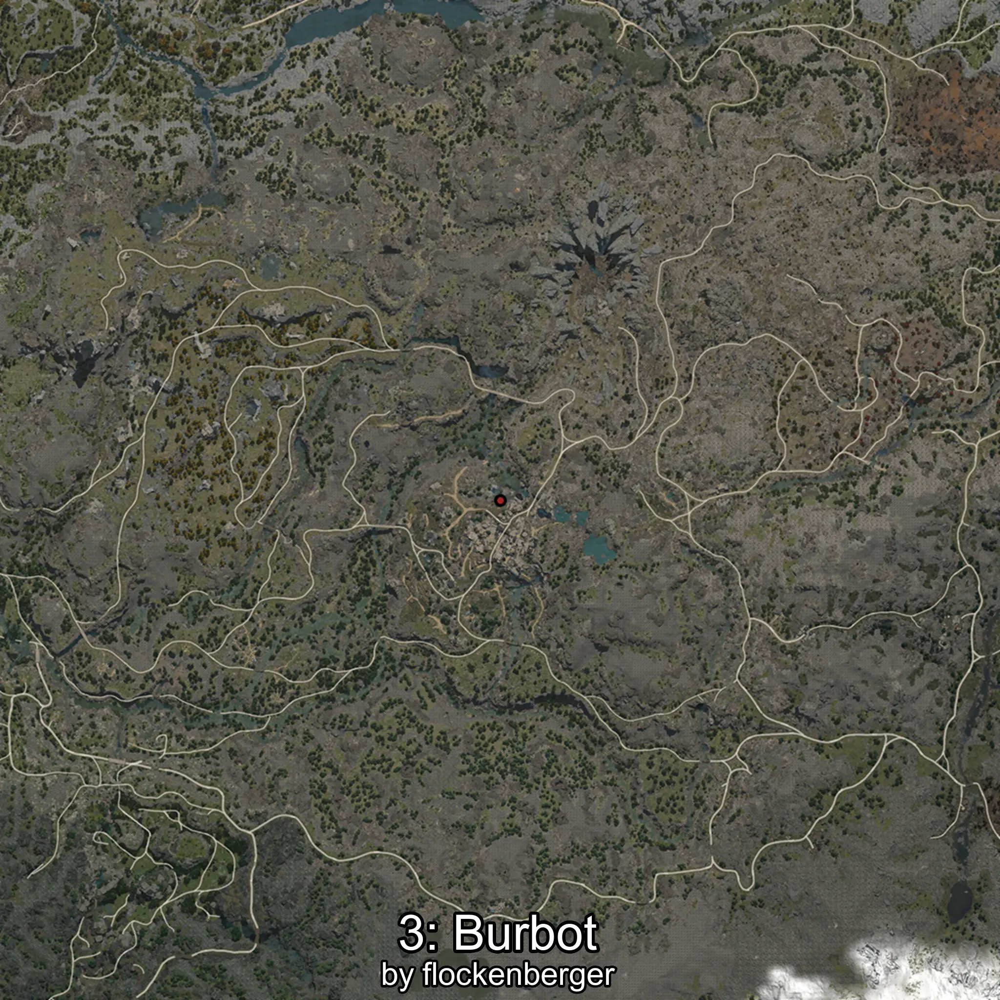
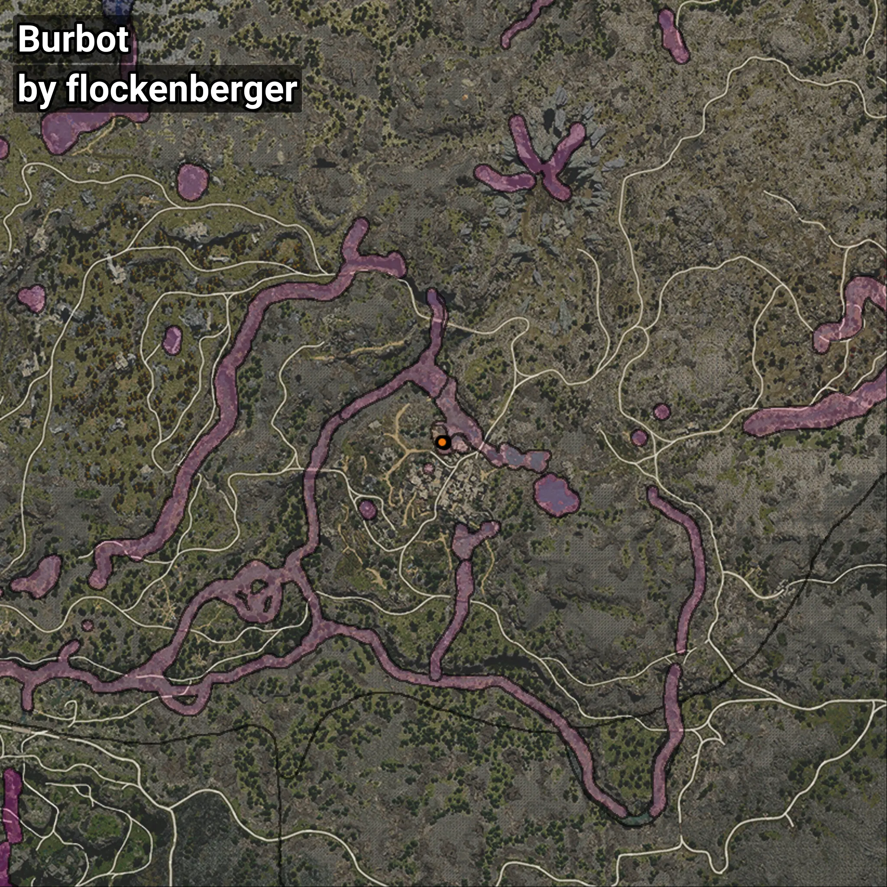

# Burbot
```xml
<!--
    Waypoints for: Burbot
    Created by: flockenberger
-->
<WorldmapBookMark>
    <BookMark BookMarkName="0: Burbot" PosX="-50564.0" PosY="20051.0" PosZ="-396678.0" />
    <BookMark BookMarkName="1: Burbot" PosX="-50565.0" PosY="19934.0" PosZ="-396498.0" />
    <BookMark BookMarkName="2: Burbot" PosX="-51121.0" PosY="20058.0" PosZ="-396565.0" />
    <BookMark BookMarkName="3: Burbot" PosX="-50535.0" PosY="19935.0" PosZ="-396452.0" />
    <BookMark BookMarkName="4: Burbot" PosX="-51136.0" PosY="20058.0" PosZ="-396647.0" />
</WorldmapBookMark>
```

## ⚠️ Disclaimer
Waypoints are generated based on the __**character’s position**__ — __not__ where the fishing float landed.
Fish are determined by where your **float** lands!
In ocean spots especially, the direction you cast your rod can place your float in a **different fishing zone**, which may result in catching the wrong type of fish.
Please pay attention to the preview images showing where each location is in relation to the outlined zones.

- You can verify your float’s position using the guide [**HERE**](https://flockenberger.github.io/bdo-fish-position/)
- Or watch the video guide [**HERE**](https://youtu.be/t-VXcRoNojk)

## Previews
      