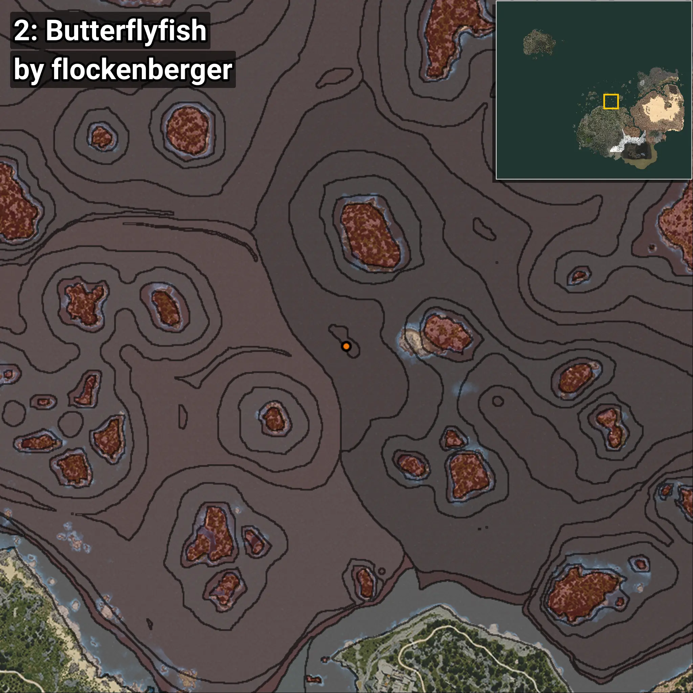
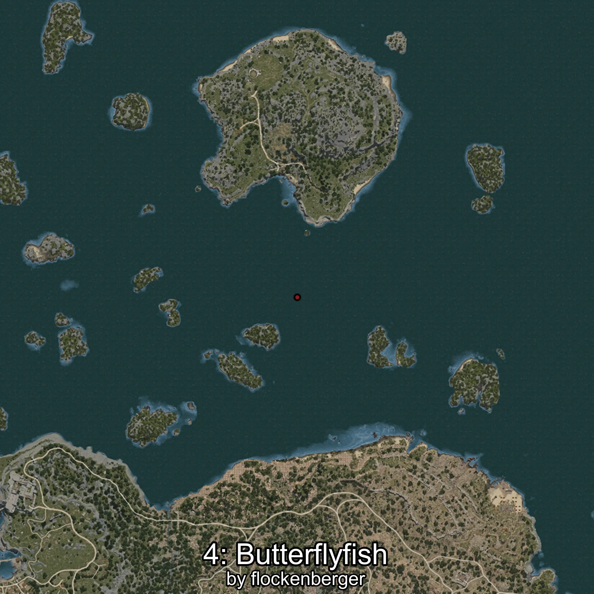

# Butterflyfish
```xml
<!--
    Waypoints for: Butterflyfish
    Created by: flockenberger
-->
<WorldmapBookMark>
    <BookMark BookMarkName="0: Butterflyfish" PosX="-21471.684" PosY="-7837.664" PosZ="156727.88" />
    <BookMark BookMarkName="1: Butterflyfish" PosX="13581.76" PosY="-7748.6406" PosZ="171788.97" />
    <BookMark BookMarkName="2: Butterflyfish" PosX="401.0" PosY="-7707.0" PosZ="251747.0" />
    <BookMark BookMarkName="3: Butterflyfish" PosX="-240.39178" PosY="-7518.5537" PosZ="252146.75" />
    <BookMark BookMarkName="4: Butterflyfish" PosX="3049.0" PosY="-7697.0" PosZ="251298.0" />
</WorldmapBookMark>
```

## ⚠️ Disclaimer
Waypoints are generated based on the __**character’s position**__ — __not__ where the fishing float landed.
Fish are determined by where your **float** lands!
In ocean spots especially, the direction you cast your rod can place your float in a **different fishing zone**, which may result in catching the wrong type of fish.
Please pay attention to the preview images showing where each location is in relation to the outlined zones.

- You can verify your float’s position using the guide [**HERE**](https://flockenberger.github.io/bdo-fish-position/)
- Or watch the video guide [**HERE**](https://youtu.be/t-VXcRoNojk)

## Previews
      