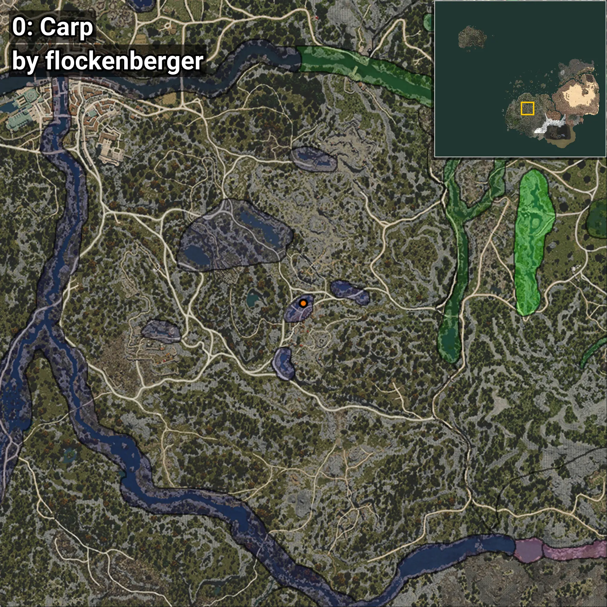
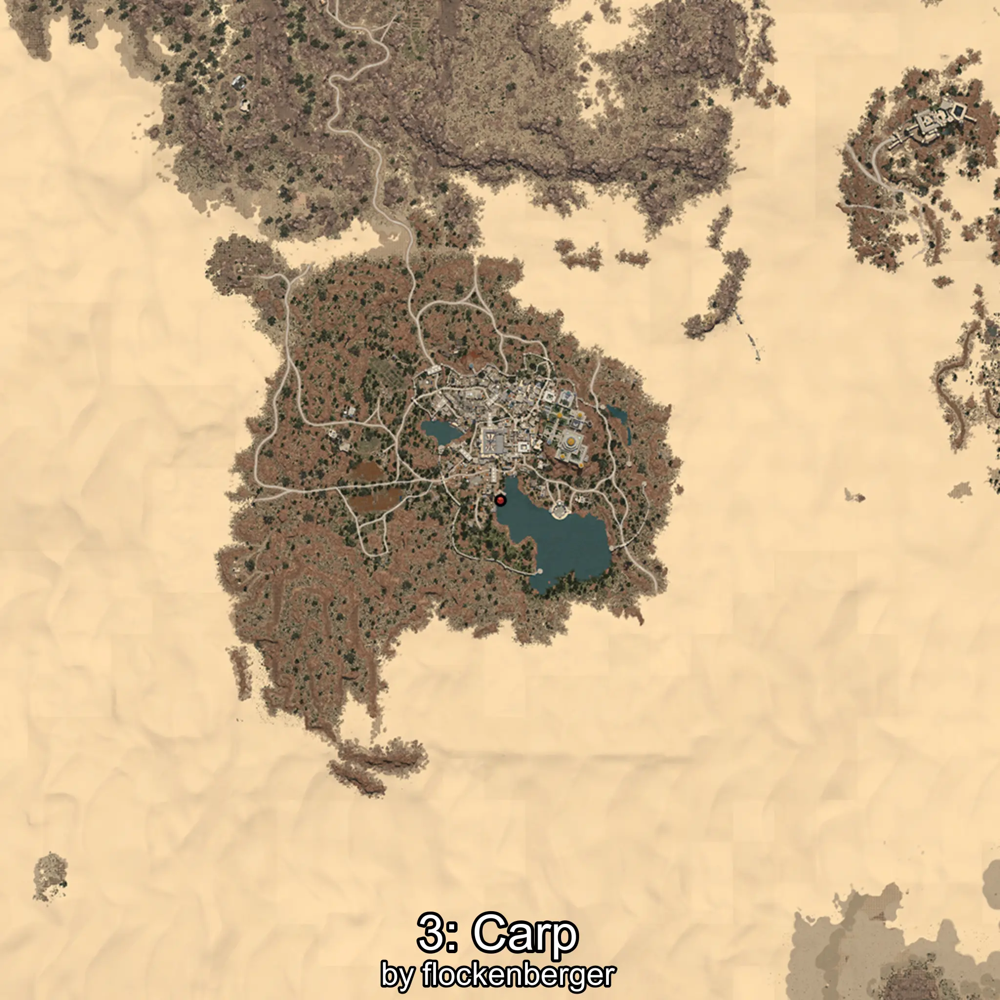
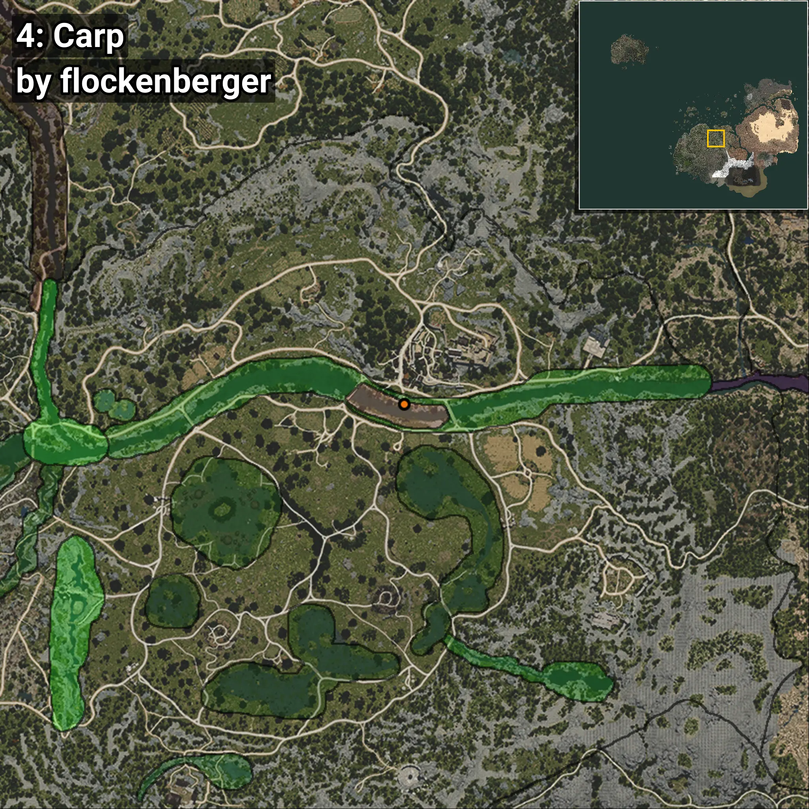
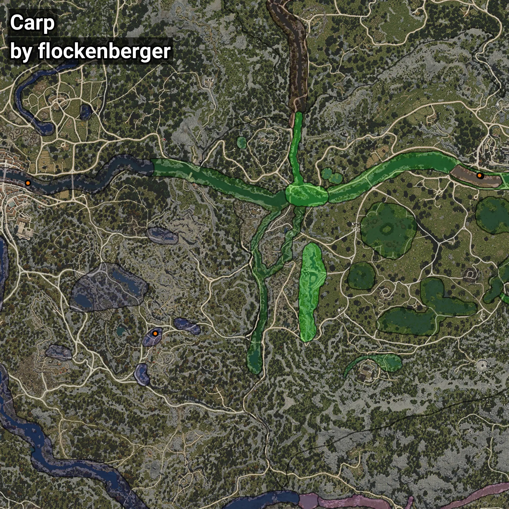

# Carp
```xml
<!--
    Waypoints for: Carp
    Created by: flockenberger
-->
<WorldmapBookMark>
    <BookMark BookMarkName="0: Carp" PosX="-155547.0" PosY="-2066.0" PosZ="-145253.0" />
    <BookMark BookMarkName="1: Carp" PosX="-231861.69" PosY="-3989.5847" PosZ="-55190.277" />
    <BookMark BookMarkName="2: Carp" PosX="39213.0" PosY="-4031.0" PosZ="-51066.0" />
    <BookMark BookMarkName="3: Carp" PosX="39218.0" PosY="-4033.0" PosZ="-51076.0" />
    <BookMark BookMarkName="4: Carp" PosX="38308.0" PosY="-3996.0" PosZ="-50691.0" />
</WorldmapBookMark>
```

## ⚠️ Disclaimer
Waypoints are generated based on the __**character’s position**__ — __not__ where the fishing float landed.
Fish are determined by where your **float** lands!
In ocean spots especially, the direction you cast your rod can place your float in a **different fishing zone**, which may result in catching the wrong type of fish.
Please pay attention to the preview images showing where each location is in relation to the outlined zones.

- You can verify your float’s position using the guide [**HERE**](https://flockenberger.github.io/bdo-fish-position/)
- Or watch the video guide [**HERE**](https://youtu.be/t-VXcRoNojk)

## Previews
      