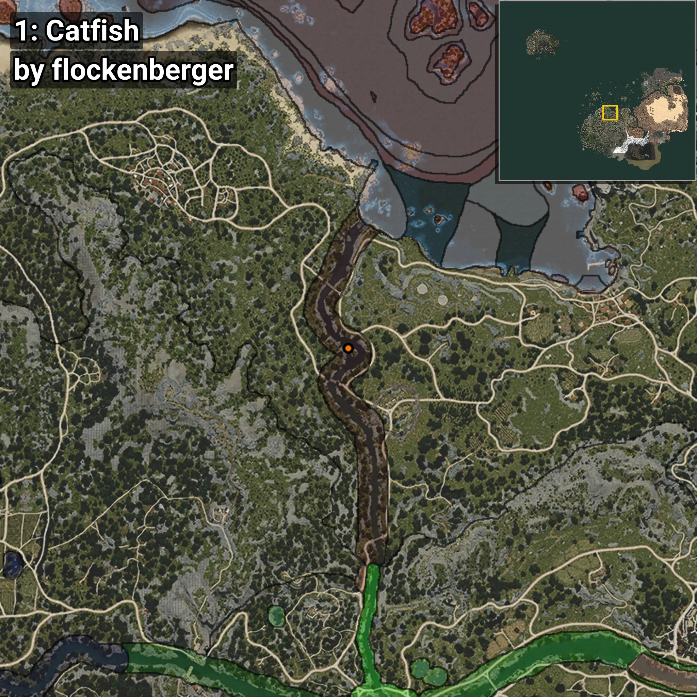
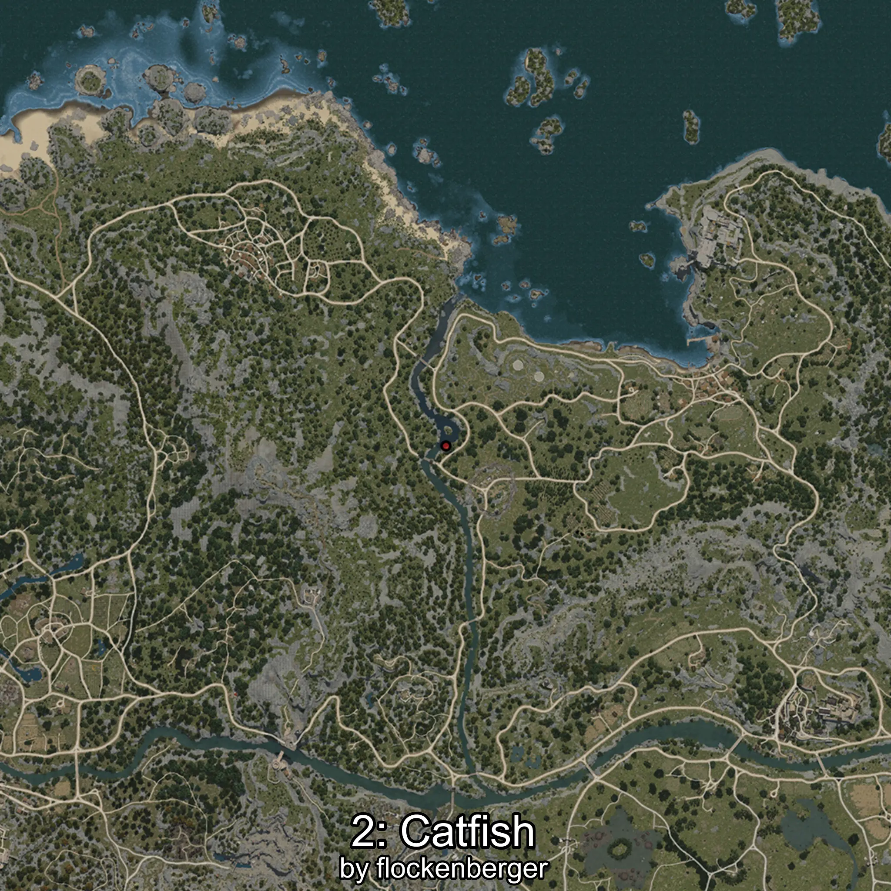
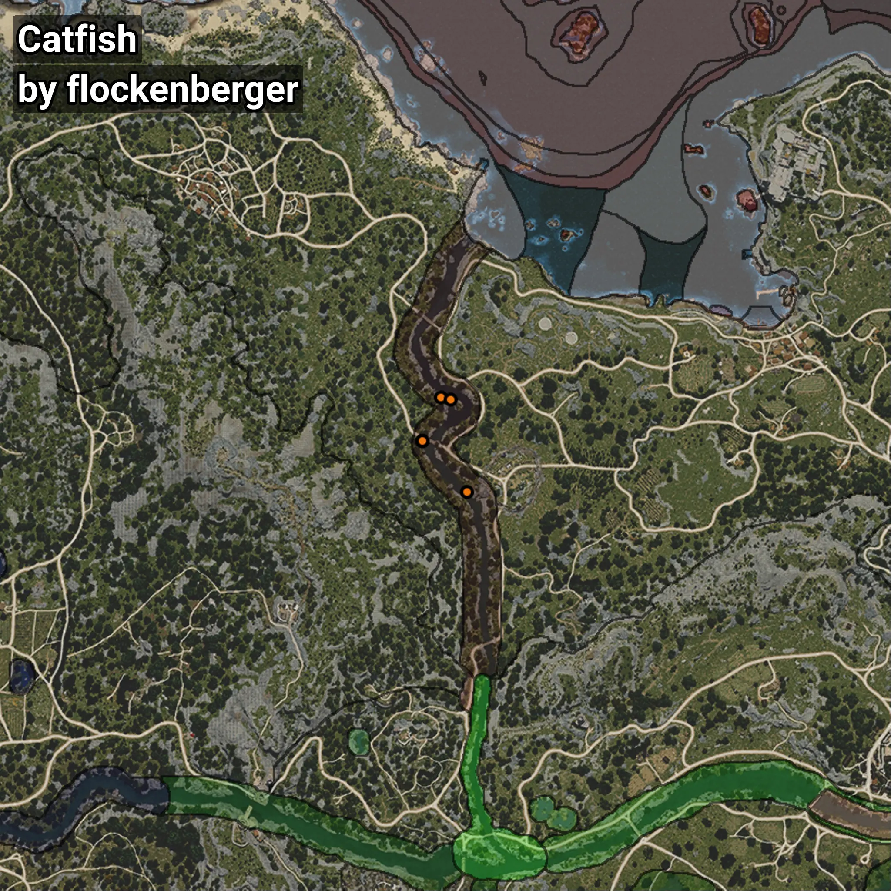

# Catfish
```xml
<!--
    Waypoints for: Catfish
    Created by: flockenberger
-->
<WorldmapBookMark>
    <BookMark BookMarkName="0: Catfish" PosX="-81233.0" PosY="-4582.0" PosZ="64290.0" />
    <BookMark BookMarkName="1: Catfish" PosX="-78332.0" PosY="-4281.0" PosZ="63616.0" />
    <BookMark BookMarkName="2: Catfish" PosX="-86294.0" PosY="-4698.0" PosZ="52171.0" />
    <BookMark BookMarkName="3: Catfish" PosX="-86395.0" PosY="-4684.0" PosZ="52147.0" />
    <BookMark BookMarkName="4: Catfish" PosX="-74055.0" PosY="-4449.0" PosZ="37952.0" />
</WorldmapBookMark>
```

## ⚠️ Disclaimer
Waypoints are generated based on the __**character’s position**__ — __not__ where the fishing float landed.
Fish are determined by where your **float** lands!
In ocean spots especially, the direction you cast your rod can place your float in a **different fishing zone**, which may result in catching the wrong type of fish.
Please pay attention to the preview images showing where each location is in relation to the outlined zones.

- You can verify your float’s position using the guide [**HERE**](https://flockenberger.github.io/bdo-fish-position/)
- Or watch the video guide [**HERE**](https://youtu.be/t-VXcRoNojk)

## Previews
      