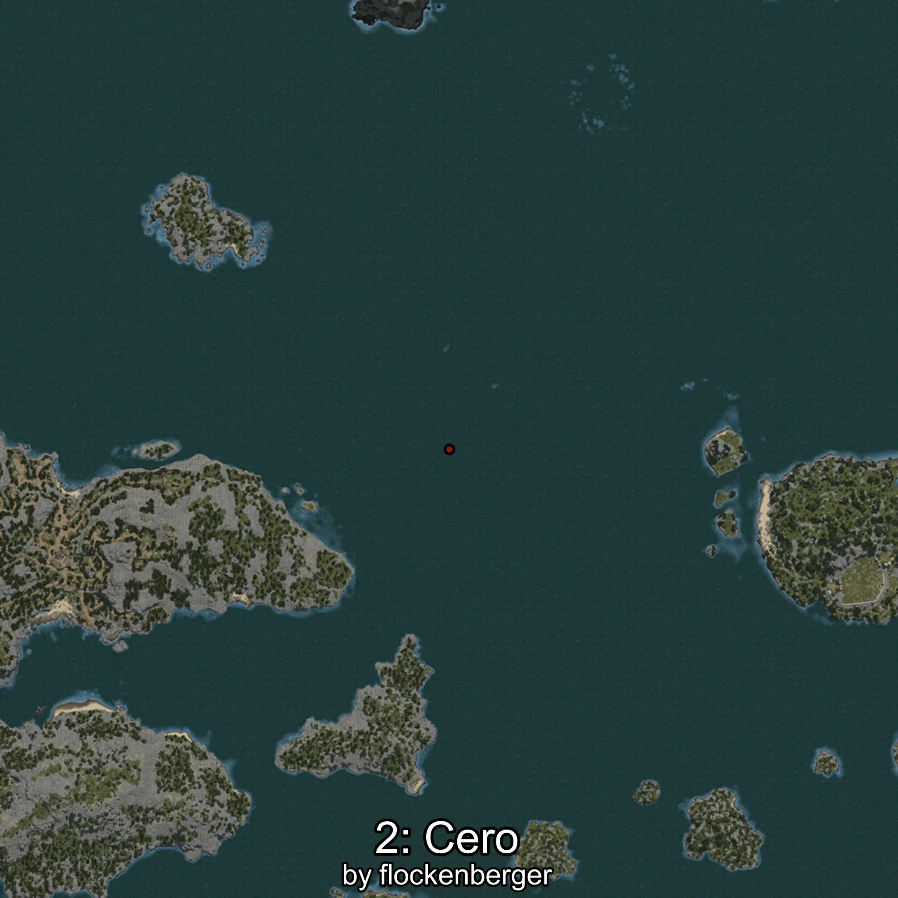

# Cero
```xml
<!--
    Waypoints for: Cero
    Created by: flockenberger
-->
<WorldmapBookMark>
    <BookMark BookMarkName="0: Cero" PosX="-470520.0" PosY="-7871.0" PosZ="361812.0" />
    <BookMark BookMarkName="1: Cero" PosX="-469209.22" PosY="-7898.256" PosZ="361771.16" />
    <BookMark BookMarkName="2: Cero" PosX="-346272.6" PosY="-7826.8164" PosZ="461499.4" />
    <BookMark BookMarkName="3: Cero" PosX="-469209.22" PosY="-7898.256" PosZ="361771.16" />
    <BookMark BookMarkName="4: Cero" PosX="-344433.0" PosY="-8193.0" PosZ="461267.0" />
</WorldmapBookMark>
```

## ⚠️ Disclaimer
Waypoints are generated based on the __**character’s position**__ — __not__ where the fishing float landed.
Fish are determined by where your **float** lands!
In ocean spots especially, the direction you cast your rod can place your float in a **different fishing zone**, which may result in catching the wrong type of fish.
Please pay attention to the preview images showing where each location is in relation to the outlined zones.

- You can verify your float’s position using the guide [**HERE**](https://flockenberger.github.io/bdo-fish-position/)
- Or watch the video guide [**HERE**](https://youtu.be/t-VXcRoNojk)

## Previews
      