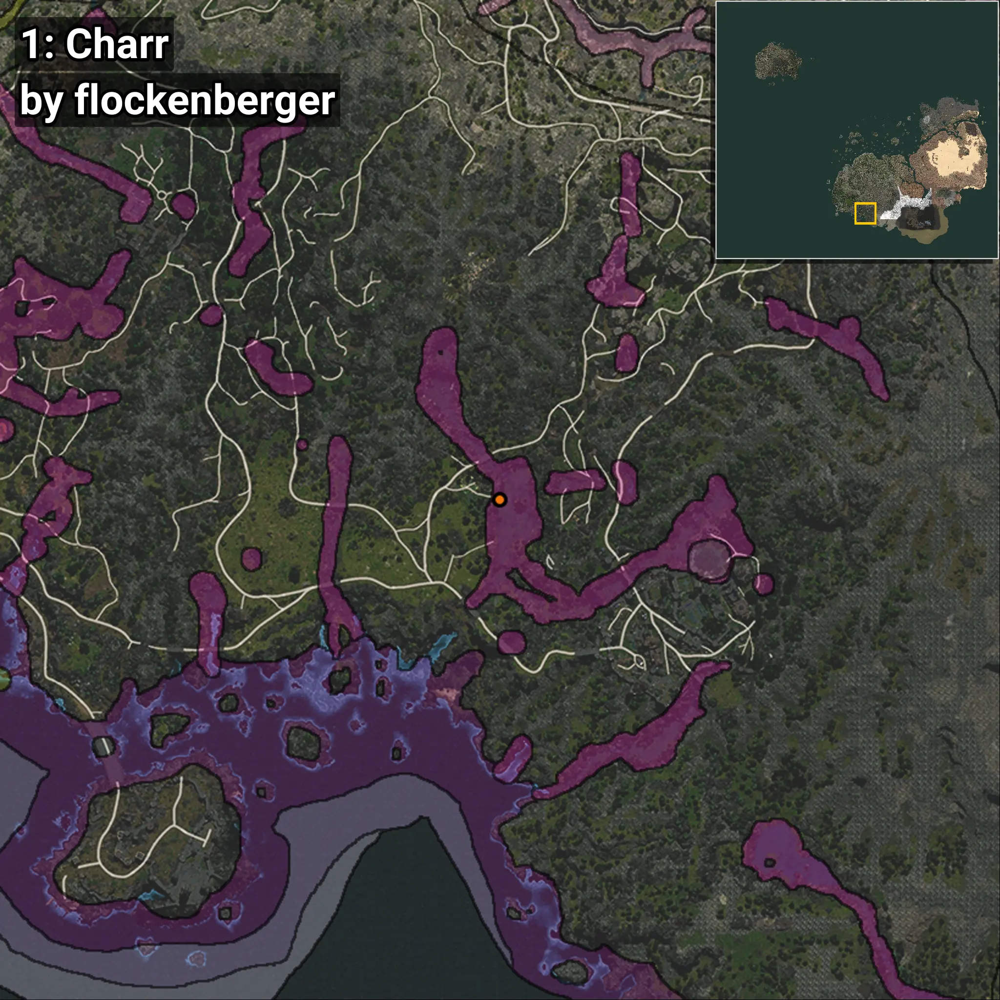
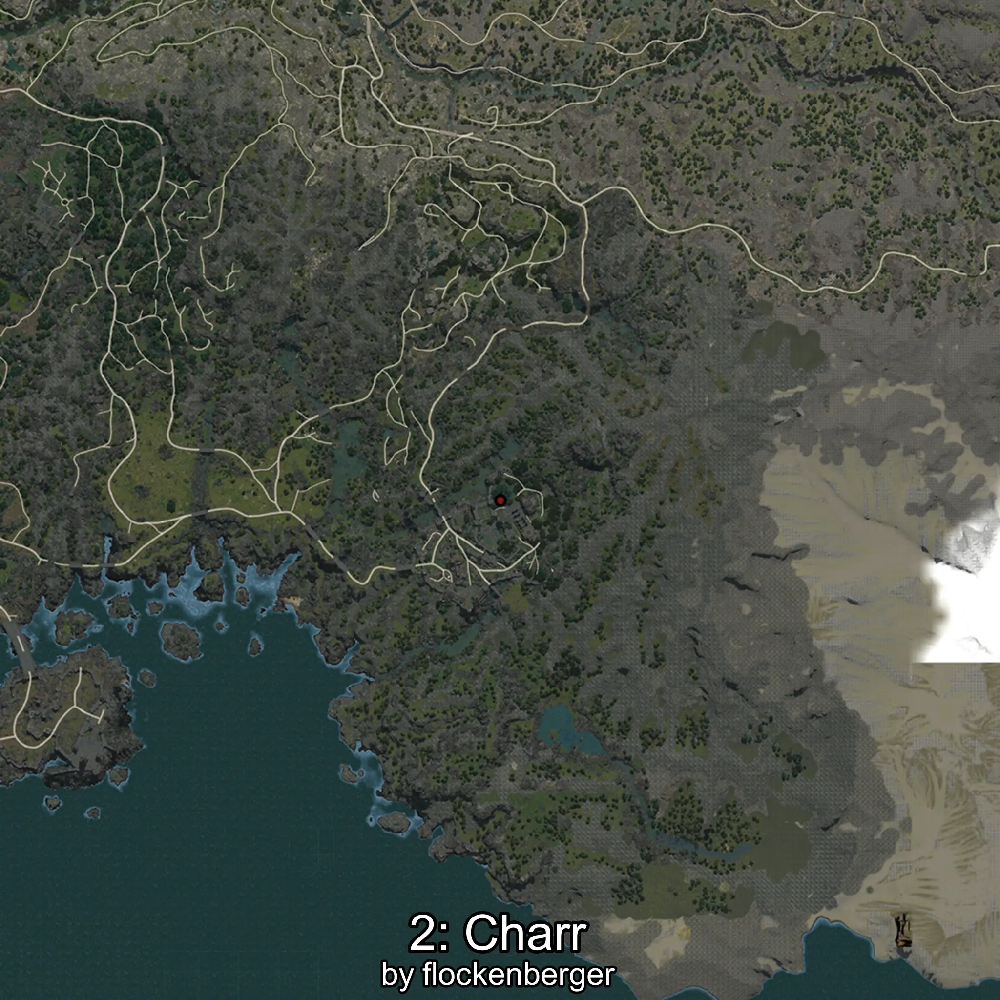
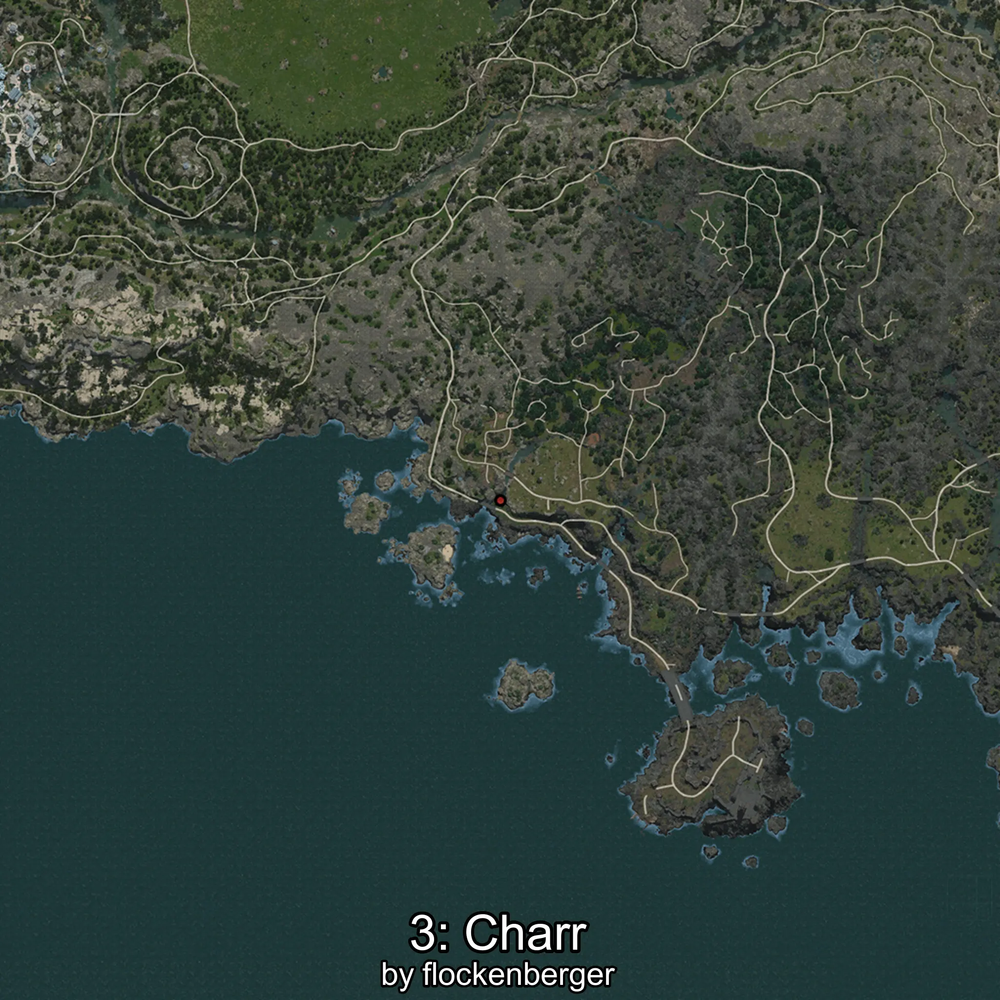
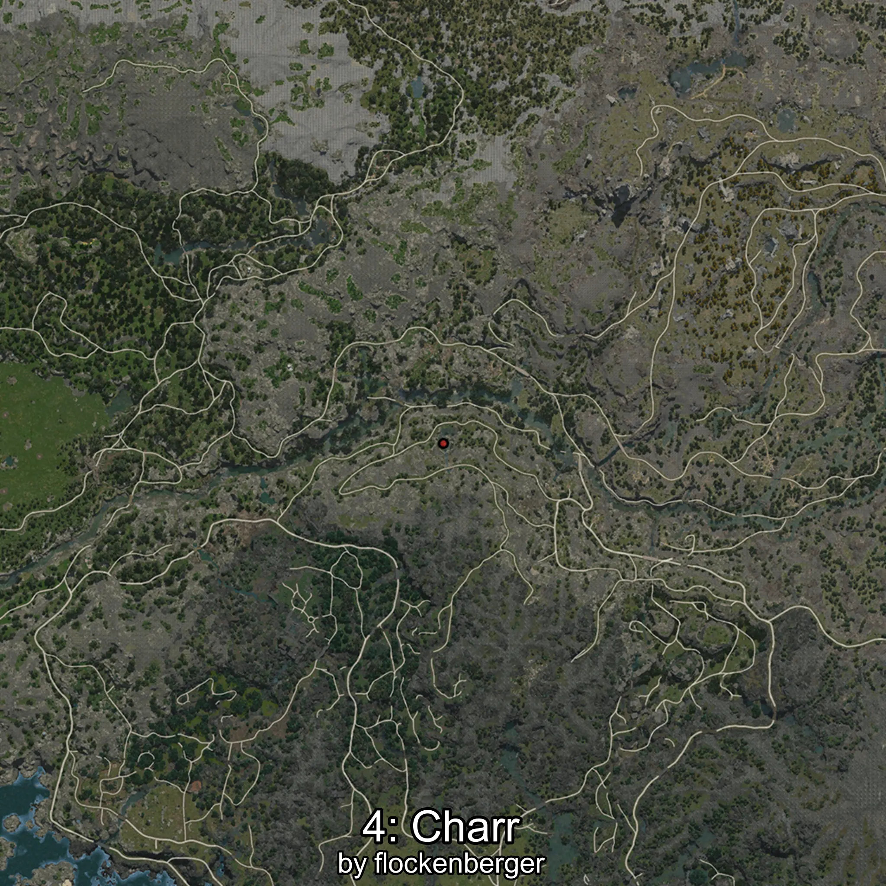

# Charr
```xml
<!--
    Waypoints for: Charr
    Created by: flockenberger
-->
<WorldmapBookMark>
    <BookMark BookMarkName="0: Charr" PosX="-202856.22" PosY="9440.207" PosZ="-572918.4" />
    <BookMark BookMarkName="1: Charr" PosX="-202801.0" PosY="9440.0" PosZ="-572953.0" />
    <BookMark BookMarkName="2: Charr" PosX="-164534.0" PosY="21844.0" PosZ="-587586.0" />
    <BookMark BookMarkName="3: Charr" PosX="-202817.0" PosY="9440.0" PosZ="-573259.0" />
    <BookMark BookMarkName="4: Charr" PosX="-148852.0" PosY="25422.0" PosZ="-586500.0" />
</WorldmapBookMark>
```

## ⚠️ Disclaimer
Waypoints are generated based on the __**character’s position**__ — __not__ where the fishing float landed.
Fish are determined by where your **float** lands!
In ocean spots especially, the direction you cast your rod can place your float in a **different fishing zone**, which may result in catching the wrong type of fish.
Please pay attention to the preview images showing where each location is in relation to the outlined zones.

- You can verify your float’s position using the guide [**HERE**](https://flockenberger.github.io/bdo-fish-position/)
- Or watch the video guide [**HERE**](https://youtu.be/t-VXcRoNojk)

## Previews
      