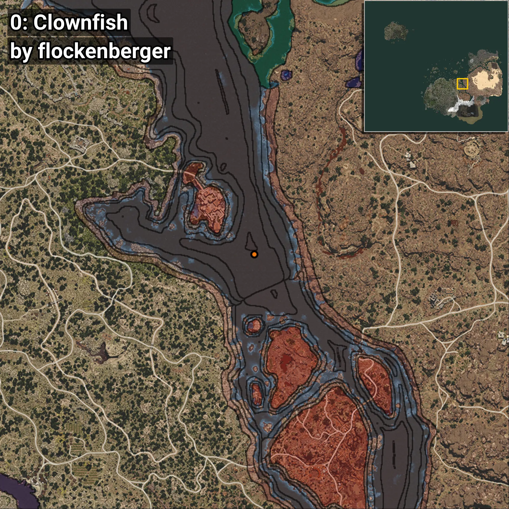
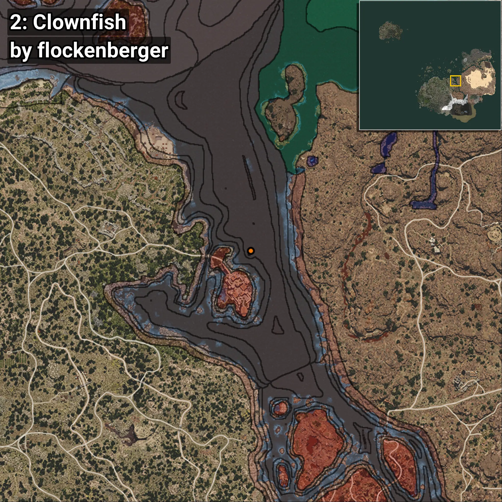
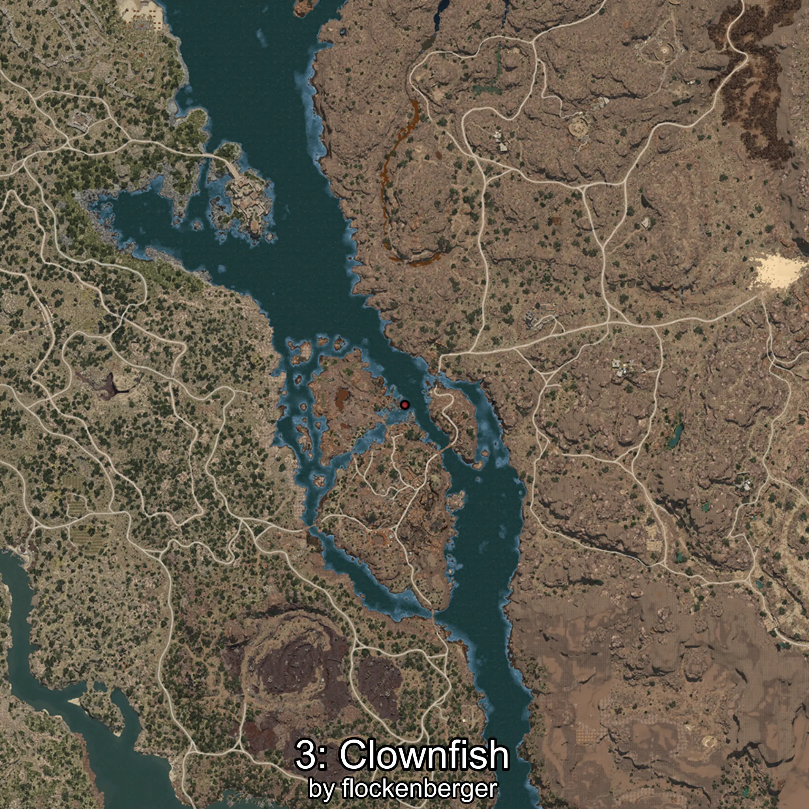
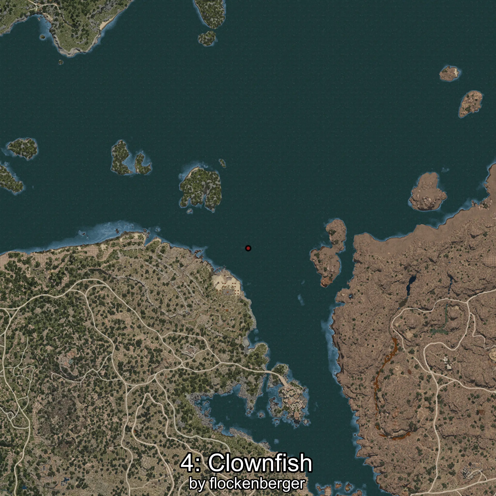

# Clownfish
```xml
<!--
    Waypoints for: Clownfish
    Created by: flockenberger
-->
<WorldmapBookMark>
    <BookMark BookMarkName="0: Clownfish" PosX="330887.0" PosY="-7894.0" PosZ="30864.0" />
    <BookMark BookMarkName="1: Clownfish" PosX="330434.2" PosY="-7755.1035" PosZ="31158.512" />
    <BookMark BookMarkName="2: Clownfish" PosX="315949.0" PosY="-8194.0" PosZ="73544.0" />
    <BookMark BookMarkName="3: Clownfish" PosX="329959.88" PosY="-7753.559" PosZ="30414.486" />
    <BookMark BookMarkName="4: Clownfish" PosX="369783.0" PosY="-8203.0" PosZ="-24143.0" />
</WorldmapBookMark>
```

## ⚠️ Disclaimer
Waypoints are generated based on the __**character’s position**__ — __not__ where the fishing float landed.
Fish are determined by where your **float** lands!
In ocean spots especially, the direction you cast your rod can place your float in a **different fishing zone**, which may result in catching the wrong type of fish.
Please pay attention to the preview images showing where each location is in relation to the outlined zones.

- You can verify your float’s position using the guide [**HERE**](https://flockenberger.github.io/bdo-fish-position/)
- Or watch the video guide [**HERE**](https://youtu.be/t-VXcRoNojk)

## Previews
      