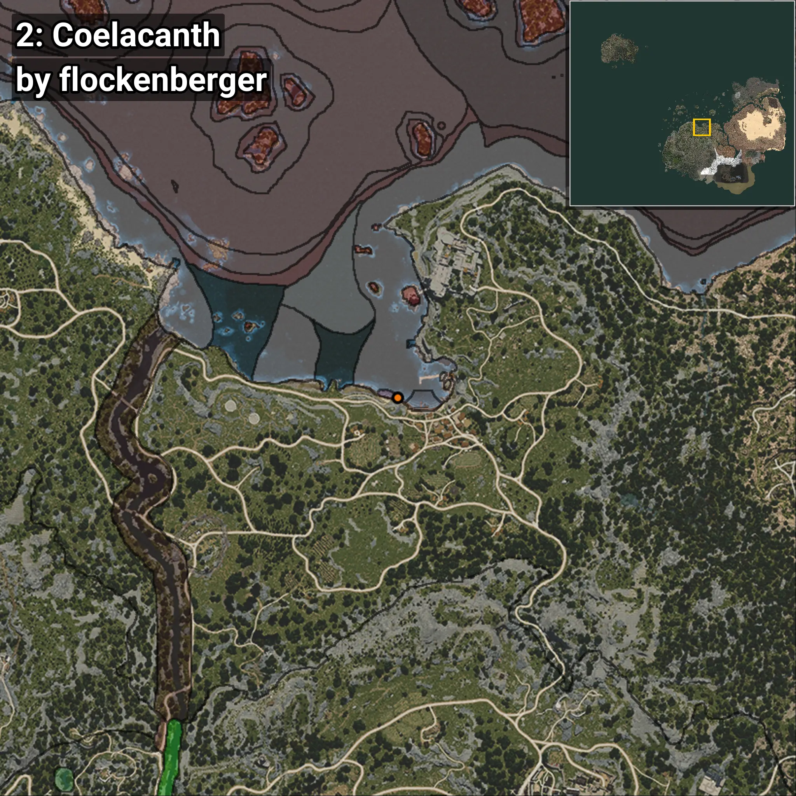
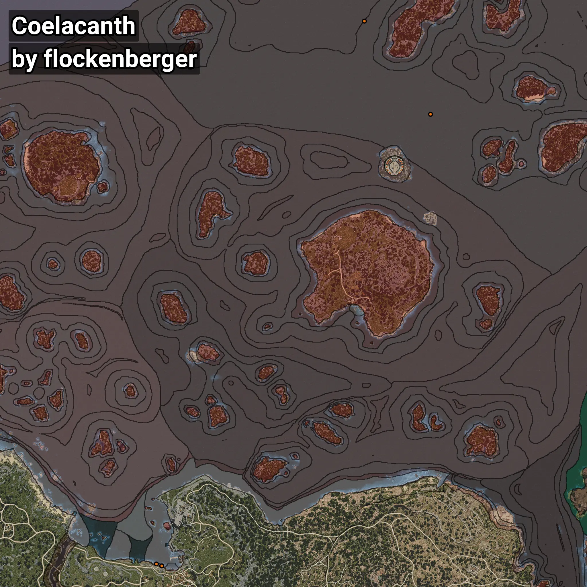

# Coelacanth
```xml
<!--
    Waypoints for: Coelacanth
    Created by: flockenberger
-->
<WorldmapBookMark>
    <BookMark BookMarkName="0: Coelacanth" PosX="160195.66" PosY="-8208.0" PosZ="518814.22" />
    <BookMark BookMarkName="1: Coelacanth" PosX="212336.0" PosY="-7859.0" PosZ="444867.0" />
    <BookMark BookMarkName="2: Coelacanth" PosX="-546.0" PosY="-8157.0" PosZ="87213.0" />
    <BookMark BookMarkName="3: Coelacanth" PosX="-436.24734" PosY="-8194.665" PosZ="87299.81" />
    <BookMark BookMarkName="4: Coelacanth" PosX="-4553.0" PosY="-8296.0" PosZ="88701.0" />
</WorldmapBookMark>
```

## ⚠️ Disclaimer
Waypoints are generated based on the __**character’s position**__ — __not__ where the fishing float landed.
Fish are determined by where your **float** lands!
In ocean spots especially, the direction you cast your rod can place your float in a **different fishing zone**, which may result in catching the wrong type of fish.
Please pay attention to the preview images showing where each location is in relation to the outlined zones.

- You can verify your float’s position using the guide [**HERE**](https://flockenberger.github.io/bdo-fish-position/)
- Or watch the video guide [**HERE**](https://youtu.be/t-VXcRoNojk)

## Previews
      