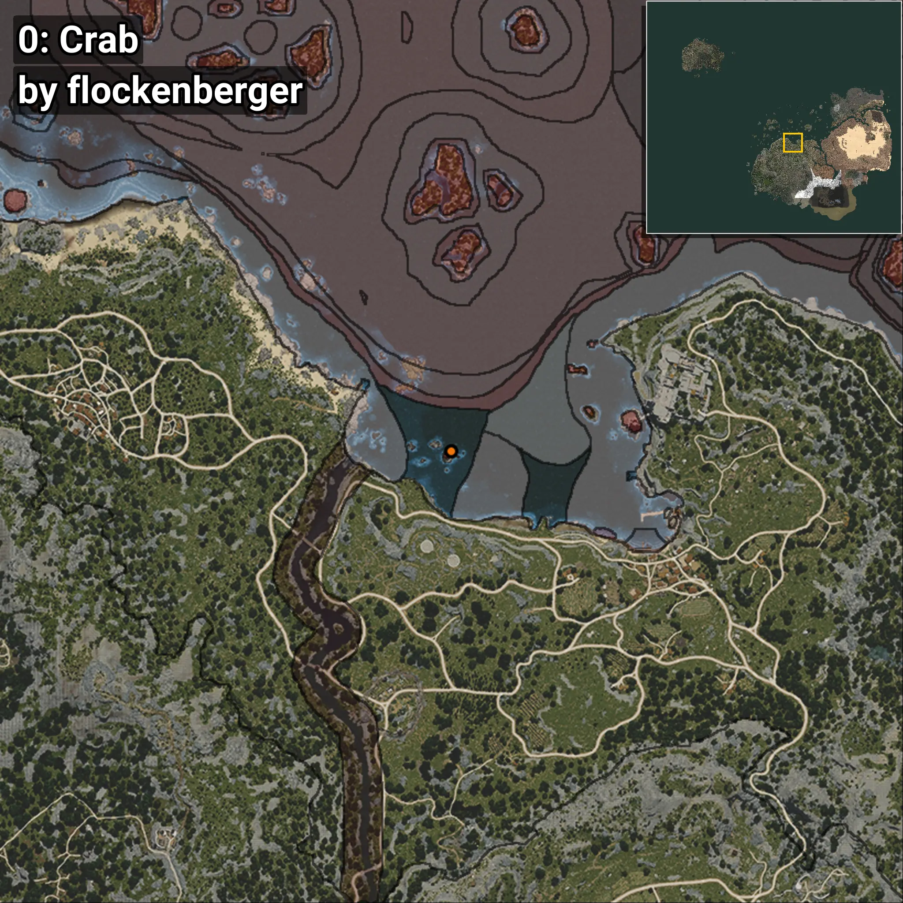
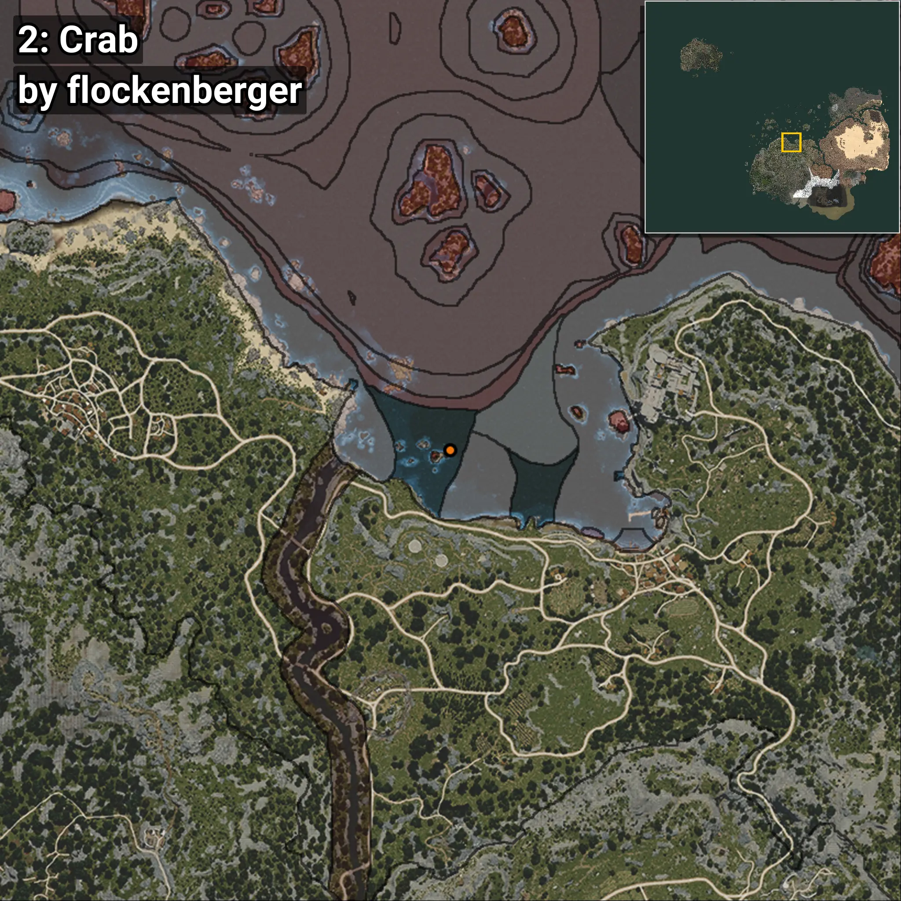
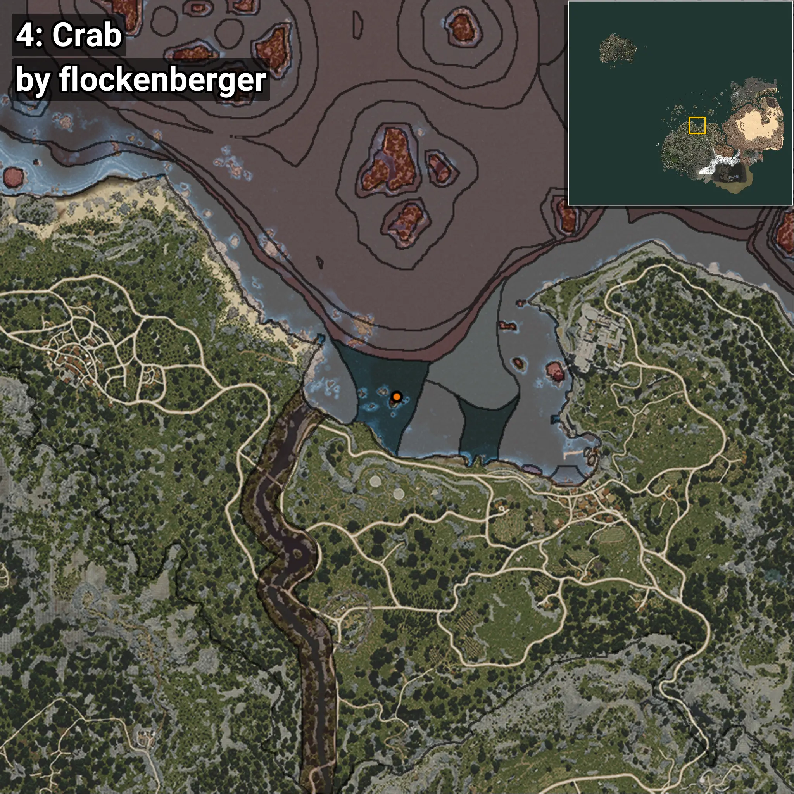
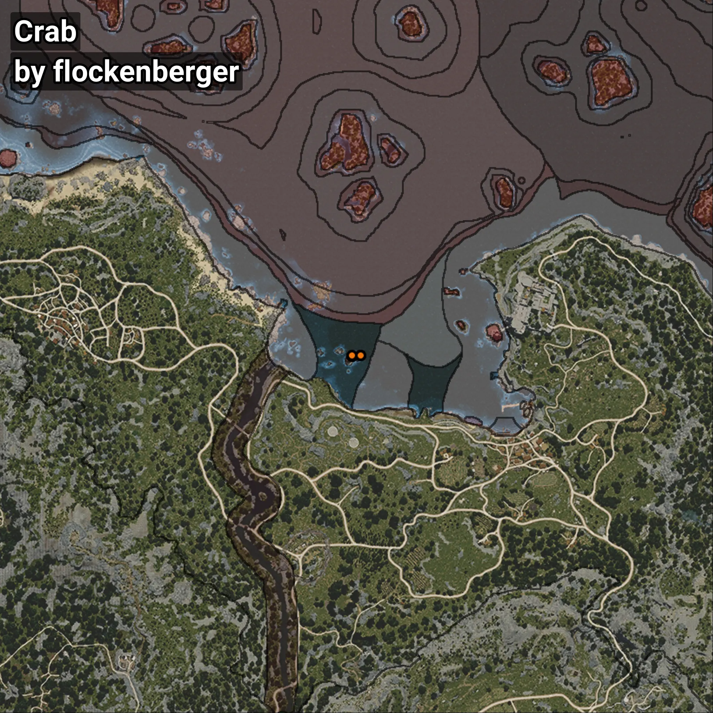

# Crab
```xml
<!--
    Waypoints for: Crab
    Created by: flockenberger
-->
<WorldmapBookMark>
    <BookMark BookMarkName="0: Crab" PosX="-45759.0" PosY="-8007.0" PosZ="110678.0" />
    <BookMark BookMarkName="1: Crab" PosX="-45752.74" PosY="-8016.2935" PosZ="110755.51" />
    <BookMark BookMarkName="2: Crab" PosX="-42731.02" PosY="-8106.638" PosZ="110992.27" />
    <BookMark BookMarkName="3: Crab" PosX="-42725.0" PosY="-8096.0" PosZ="110946.0" />
    <BookMark BookMarkName="4: Crab" PosX="-45732.0" PosY="-8045.0" PosZ="110846.0" />
</WorldmapBookMark>
```

## ⚠️ Disclaimer
Waypoints are generated based on the __**character’s position**__ — __not__ where the fishing float landed.
Fish are determined by where your **float** lands!
In ocean spots especially, the direction you cast your rod can place your float in a **different fishing zone**, which may result in catching the wrong type of fish.
Please pay attention to the preview images showing where each location is in relation to the outlined zones.

- You can verify your float’s position using the guide [**HERE**](https://flockenberger.github.io/bdo-fish-position/)
- Or watch the video guide [**HERE**](https://youtu.be/t-VXcRoNojk)

## Previews
      