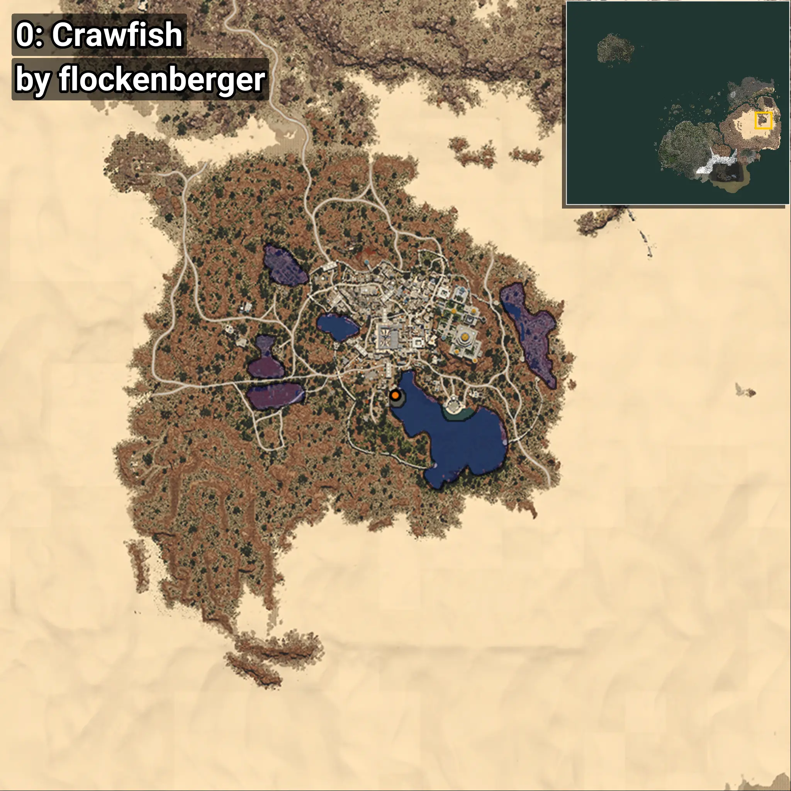
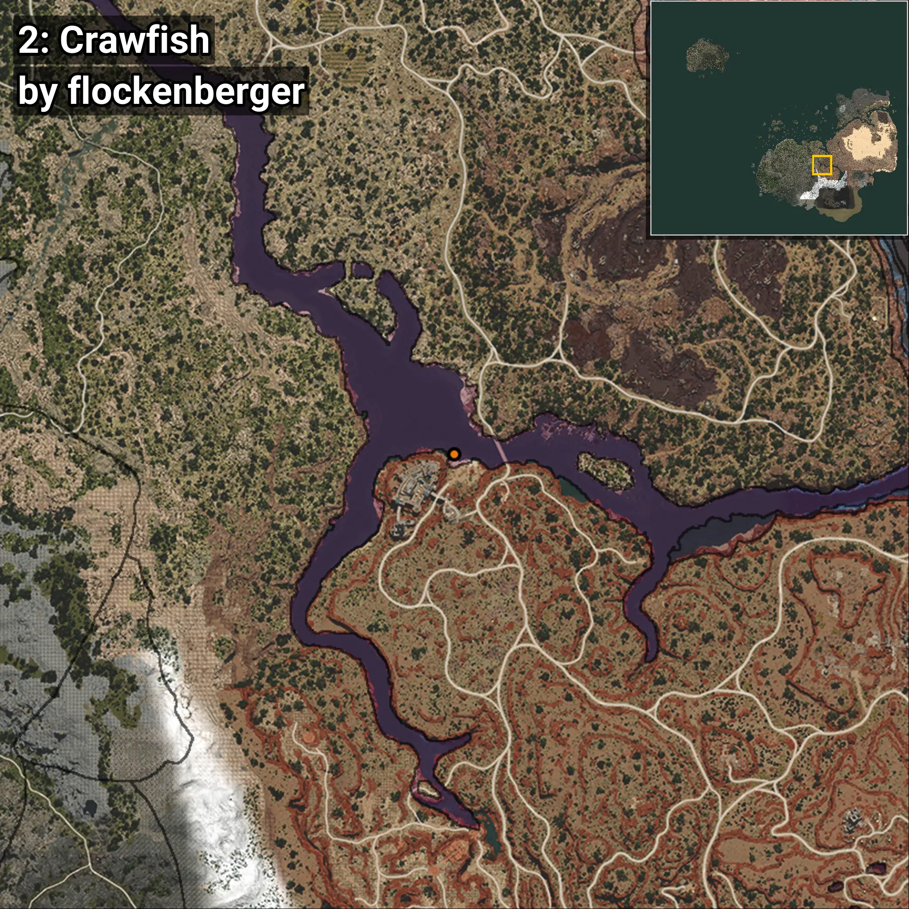
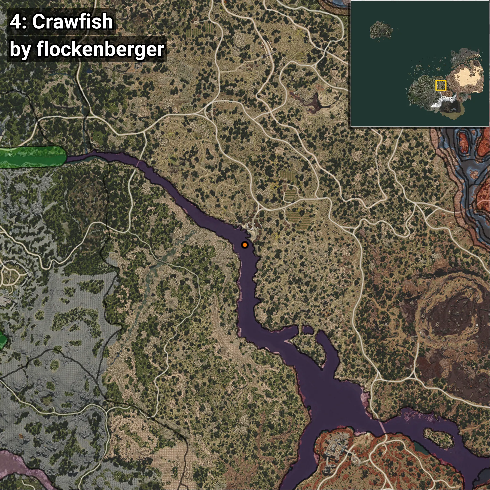

# Crawfish
```xml
<!--
    Waypoints for: Crawfish
    Created by: flockenberger
-->
<WorldmapBookMark>
    <BookMark BookMarkName="0: Crawfish" PosX="1028569.94" PosY="10416.199" PosZ="181503.64" />
    <BookMark BookMarkName="1: Crawfish" PosX="1028532.0" PosY="10439.0" PosZ="181503.0" />
    <BookMark BookMarkName="2: Crawfish" PosX="278370.0" PosY="-7281.0" PosZ="-181088.0" />
    <BookMark BookMarkName="3: Crawfish" PosX="1028472.25" PosY="10475.776" PosZ="181517.9" />
    <BookMark BookMarkName="4: Crawfish" PosX="221777.0" PosY="-5346.0" PosZ="-88249.0" />
</WorldmapBookMark>
```

## ⚠️ Disclaimer
Waypoints are generated based on the __**character’s position**__ — __not__ where the fishing float landed.
Fish are determined by where your **float** lands!
In ocean spots especially, the direction you cast your rod can place your float in a **different fishing zone**, which may result in catching the wrong type of fish.
Please pay attention to the preview images showing where each location is in relation to the outlined zones.

- You can verify your float’s position using the guide [**HERE**](https://flockenberger.github.io/bdo-fish-position/)
- Or watch the video guide [**HERE**](https://youtu.be/t-VXcRoNojk)

## Previews
      