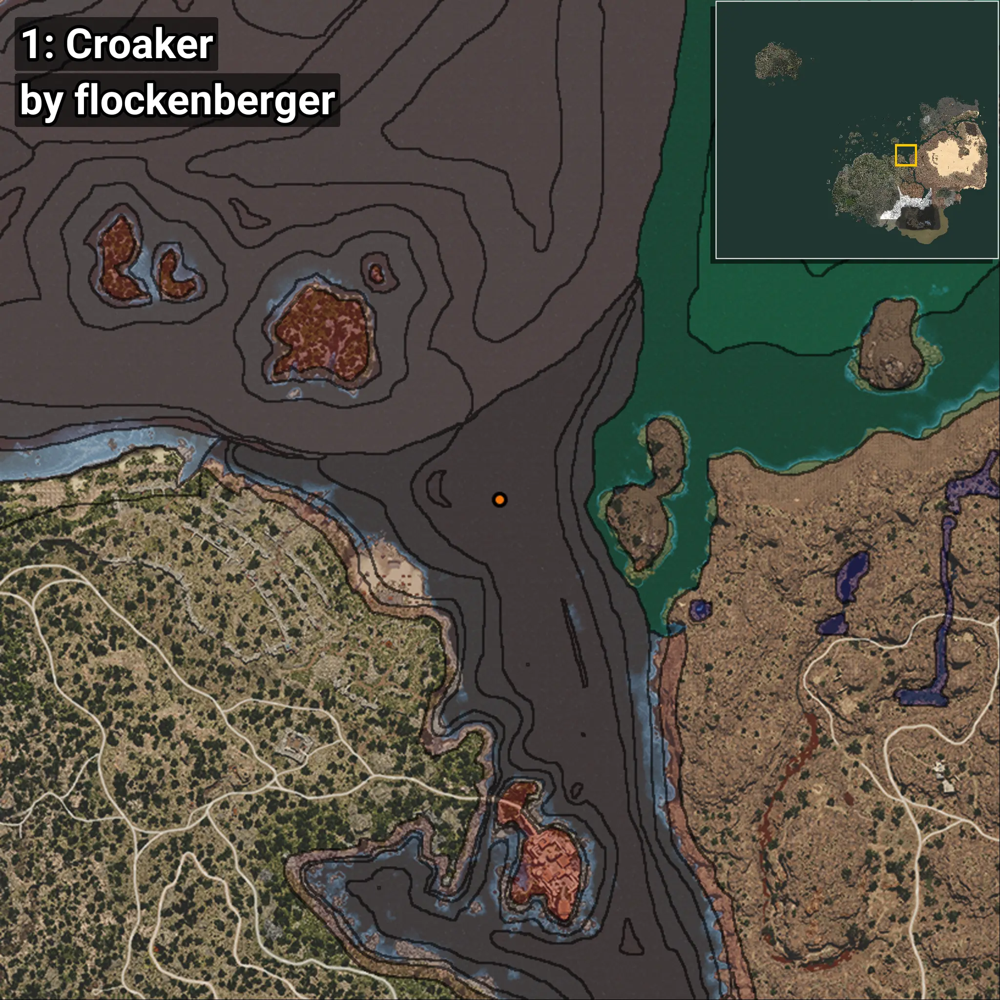
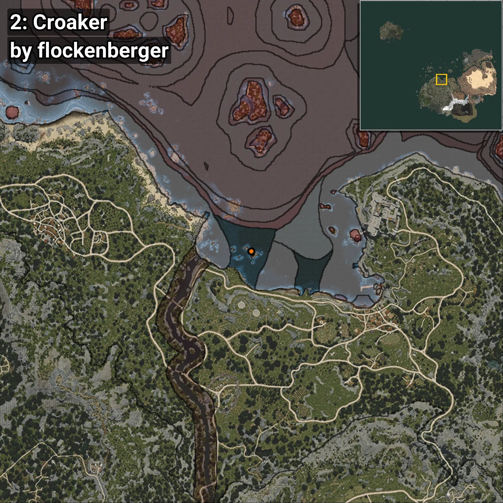
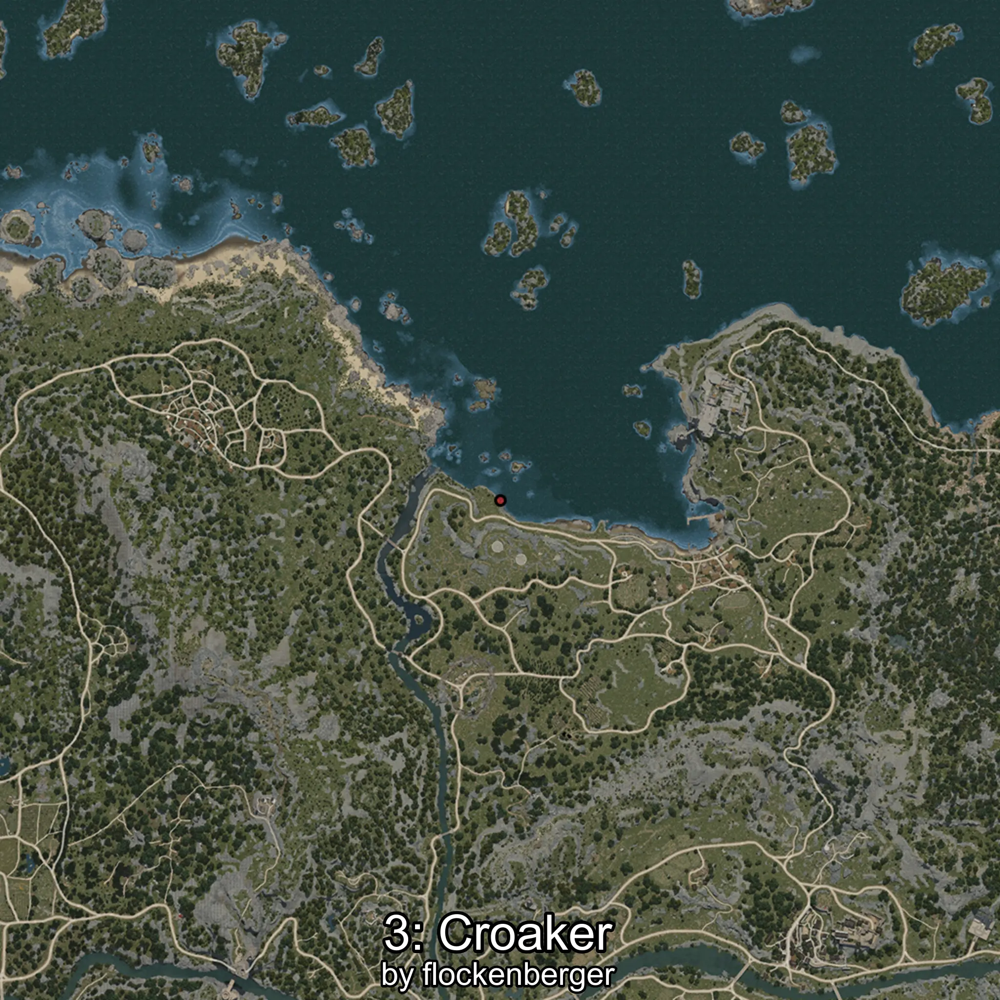

# Croaker
```xml
<!--
    Waypoints for: Croaker
    Created by: flockenberger
-->
<WorldmapBookMark>
    <BookMark BookMarkName="0: Croaker" PosX="313268.0" PosY="-7917.0" PosZ="117846.0" />
    <BookMark BookMarkName="1: Croaker" PosX="296712.0" PosY="-8169.0" PosZ="145135.0" />
    <BookMark BookMarkName="2: Croaker" PosX="-47326.0" PosY="-8005.0" PosZ="111040.0" />
    <BookMark BookMarkName="3: Croaker" PosX="-47470.0" PosY="-8012.0" PosZ="111196.0" />
    <BookMark BookMarkName="4: Croaker" PosX="-51248.78" PosY="-7335.531" PosZ="97821.055" />
</WorldmapBookMark>
```

## ⚠️ Disclaimer
Waypoints are generated based on the __**character’s position**__ — __not__ where the fishing float landed.
Fish are determined by where your **float** lands!
In ocean spots especially, the direction you cast your rod can place your float in a **different fishing zone**, which may result in catching the wrong type of fish.
Please pay attention to the preview images showing where each location is in relation to the outlined zones.

- You can verify your float’s position using the guide [**HERE**](https://flockenberger.github.io/bdo-fish-position/)
- Or watch the video guide [**HERE**](https://youtu.be/t-VXcRoNojk)

## Previews
      