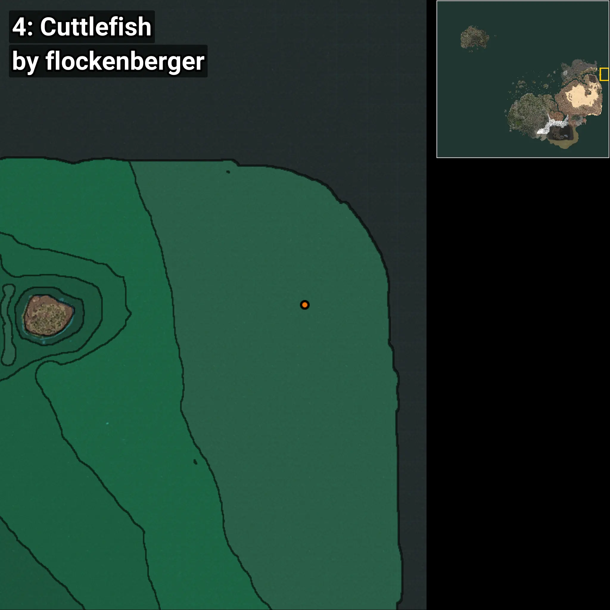

# Cuttlefish
```xml
<!--
    Waypoints for: Cuttlefish
    Created by: flockenberger
-->
<WorldmapBookMark>
    <BookMark BookMarkName="0: Cuttlefish" PosX="1263288.6" PosY="-7700.3647" PosZ="547364.06" />
    <BookMark BookMarkName="1: Cuttlefish" PosX="1263752.0" PosY="-7751.0" PosZ="545551.0" />
    <BookMark BookMarkName="2: Cuttlefish" PosX="1264646.0" PosY="-7764.3286" PosZ="548950.5" />
    <BookMark BookMarkName="3: Cuttlefish" PosX="1265430.0" PosY="-7870.0" PosZ="548467.0" />
    <BookMark BookMarkName="4: Cuttlefish" PosX="1384405.0" PosY="-8158.0" PosZ="557105.0" />
</WorldmapBookMark>
```

## ⚠️ Disclaimer
Waypoints are generated based on the __**character’s position**__ — __not__ where the fishing float landed.
Fish are determined by where your **float** lands!
In ocean spots especially, the direction you cast your rod can place your float in a **different fishing zone**, which may result in catching the wrong type of fish.
Please pay attention to the preview images showing where each location is in relation to the outlined zones.

- You can verify your float’s position using the guide [**HERE**](https://flockenberger.github.io/bdo-fish-position/)
- Or watch the video guide [**HERE**](https://youtu.be/t-VXcRoNojk)

## Previews
      