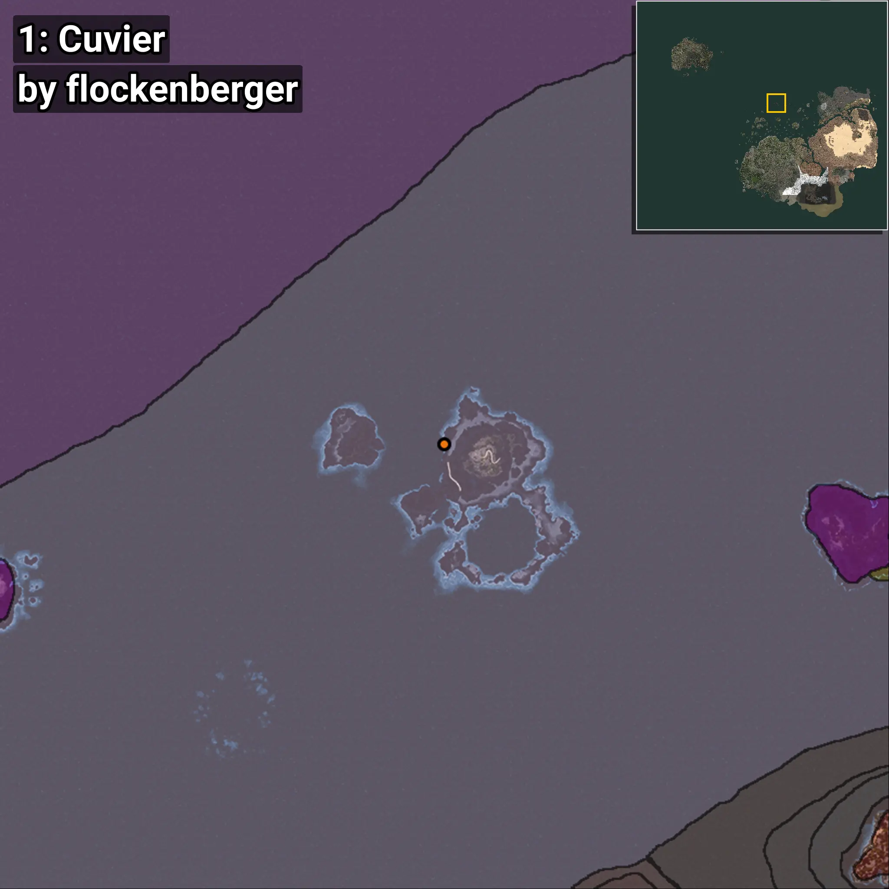
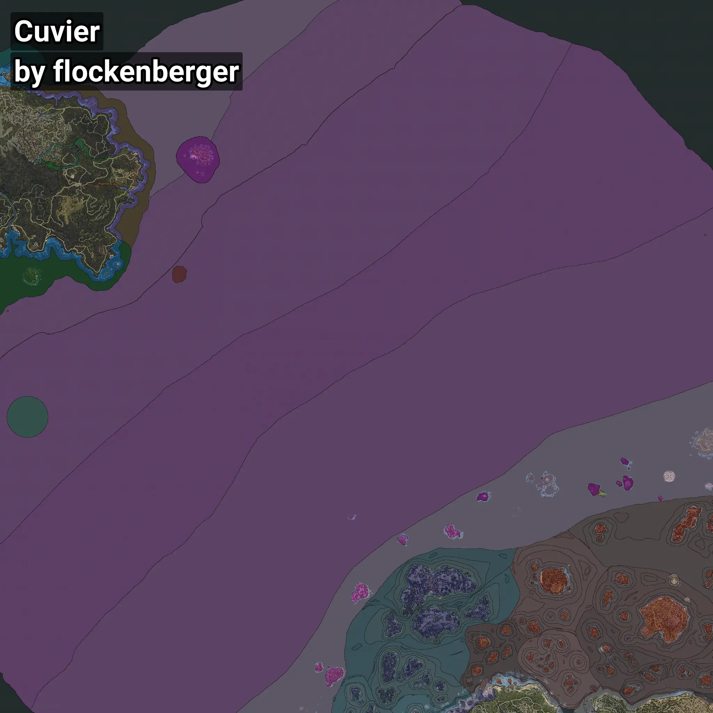

# Cuvier
```xml
<!--
    Waypoints for: Cuvier
    Created by: flockenberger
-->
<WorldmapBookMark>
    <BookMark BookMarkName="0: Cuvier" PosX="-105576.5" PosY="-8157.2715" PosZ="628927.44" />
    <BookMark BookMarkName="1: Cuvier" PosX="-105588.0" PosY="-8160.0" PosZ="628924.0" />
    <BookMark BookMarkName="2: Cuvier" PosX="-1277521.0" PosY="-7914.0" PosZ="995891.0" />
    <BookMark BookMarkName="3: Cuvier" PosX="-105566.0" PosY="-8157.0" PosZ="628967.0" />
    <BookMark BookMarkName="4: Cuvier" PosX="252339.33" PosY="-7256.35" PosZ="1162368.5" />
</WorldmapBookMark>
```

## ⚠️ Disclaimer
Waypoints are generated based on the __**character’s position**__ — __not__ where the fishing float landed.
Fish are determined by where your **float** lands!
In ocean spots especially, the direction you cast your rod can place your float in a **different fishing zone**, which may result in catching the wrong type of fish.
Please pay attention to the preview images showing where each location is in relation to the outlined zones.

- You can verify your float’s position using the guide [**HERE**](https://flockenberger.github.io/bdo-fish-position/)
- Or watch the video guide [**HERE**](https://youtu.be/t-VXcRoNojk)

## Previews
      