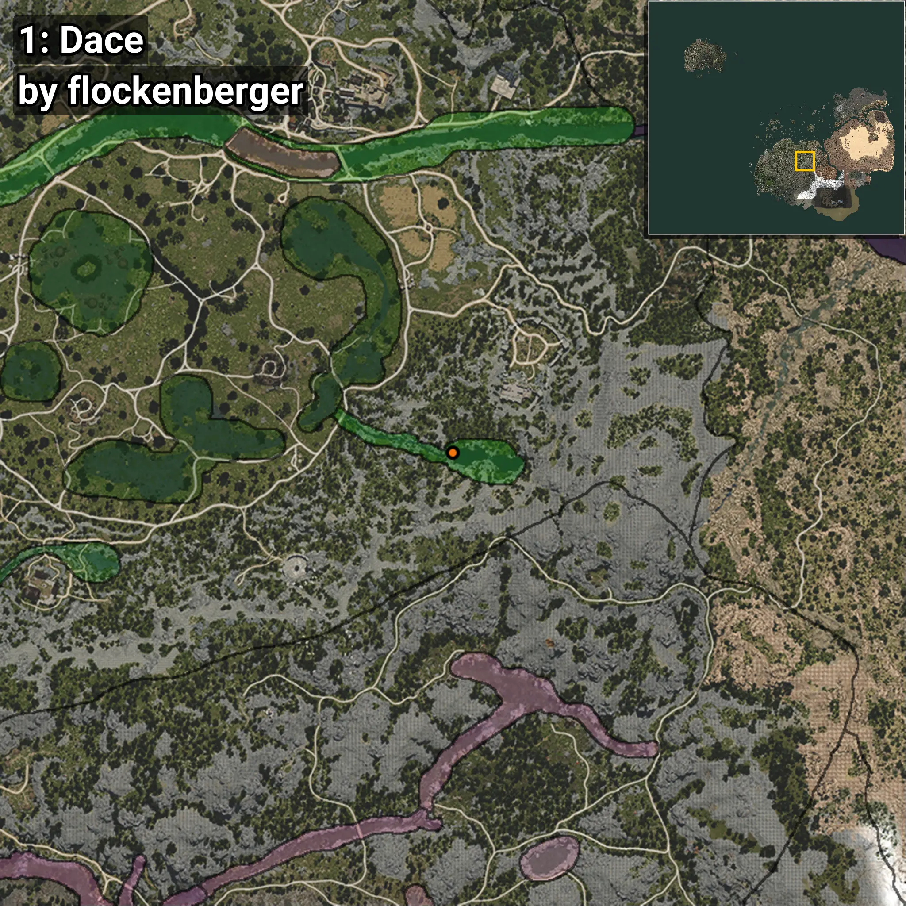
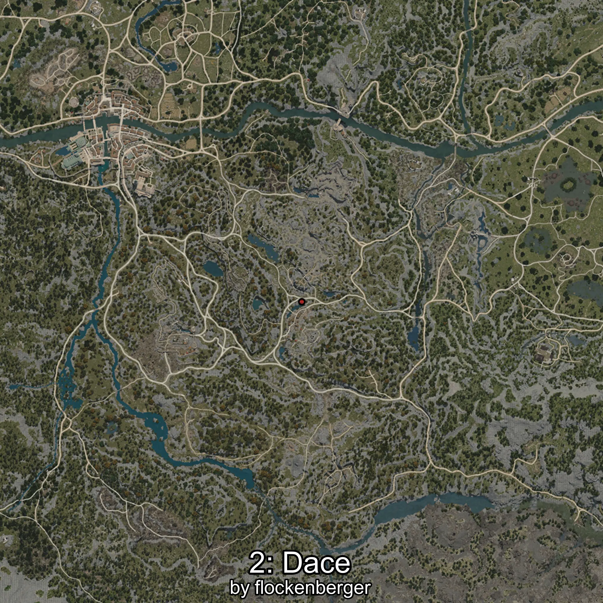
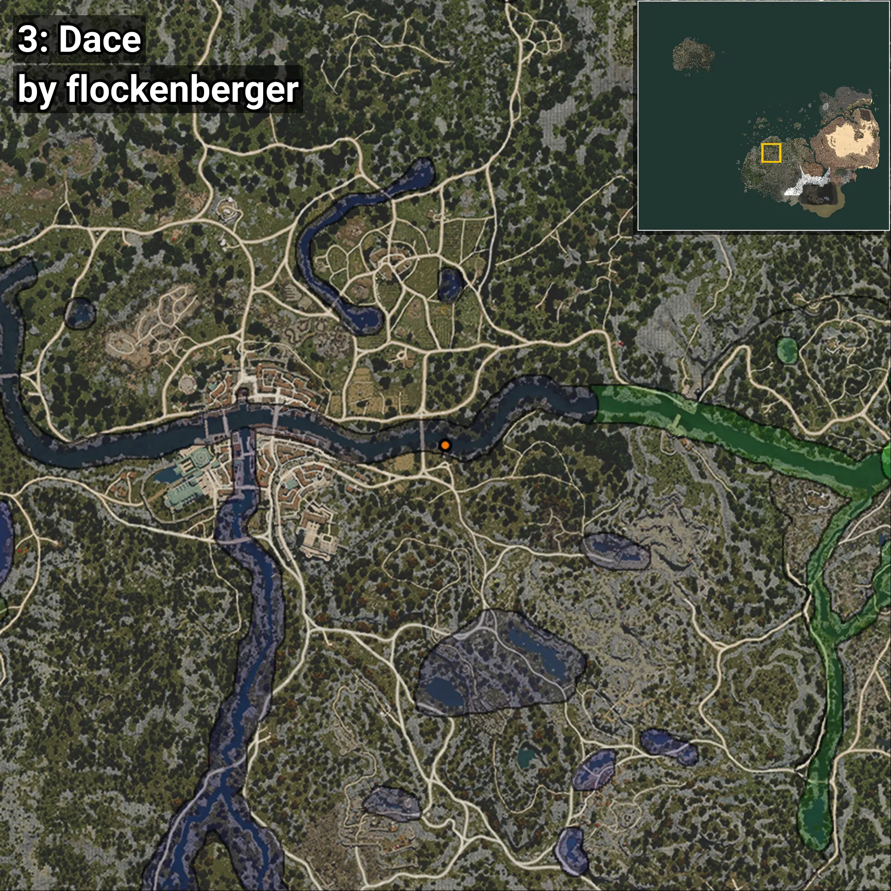
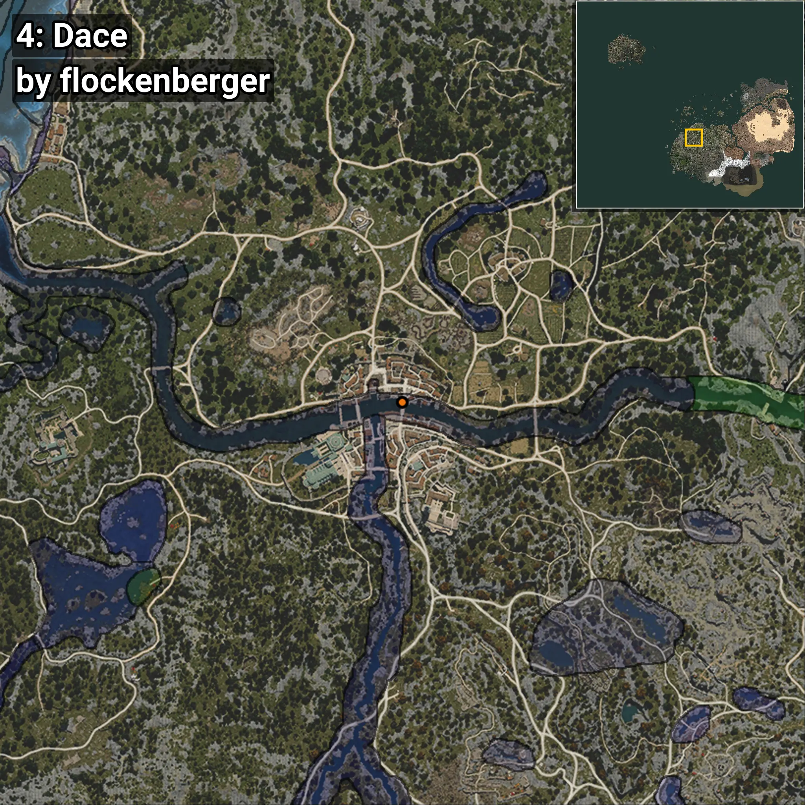

# Dace
```xml
<!--
    Waypoints for: Dace
    Created by: flockenberger
-->
<WorldmapBookMark>
    <BookMark BookMarkName="0: Dace" PosX="-10463.0" PosY="-33.0" PosZ="-162053.0" />
    <BookMark BookMarkName="1: Dace" PosX="82653.0" PosY="4653.0" PosZ="-132873.0" />
    <BookMark BookMarkName="2: Dace" PosX="-202303.0" PosY="-3437.0" PosZ="-56030.0" />
    <BookMark BookMarkName="3: Dace" PosX="-198552.16" PosY="-4061.08" PosZ="-57226.527" />
    <BookMark BookMarkName="4: Dace" PosX="-246009.0" PosY="-3814.0" PosZ="-48663.0" />
</WorldmapBookMark>
```

## ⚠️ Disclaimer
Waypoints are generated based on the __**character’s position**__ — __not__ where the fishing float landed.
Fish are determined by where your **float** lands!
In ocean spots especially, the direction you cast your rod can place your float in a **different fishing zone**, which may result in catching the wrong type of fish.
Please pay attention to the preview images showing where each location is in relation to the outlined zones.

- You can verify your float’s position using the guide [**HERE**](https://flockenberger.github.io/bdo-fish-position/)
- Or watch the video guide [**HERE**](https://youtu.be/t-VXcRoNojk)

## Previews
      