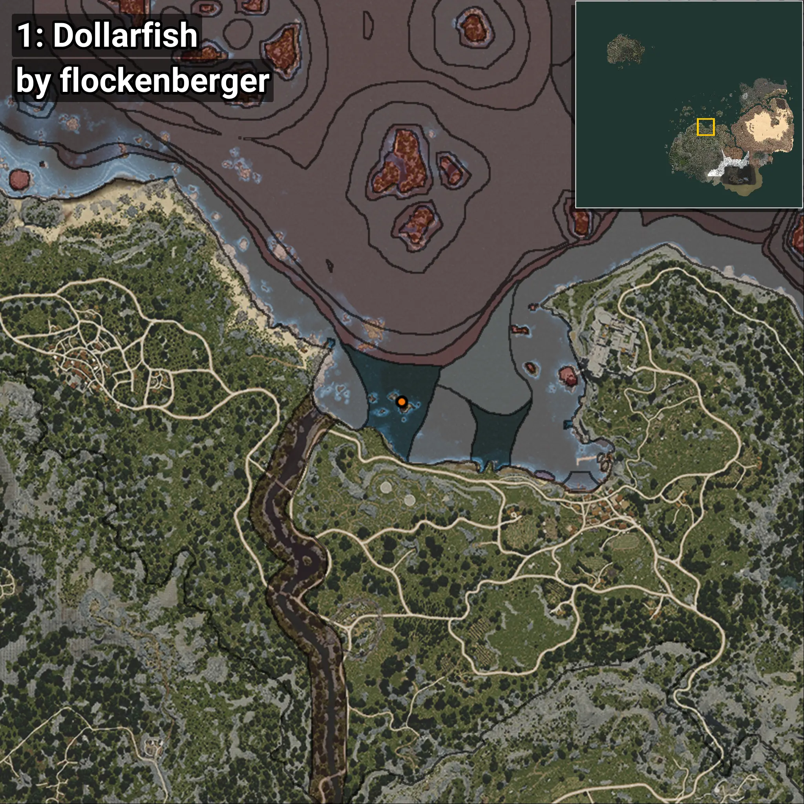
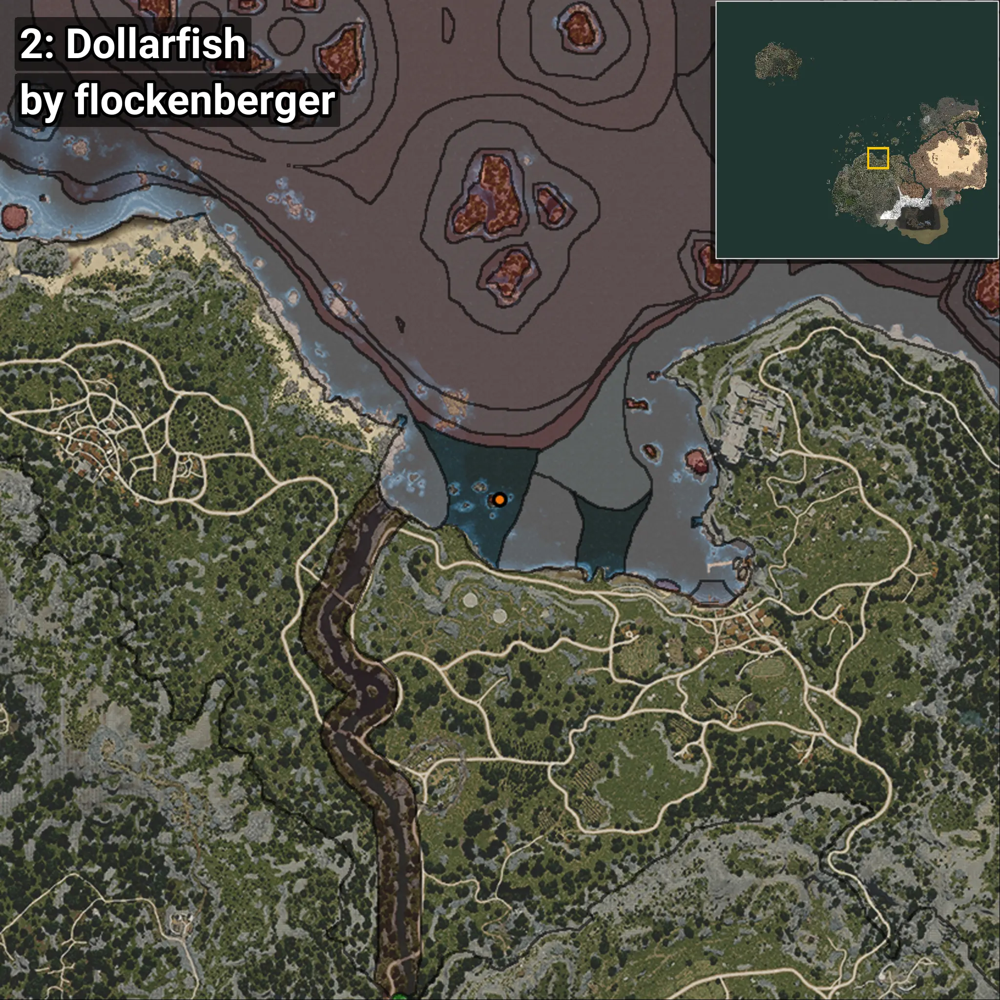
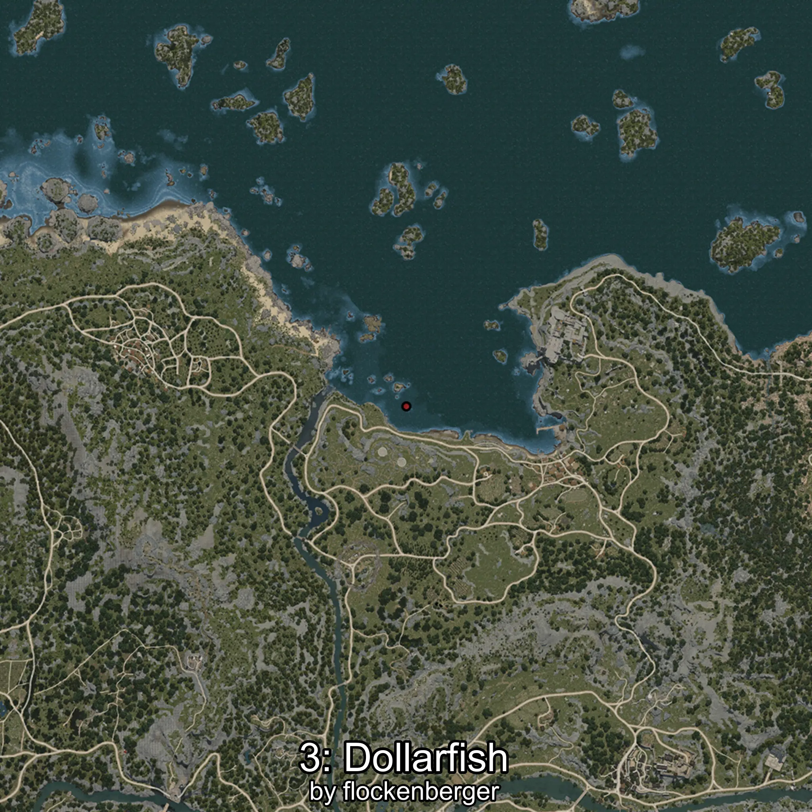
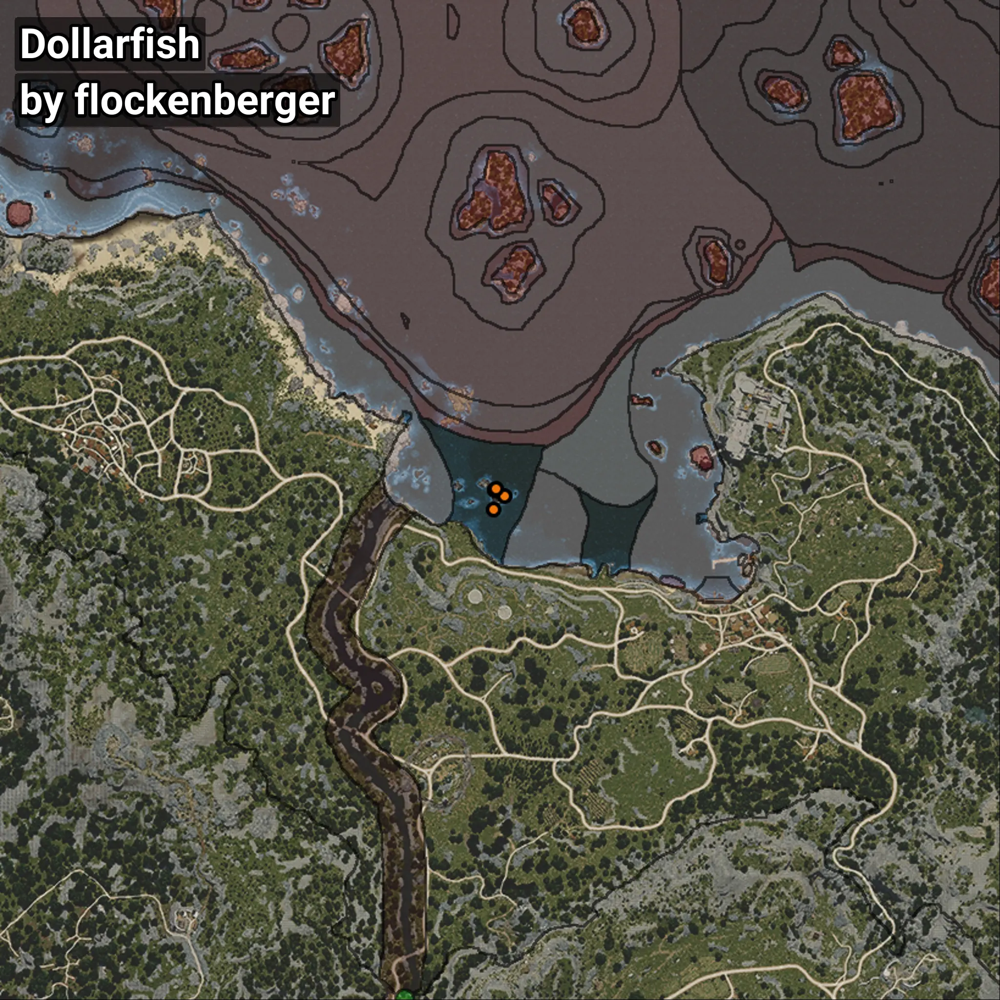

# Dollarfish
```xml
<!--
    Waypoints for: Dollarfish
    Created by: flockenberger
-->
<WorldmapBookMark>
    <BookMark BookMarkName="0: Dollarfish" PosX="-47528.0" PosY="-7994.0" PosZ="111093.0" />
    <BookMark BookMarkName="1: Dollarfish" PosX="-47454.0" PosY="-7992.0" PosZ="111006.0" />
    <BookMark BookMarkName="2: Dollarfish" PosX="-45054.19" PosY="-8205.76" PosZ="109421.01" />
    <BookMark BookMarkName="3: Dollarfish" PosX="-47220.305" PosY="-8042.707" PosZ="111175.48" />
    <BookMark BookMarkName="4: Dollarfish" PosX="-47838.0" PosY="-7948.0" PosZ="106015.0" />
</WorldmapBookMark>
```

## ⚠️ Disclaimer
Waypoints are generated based on the __**character’s position**__ — __not__ where the fishing float landed.
Fish are determined by where your **float** lands!
In ocean spots especially, the direction you cast your rod can place your float in a **different fishing zone**, which may result in catching the wrong type of fish.
Please pay attention to the preview images showing where each location is in relation to the outlined zones.

- You can verify your float’s position using the guide [**HERE**](https://flockenberger.github.io/bdo-fish-position/)
- Or watch the video guide [**HERE**](https://youtu.be/t-VXcRoNojk)

## Previews
      