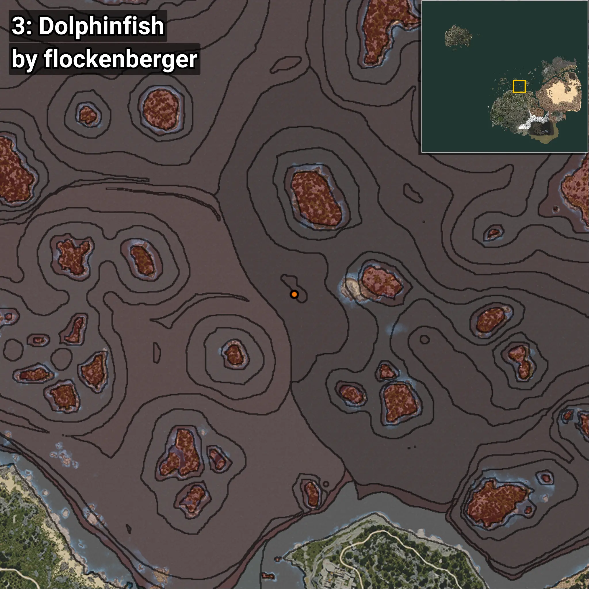
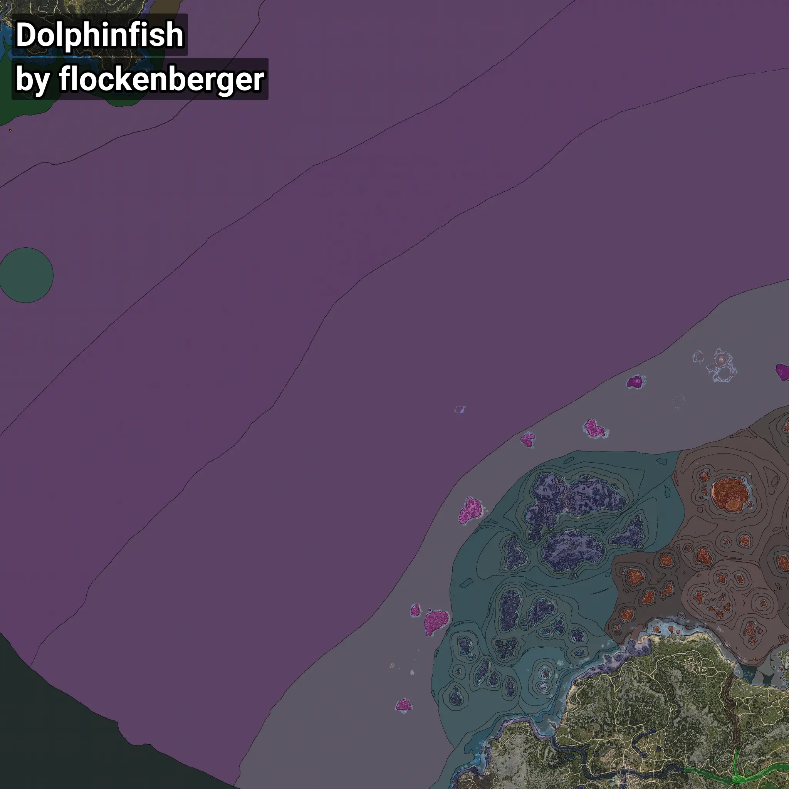

# Dolphinfish
```xml
<!--
    Waypoints for: Dolphinfish
    Created by: flockenberger
-->
<WorldmapBookMark>
    <BookMark BookMarkName="0: Dolphinfish" PosX="-6143.0" PosY="-7758.0" PosZ="247931.0" />
    <BookMark BookMarkName="1: Dolphinfish" PosX="-473.87637" PosY="-7628.6567" PosZ="251248.36" />
    <BookMark BookMarkName="2: Dolphinfish" PosX="-1259382.0" PosY="-7919.0" PosZ="1001019.0" />
    <BookMark BookMarkName="3: Dolphinfish" PosX="-296.6355" PosY="-7450.589" PosZ="251114.92" />
    <BookMark BookMarkName="4: Dolphinfish" PosX="-39622.625" PosY="-7910.08" PosZ="135124.72" />
</WorldmapBookMark>
```

## ⚠️ Disclaimer
Waypoints are generated based on the __**character’s position**__ — __not__ where the fishing float landed.
Fish are determined by where your **float** lands!
In ocean spots especially, the direction you cast your rod can place your float in a **different fishing zone**, which may result in catching the wrong type of fish.
Please pay attention to the preview images showing where each location is in relation to the outlined zones.

- You can verify your float’s position using the guide [**HERE**](https://flockenberger.github.io/bdo-fish-position/)
- Or watch the video guide [**HERE**](https://youtu.be/t-VXcRoNojk)

## Previews
      