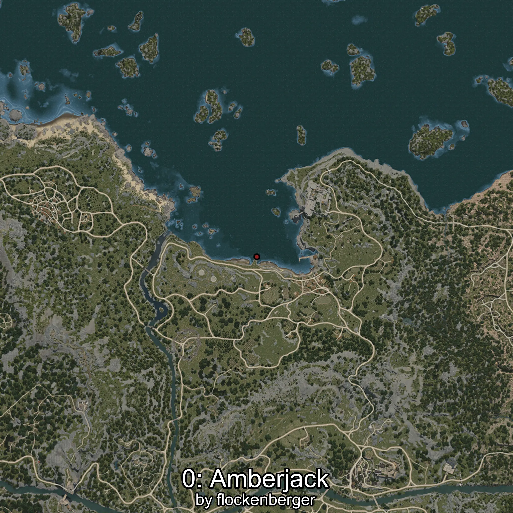

# Amberjack
Created by **flockenberger**

## ⚠️ Disclaimer:
Waypoints are generated based on your __**character’s position**__ — __not__ where your fishing float lands.
In ocean spots especially, the direction you cast your rod can place your float in a **different fishing zone**, which may result in catching the wrong type of fish.
This only happens in rare cases — when the position is right on the **edge of a zone** and you cast to the “wrong” side.

- To verify that your float you can use the guide [HERE](https://flockenberger.github.io/bdo-fish-position/)
- Or watch the guide [HERE](https://youtu.be/t-VXcRoNojk)

## Waypoints
```xml
<!--
    Waypoints for: Amberjack
    Created by: flockenberger
-->
<WorldmapBookMark>
    <BookMark BookMarkName="0: Amberjack" PosX="-19209.0" PosY="-8183.0" PosZ="94128.0" />
    <BookMark BookMarkName="1: Amberjack" PosX="-18695.0" PosY="-7884.0" PosZ="90237.0" />
    <BookMark BookMarkName="2: Amberjack" PosX="-16965.0" PosY="-8005.0" PosZ="91905.0" />
    <BookMark BookMarkName="3: Amberjack" PosX="-18845.0" PosY="-8128.0" PosZ="93531.0" />
    <BookMark BookMarkName="4: Amberjack" PosX="-18841.0" PosY="-8075.0" PosZ="93393.0" />
</WorldmapBookMark>
```

     