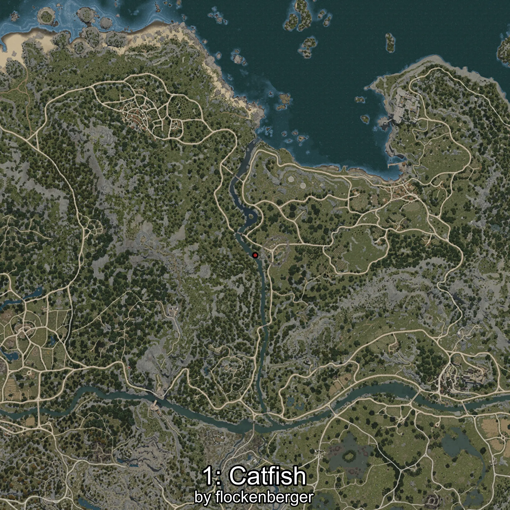

# Catfish
Created by **flockenberger**

## ⚠️ Disclaimer:
Waypoints are generated based on your __**character’s position**__ — __not__ where your fishing float lands.
In ocean spots especially, the direction you cast your rod can place your float in a **different fishing zone**, which may result in catching the wrong type of fish.
This only happens in rare cases — when the position is right on the **edge of a zone** and you cast to the “wrong” side.

- To verify that your float you can use the guide [HERE](https://flockenberger.github.io/bdo-fish-position/)
- Or watch the guide [HERE](https://youtu.be/t-VXcRoNojk)

## Waypoints
```xml
<!--
    Waypoints for: Catfish
    Created by: flockenberger
-->
<WorldmapBookMark>
    <BookMark BookMarkName="0: Catfish" PosX="-84887.0" PosY="-4703.0" PosZ="91696.0" />
    <BookMark BookMarkName="1: Catfish" PosX="-74047.0" PosY="-4383.0" PosZ="38827.0" />
    <BookMark BookMarkName="2: Catfish" PosX="-77355.0" PosY="-4597.0" PosZ="56912.0" />
    <BookMark BookMarkName="3: Catfish" PosX="-73808.0" PosY="-4449.0" PosZ="38025.0" />
    <BookMark BookMarkName="4: Catfish" PosX="-68516.0" PosY="-4383.0" PosZ="12033.0" />
</WorldmapBookMark>
```

     