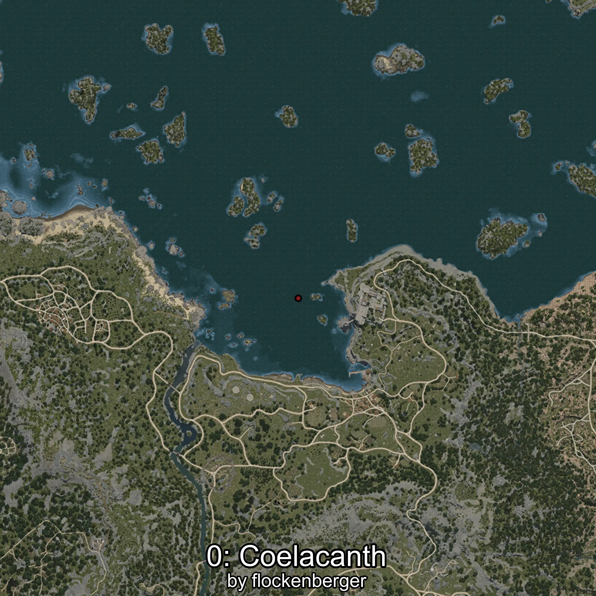

# Coelacanth
Created by **flockenberger**

## ⚠️ Disclaimer:
Waypoints are generated based on your __**character’s position**__ — __not__ where your fishing float lands.
In ocean spots especially, the direction you cast your rod can place your float in a **different fishing zone**, which may result in catching the wrong type of fish.
This only happens in rare cases — when the position is right on the **edge of a zone** and you cast to the “wrong” side.

- To verify that your float you can use the guide [HERE](https://flockenberger.github.io/bdo-fish-position/)
- Or watch the guide [HERE](https://youtu.be/t-VXcRoNojk)

## Waypoints
```xml
<!--
    Waypoints for: Coelacanth
    Created by: flockenberger
-->
<WorldmapBookMark>
    <BookMark BookMarkName="0: Coelacanth" PosX="-19961.0" PosY="-7672.0" PosZ="132023.0" />
    <BookMark BookMarkName="1: Coelacanth" PosX="-1745.0" PosY="-8193.0" PosZ="87827.0" />
    <BookMark BookMarkName="2: Coelacanth" PosX="-2853.0" PosY="-8203.0" PosZ="88012.0" />
    <BookMark BookMarkName="3: Coelacanth" PosX="-3628.2273" PosY="-8179.679" PosZ="87974.67" />
    <BookMark BookMarkName="4: Coelacanth" PosX="-2651.0" PosY="-8146.0" PosZ="87768.0" />
</WorldmapBookMark>
```

     