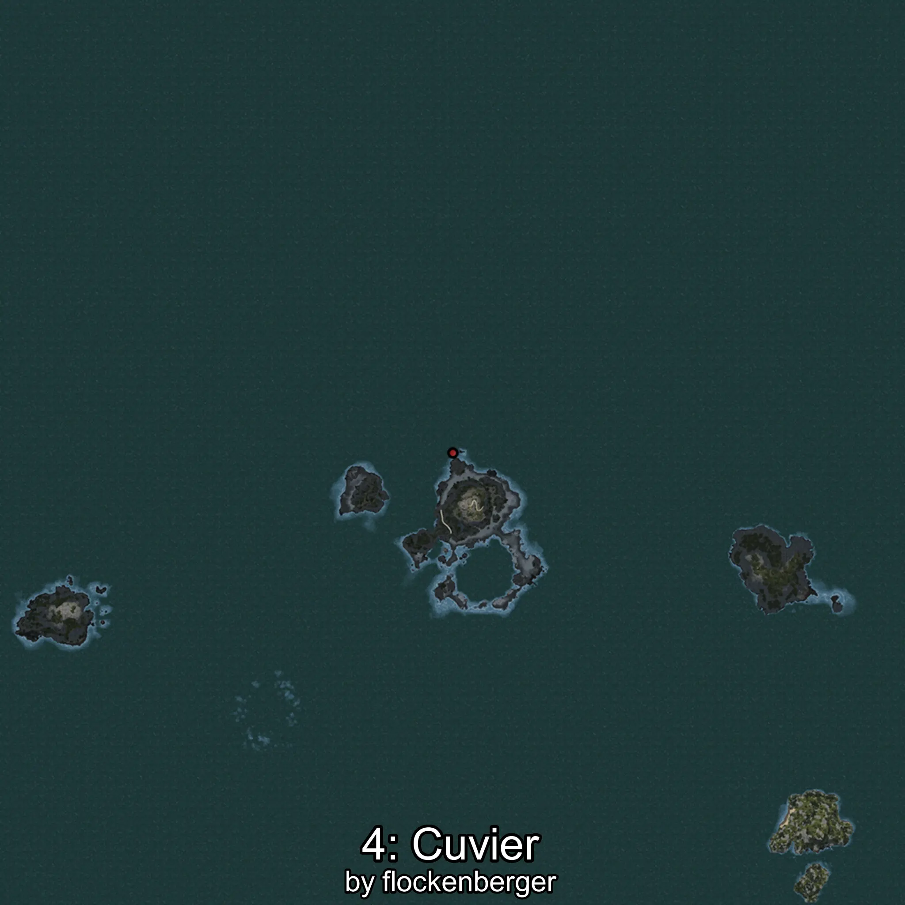

# Cuvier
Created by **flockenberger**

## ⚠️ Disclaimer:
Waypoints are generated based on your __**character’s position**__ — __not__ where your fishing float lands.
In ocean spots especially, the direction you cast your rod can place your float in a **different fishing zone**, which may result in catching the wrong type of fish.
This only happens in rare cases — when the position is right on the **edge of a zone** and you cast to the “wrong” side.

- To verify that your float you can use the guide [HERE](https://flockenberger.github.io/bdo-fish-position/)
- Or watch the guide [HERE](https://youtu.be/t-VXcRoNojk)

## Waypoints
```xml
<!--
    Waypoints for: Cuvier
    Created by: flockenberger
-->
<WorldmapBookMark>
    <BookMark BookMarkName="0: Cuvier" PosX="-104134.0" PosY="-7903.0" PosZ="637814.0" />
    <BookMark BookMarkName="1: Cuvier" PosX="-106503.0" PosY="-8093.0" PosZ="631702.0" />
    <BookMark BookMarkName="2: Cuvier" PosX="-106562.0" PosY="-7963.0" PosZ="626781.0" />
    <BookMark BookMarkName="3: Cuvier" PosX="-1195684.0" PosY="-7271.0" PosZ="758081.0" />
    <BookMark BookMarkName="4: Cuvier" PosX="-100503.055" PosY="-8139.8193" PosZ="643567.5" />
</WorldmapBookMark>
```

     