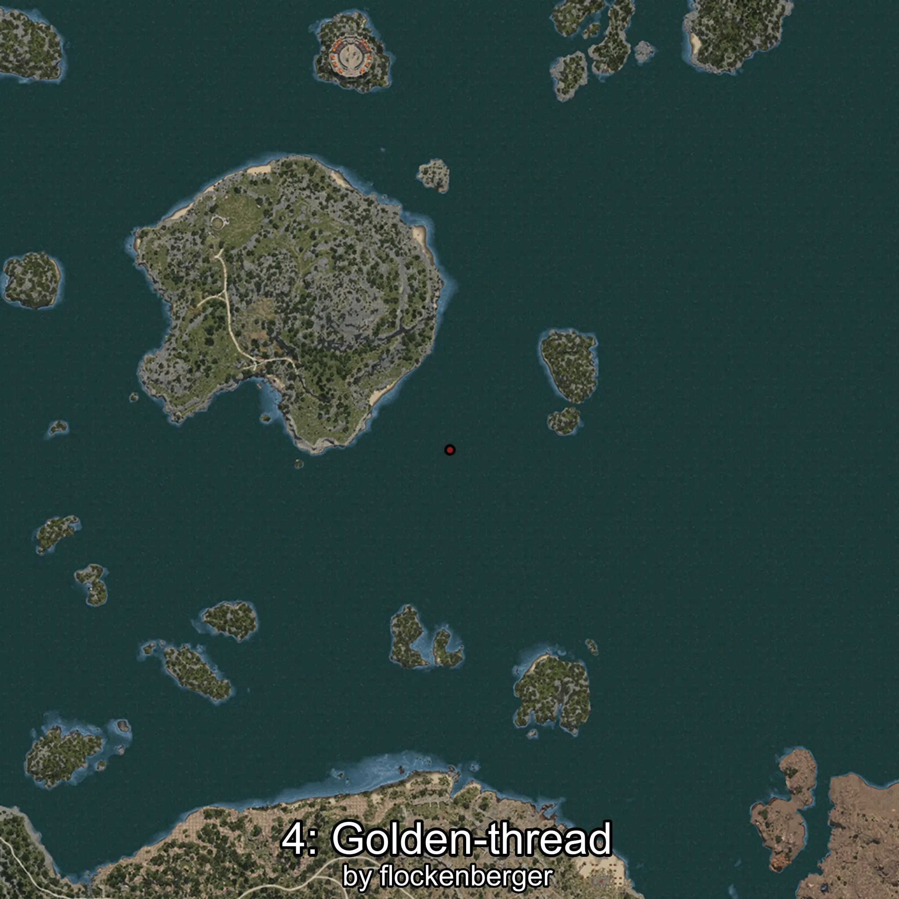

# Golden-thread
Created by **flockenberger**

## ⚠️ Disclaimer:
Waypoints are generated based on your __**character’s position**__ — __not__ where your fishing float lands.
In ocean spots especially, the direction you cast your rod can place your float in a **different fishing zone**, which may result in catching the wrong type of fish.
This only happens in rare cases — when the position is right on the **edge of a zone** and you cast to the “wrong” side.

- To verify that your float you can use the guide [HERE](https://flockenberger.github.io/bdo-fish-position/)
- Or watch the guide [HERE](https://youtu.be/t-VXcRoNojk)

## Waypoints
```xml
<!--
    Waypoints for: Golden-thread
    Created by: flockenberger
-->
<WorldmapBookMark>
    <BookMark BookMarkName="0: Golden-thread" PosX="275033.53" PosY="-7590.72" PosZ="311932.28" />
    <BookMark BookMarkName="1: Golden-thread" PosX="87346.0" PosY="-7677.0" PosZ="373329.0" />
    <BookMark BookMarkName="2: Golden-thread" PosX="151902.0" PosY="-8001.0" PosZ="291980.0" />
    <BookMark BookMarkName="3: Golden-thread" PosX="218809.0" PosY="-7599.0" PosZ="270449.0" />
    <BookMark BookMarkName="4: Golden-thread" PosX="217830.77" PosY="-7805.885" PosZ="268557.2" />
</WorldmapBookMark>
```

     