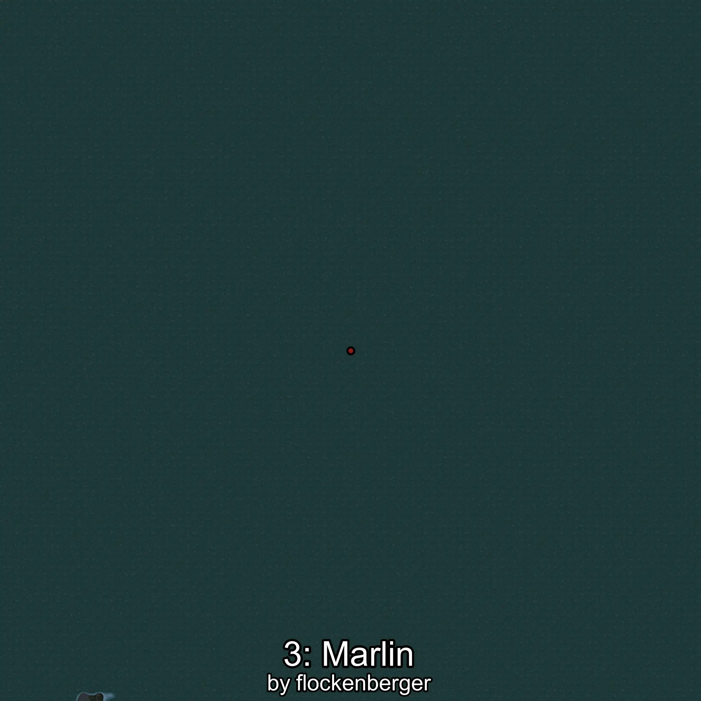

# Marlin
Created by **flockenberger**

## ⚠️ Disclaimer:
Waypoints are generated based on your __**character’s position**__ — __not__ where your fishing float lands.
In ocean spots especially, the direction you cast your rod can place your float in a **different fishing zone**, which may result in catching the wrong type of fish.
This only happens in rare cases — when the position is right on the **edge of a zone** and you cast to the “wrong” side.

- To verify that your float you can use the guide [HERE](https://flockenberger.github.io/bdo-fish-position/)
- Or watch the guide [HERE](https://youtu.be/t-VXcRoNojk)

## Waypoints
```xml
<!--
    Waypoints for: Marlin
    Created by: flockenberger
-->
<WorldmapBookMark>
    <BookMark BookMarkName="0: Marlin" PosX="-161633.0" PosY="-7569.0" PosZ="734331.0" />
    <BookMark BookMarkName="1: Marlin" PosX="1427758.0" PosY="-7664.0" PosZ="223479.0" />
    <BookMark BookMarkName="2: Marlin" PosX="401956.0" PosY="-7650.0" PosZ="257963.0" />
    <BookMark BookMarkName="3: Marlin" PosX="-408232.0" PosY="-7562.0" PosZ="699510.0" />
    <BookMark BookMarkName="4: Marlin" PosX="-688211.0" PosY="-7536.0" PosZ="784976.0" />
</WorldmapBookMark>
```

     