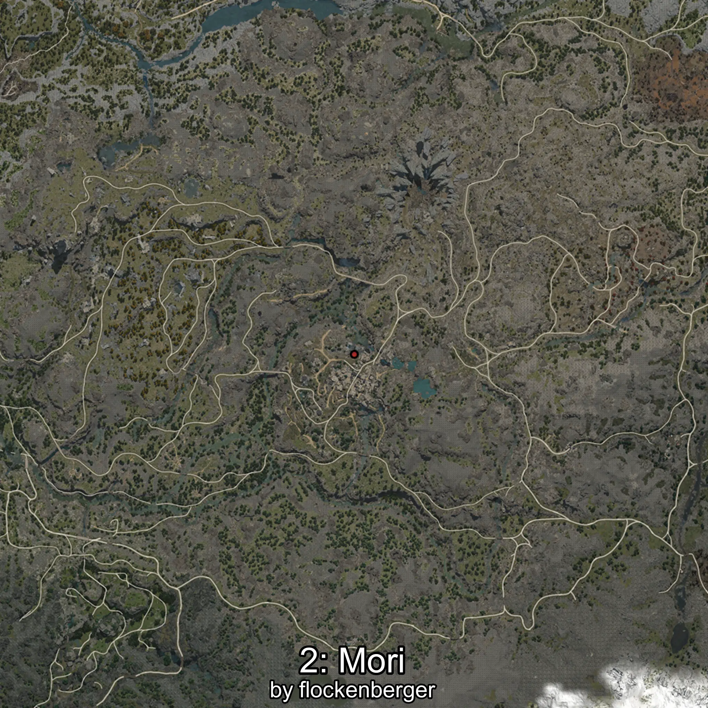

# Mori
Created by **flockenberger**

## ⚠️ Disclaimer:
Waypoints are generated based on your __**character’s position**__ — __not__ where your fishing float lands.
In ocean spots especially, the direction you cast your rod can place your float in a **different fishing zone**, which may result in catching the wrong type of fish.
This only happens in rare cases — when the position is right on the **edge of a zone** and you cast to the “wrong” side.

- To verify that your float you can use the guide [HERE](https://flockenberger.github.io/bdo-fish-position/)
- Or watch the guide [HERE](https://youtu.be/t-VXcRoNojk)

## Waypoints
```xml
<!--
    Waypoints for: Mori
    Created by: flockenberger
-->
<WorldmapBookMark>
    <BookMark BookMarkName="0: Mori" PosX="-1488228.6" PosY="11180.331" PosZ="1332563.1" />
    <BookMark BookMarkName="1: Mori" PosX="-1396190.0" PosY="12919.0" PosZ="1350621.0" />
    <BookMark BookMarkName="2: Mori" PosX="-49974.0" PosY="19852.0" PosZ="-396424.0" />
    <BookMark BookMarkName="3: Mori" PosX="-1488744.0" PosY="11171.0" PosZ="1332313.0" />
    <BookMark BookMarkName="4: Mori" PosX="-1487945.0" PosY="11180.0" PosZ="1332490.0" />
</WorldmapBookMark>
```

     