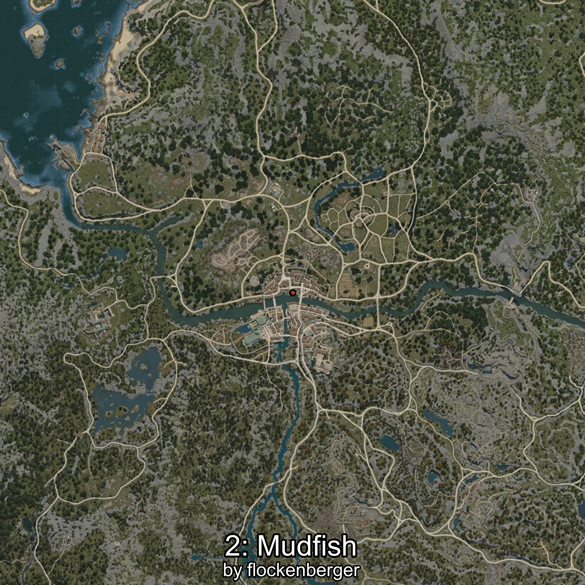
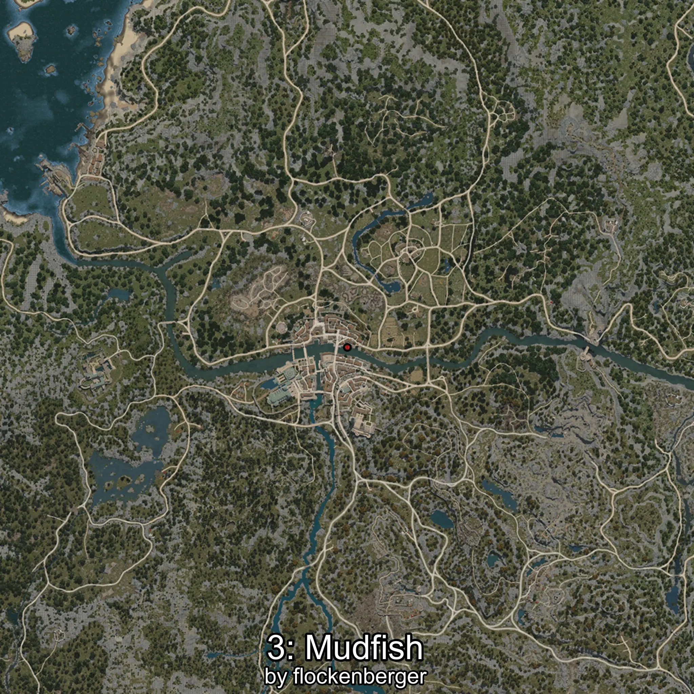

# Mudfish
Created by **flockenberger**

## ⚠️ Disclaimer:
Waypoints are generated based on your __**character’s position**__ — __not__ where your fishing float lands.
In ocean spots especially, the direction you cast your rod can place your float in a **different fishing zone**, which may result in catching the wrong type of fish.
This only happens in rare cases — when the position is right on the **edge of a zone** and you cast to the “wrong” side.

- To verify that your float you can use the guide [HERE](https://flockenberger.github.io/bdo-fish-position/)
- Or watch the guide [HERE](https://youtu.be/t-VXcRoNojk)

## Waypoints
```xml
<!--
    Waypoints for: Mudfish
    Created by: flockenberger
-->
<WorldmapBookMark>
    <BookMark BookMarkName="0: Mudfish" PosX="-381838.0" PosY="9828.0" PosZ="-225052.0" />
    <BookMark BookMarkName="1: Mudfish" PosX="-249698.0" PosY="-3939.0" PosZ="-46982.0" />
    <BookMark BookMarkName="2: Mudfish" PosX="-249925.05" PosY="-3939.9097" PosZ="-46653.977" />
    <BookMark BookMarkName="3: Mudfish" PosX="-240853.0" PosY="-3841.0" PosZ="-49294.0" />
    <BookMark BookMarkName="4: Mudfish" PosX="-249796.0" PosY="-4059.0" PosZ="-47187.0" />
</WorldmapBookMark>
```

     