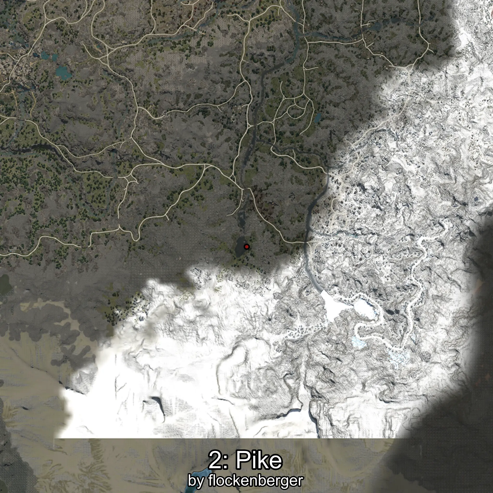

# Pike
Created by **flockenberger**

## ⚠️ Disclaimer:
Waypoints are generated based on your __**character’s position**__ — __not__ where your fishing float lands.
In ocean spots especially, the direction you cast your rod can place your float in a **different fishing zone**, which may result in catching the wrong type of fish.
This only happens in rare cases — when the position is right on the **edge of a zone** and you cast to the “wrong” side.

- To verify that your float you can use the guide [HERE](https://flockenberger.github.io/bdo-fish-position/)
- Or watch the guide [HERE](https://youtu.be/t-VXcRoNojk)

## Waypoints
```xml
<!--
    Waypoints for: Pike
    Created by: flockenberger
-->
<WorldmapBookMark>
    <BookMark BookMarkName="0: Pike" PosX="95236.0" PosY="21693.0" PosZ="-518792.0" />
    <BookMark BookMarkName="1: Pike" PosX="88574.0" PosY="21751.0" PosZ="-518309.0" />
    <BookMark BookMarkName="2: Pike" PosX="95354.0" PosY="21779.0" PosZ="-519880.0" />
    <BookMark BookMarkName="3: Pike" PosX="95134.0" PosY="21731.0" PosZ="-516761.0" />
    <BookMark BookMarkName="4: Pike" PosX="93074.0" PosY="21675.0" PosZ="-523564.0" />
</WorldmapBookMark>
```

     