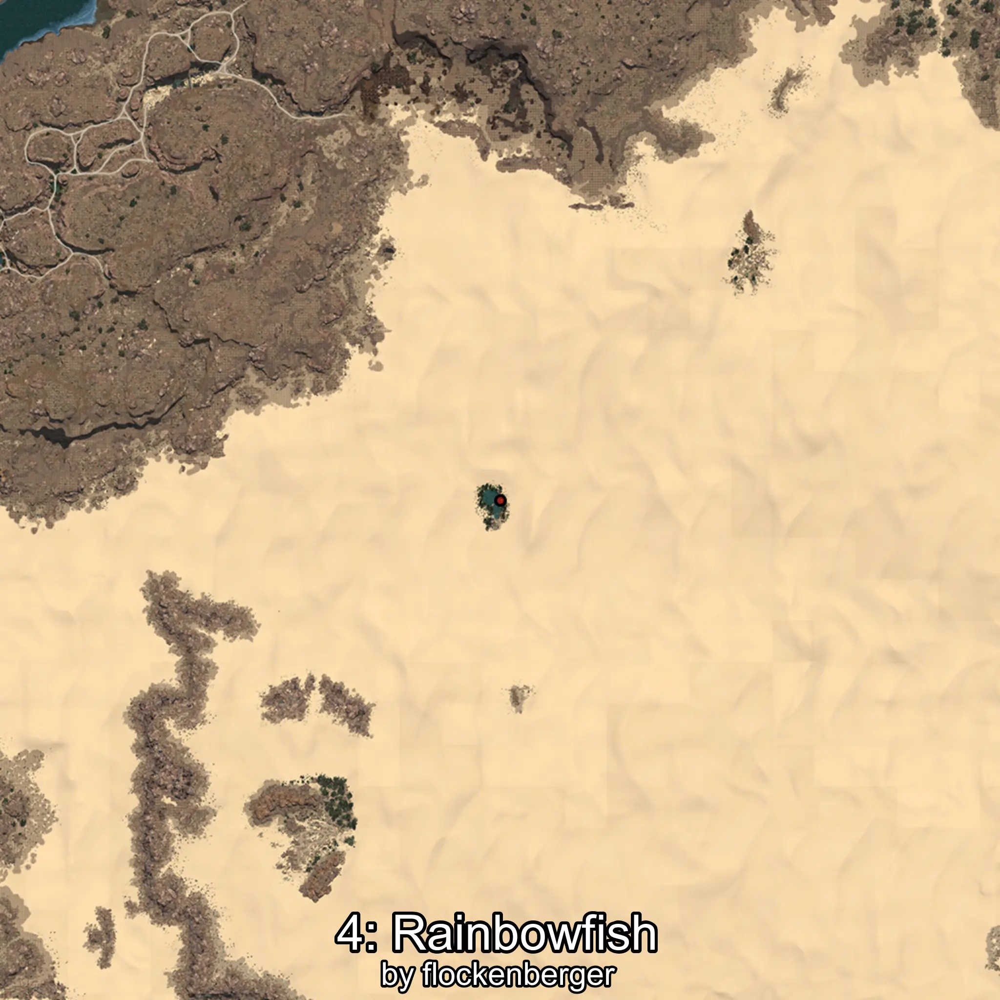

# Rainbowfish
Created by **flockenberger**

## ⚠️ Disclaimer:
Waypoints are generated based on your __**character’s position**__ — __not__ where your fishing float lands.
In ocean spots especially, the direction you cast your rod can place your float in a **different fishing zone**, which may result in catching the wrong type of fish.
This only happens in rare cases — when the position is right on the **edge of a zone** and you cast to the “wrong” side.

- To verify that your float you can use the guide [HERE](https://flockenberger.github.io/bdo-fish-position/)
- Or watch the guide [HERE](https://youtu.be/t-VXcRoNojk)

## Waypoints
```xml
<!--
    Waypoints for: Rainbowfish
    Created by: flockenberger
-->
<WorldmapBookMark>
    <BookMark BookMarkName="0: Rainbowfish" PosX="732938.0" PosY="3396.0" PosZ="202311.0" />
    <BookMark BookMarkName="1: Rainbowfish" PosX="732856.0" PosY="3413.0" PosZ="202291.0" />
    <BookMark BookMarkName="2: Rainbowfish" PosX="735129.0" PosY="3337.0" PosZ="201777.0" />
    <BookMark BookMarkName="3: Rainbowfish" PosX="732810.0" PosY="3353.0" PosZ="200156.0" />
    <BookMark BookMarkName="4: Rainbowfish" PosX="735110.0" PosY="3280.0" PosZ="202820.0" />
</WorldmapBookMark>
```

     