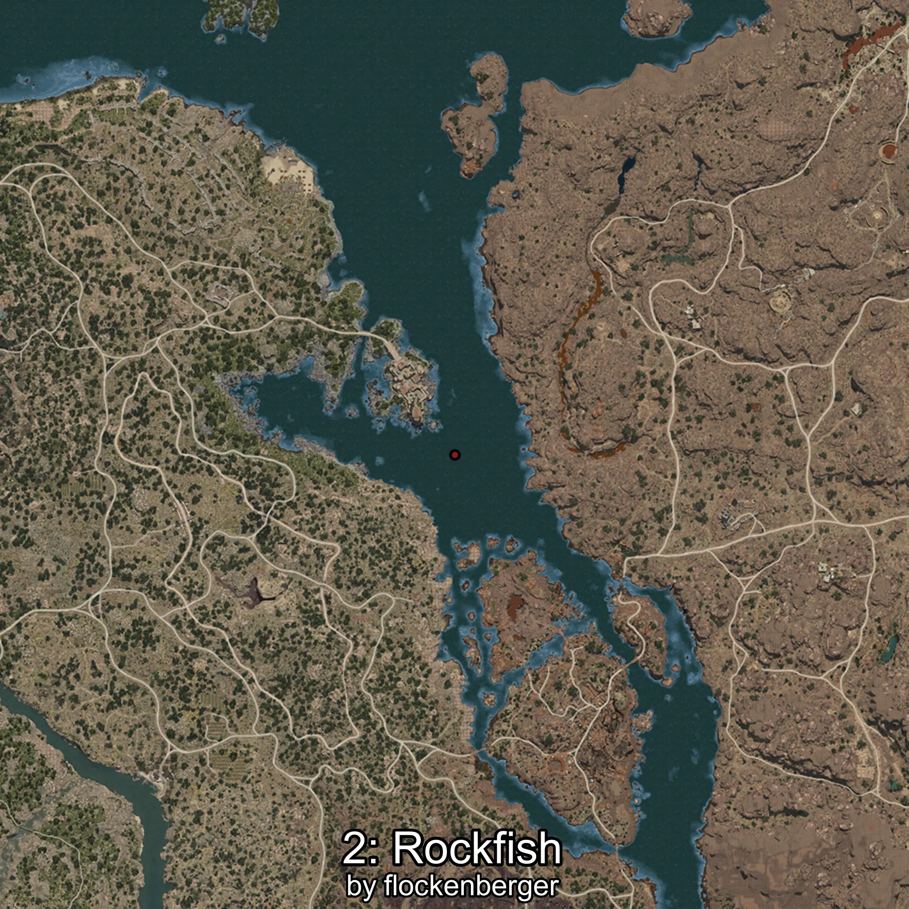
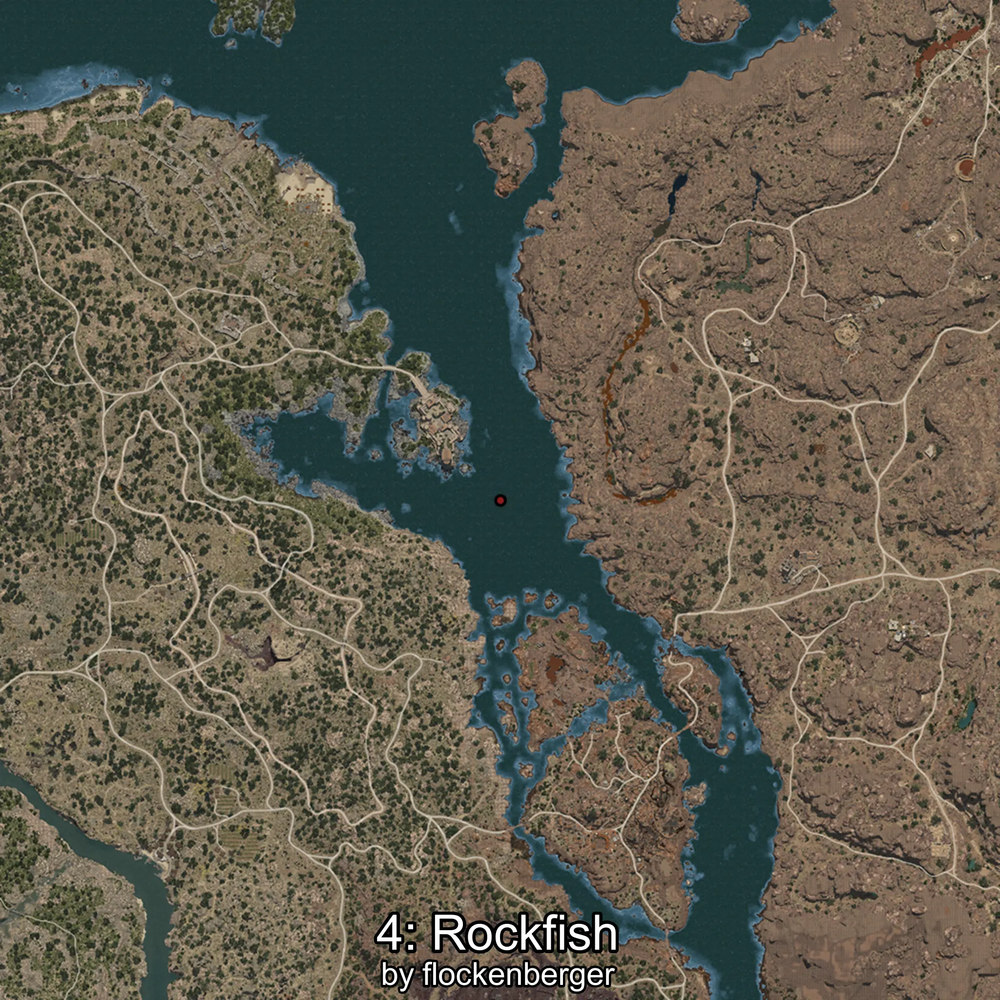

# Rockfish
Created by **flockenberger**

## ⚠️ Disclaimer:
Waypoints are generated based on your __**character’s position**__ — __not__ where your fishing float lands.
In ocean spots especially, the direction you cast your rod can place your float in a **different fishing zone**, which may result in catching the wrong type of fish.
This only happens in rare cases — when the position is right on the **edge of a zone** and you cast to the “wrong” side.

- To verify that your float you can use the guide [HERE](https://flockenberger.github.io/bdo-fish-position/)
- Or watch the guide [HERE](https://youtu.be/t-VXcRoNojk)

## Waypoints
```xml
<!--
    Waypoints for: Rockfish
    Created by: flockenberger
-->
<WorldmapBookMark>
    <BookMark BookMarkName="0: Rockfish" PosX="336702.0" PosY="-8303.0" PosZ="-60476.0" />
    <BookMark BookMarkName="1: Rockfish" PosX="398263.0" PosY="-7594.0" PosZ="-61620.0" />
    <BookMark BookMarkName="2: Rockfish" PosX="325685.0" PosY="-7903.0" PosZ="29939.0" />
    <BookMark BookMarkName="3: Rockfish" PosX="369780.0" PosY="-8201.0" PosZ="-24009.0" />
    <BookMark BookMarkName="4: Rockfish" PosX="329191.0" PosY="-7732.0" PosZ="30169.0" />
</WorldmapBookMark>
```

     