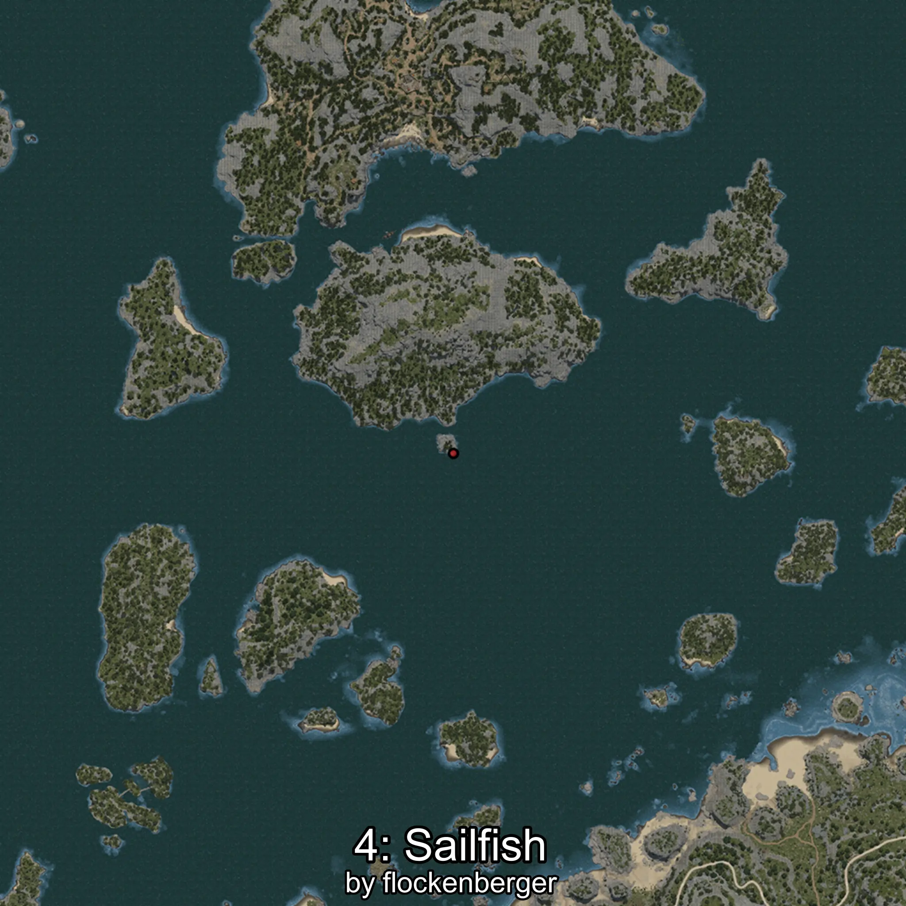

# Sailfish
Created by **flockenberger**

## ⚠️ Disclaimer:
Waypoints are generated based on your __**character’s position**__ — __not__ where your fishing float lands.
In ocean spots especially, the direction you cast your rod can place your float in a **different fishing zone**, which may result in catching the wrong type of fish.
This only happens in rare cases — when the position is right on the **edge of a zone** and you cast to the “wrong” side.

- To verify that your float you can use the guide [HERE](https://flockenberger.github.io/bdo-fish-position/)
- Or watch the guide [HERE](https://youtu.be/t-VXcRoNojk)

## Waypoints
```xml
<!--
    Waypoints for: Sailfish
    Created by: flockenberger
-->
<WorldmapBookMark>
    <BookMark BookMarkName="0: Sailfish" PosX="-688051.0" PosY="-7407.0" PosZ="784899.0" />
    <BookMark BookMarkName="1: Sailfish" PosX="-1270986.0" PosY="-7099.0" PosZ="950440.0" />
    <BookMark BookMarkName="2: Sailfish" PosX="-413316.0" PosY="-8105.0" PosZ="953078.0" />
    <BookMark BookMarkName="3: Sailfish" PosX="-1297640.0" PosY="-7630.0" PosZ="945436.0" />
    <BookMark BookMarkName="4: Sailfish" PosX="-334437.0" PosY="-7911.0" PosZ="269833.0" />
</WorldmapBookMark>
```

     