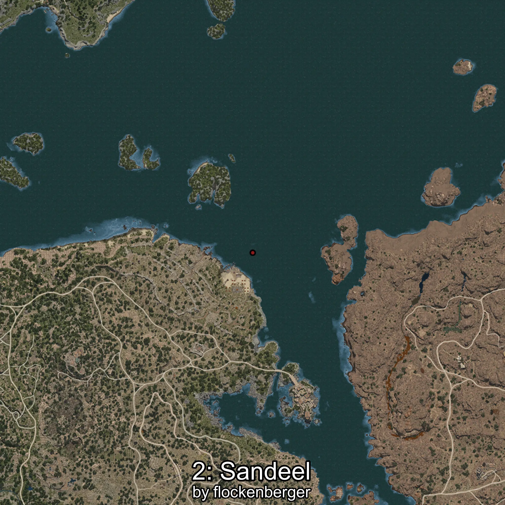

# Sandeel
Created by **flockenberger**

## ⚠️ Disclaimer:
Waypoints are generated based on your __**character’s position**__ — __not__ where your fishing float lands.
In ocean spots especially, the direction you cast your rod can place your float in a **different fishing zone**, which may result in catching the wrong type of fish.
This only happens in rare cases — when the position is right on the **edge of a zone** and you cast to the “wrong” side.

- To verify that your float you can use the guide [HERE](https://flockenberger.github.io/bdo-fish-position/)
- Or watch the guide [HERE](https://youtu.be/t-VXcRoNojk)

## Waypoints
```xml
<!--
    Waypoints for: Sandeel
    Created by: flockenberger
-->
<WorldmapBookMark>
    <BookMark BookMarkName="0: Sandeel" PosX="71181.0" PosY="1851.0" PosZ="57814.0" />
    <BookMark BookMarkName="1: Sandeel" PosX="995.0" PosY="-8106.0" PosZ="87109.0" />
    <BookMark BookMarkName="2: Sandeel" PosX="279197.0" PosY="-7844.0" PosZ="143325.0" />
    <BookMark BookMarkName="3: Sandeel" PosX="-261.0" PosY="-8237.0" PosZ="87410.0" />
    <BookMark BookMarkName="4: Sandeel" PosX="-214772.0" PosY="-8231.0" PosZ="174704.0" />
</WorldmapBookMark>
```

     