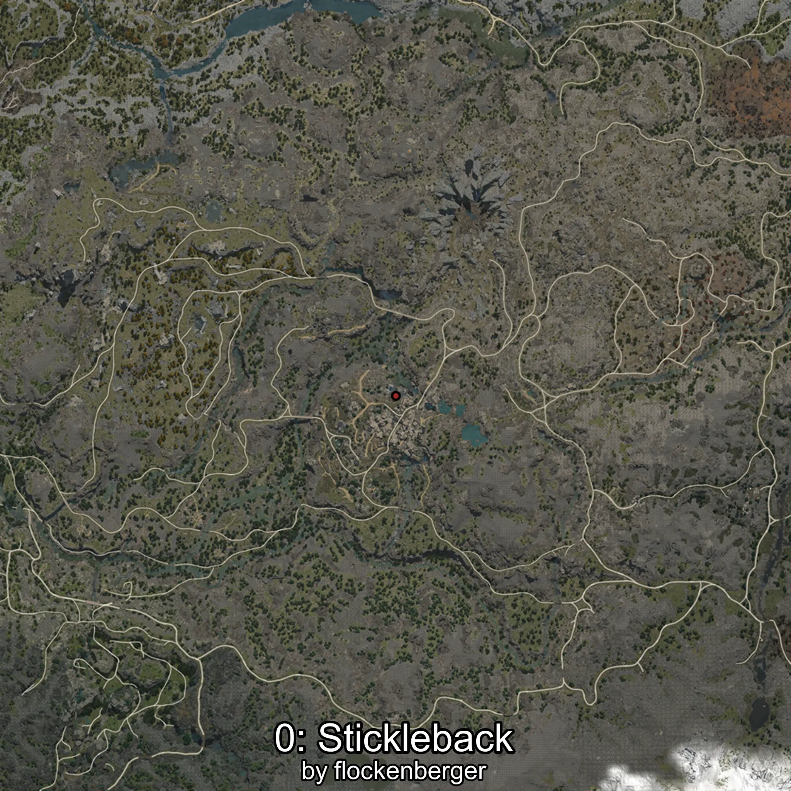

# Stickleback
Created by **flockenberger**

## ⚠️ Disclaimer:
Waypoints are generated based on your __**character’s position**__ — __not__ where your fishing float lands.
In ocean spots especially, the direction you cast your rod can place your float in a **different fishing zone**, which may result in catching the wrong type of fish.
This only happens in rare cases — when the position is right on the **edge of a zone** and you cast to the “wrong” side.

- To verify that your float you can use the guide [HERE](https://flockenberger.github.io/bdo-fish-position/)
- Or watch the guide [HERE](https://youtu.be/t-VXcRoNojk)

## Waypoints
```xml
<!--
    Waypoints for: Stickleback
    Created by: flockenberger
-->
<WorldmapBookMark>
    <BookMark BookMarkName="0: Stickleback" PosX="-49885.0" PosY="19746.0" PosZ="-395959.0" />
    <BookMark BookMarkName="1: Stickleback" PosX="-51472.547" PosY="19832.459" PosZ="-396178.06" />
    <BookMark BookMarkName="2: Stickleback" PosX="-50160.0" PosY="20264.0" PosZ="-396694.0" />
    <BookMark BookMarkName="3: Stickleback" PosX="-51178.0" PosY="20058.0" PosZ="-396562.0" />
    <BookMark BookMarkName="4: Stickleback" PosX="-51456.0" PosY="19835.0" PosZ="-396166.0" />
</WorldmapBookMark>
```

     