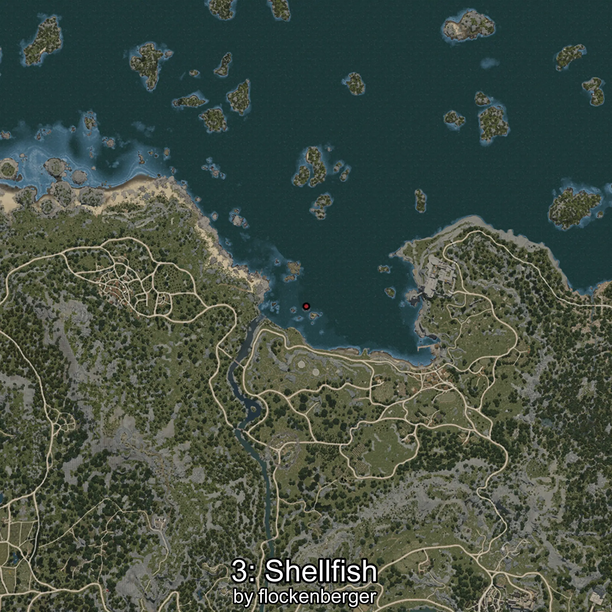
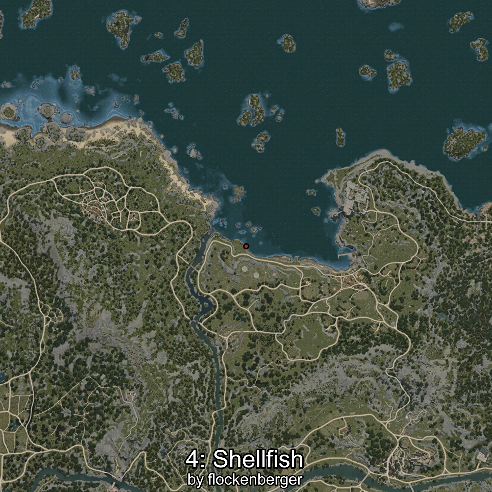

# Almeja
Created by **flockenberger**

## ⚠️ Disclaimer:
Waypoints are generated based on your __**character’s position**__ — __not__ where your fishing float lands.
In ocean spots especially, the direction you cast your rod can place your float in a **different fishing zone**, which may result in catching the wrong type of fish.
This only happens in rare cases — when the position is right on the **edge of a zone** and you cast to the “wrong” side.

- To verify that your float you can use the guide [HERE](https://flockenberger.github.io/bdo-fish-position/)
- Or watch the guide [HERE](https://youtu.be/t-VXcRoNojk)

## Waypoints
```xml
<!--
    Waypoints for: Almeja
    Created by: flockenberger
-->
<WorldmapBookMark>
    <BookMark BookMarkName="0: Almeja" PosX="-51226.0" PosY="-8164.0" PosZ="99003.0" />
    <BookMark BookMarkName="1: Almeja" PosX="-42725.0" PosY="-8096.0" PosZ="110946.0" />
    <BookMark BookMarkName="2: Almeja" PosX="-977691.0" PosY="-7678.0" PosZ="1383843.0" />
    <BookMark BookMarkName="3: Almeja" PosX="-49934.0" PosY="-8172.0" PosZ="114049.0" />
    <BookMark BookMarkName="4: Almeja" PosX="-51264.0" PosY="-8126.0" PosZ="98904.0" />
</WorldmapBookMark>
```

     