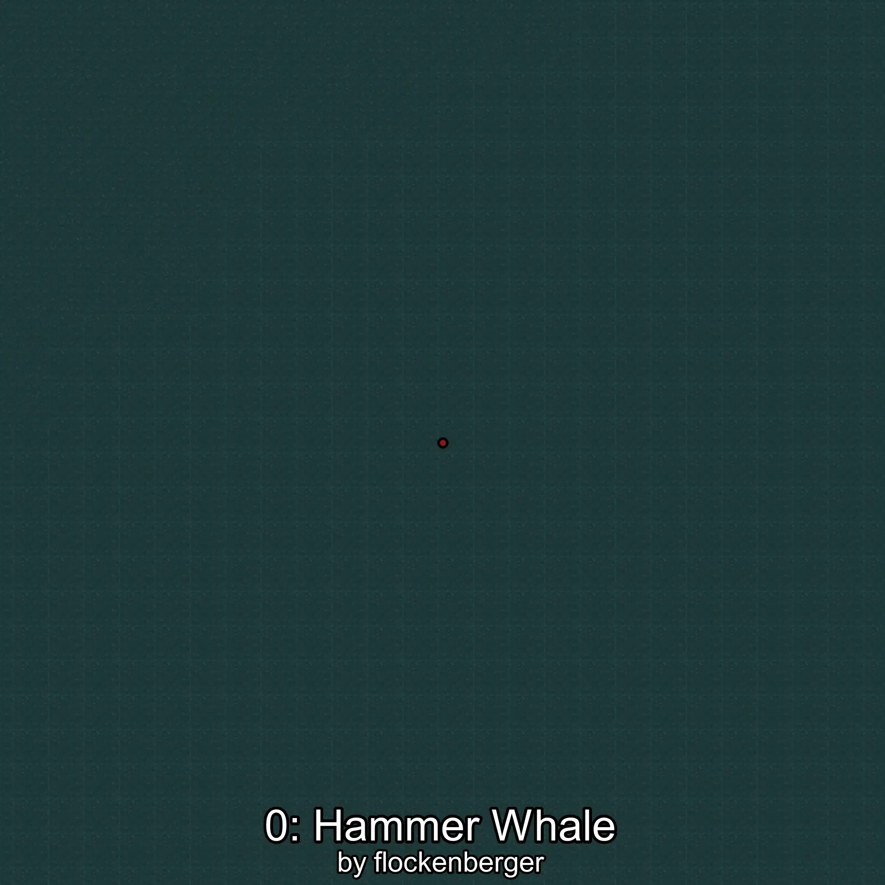

# Berardius
Created by **flockenberger**

## ⚠️ Disclaimer:
Waypoints are generated based on your __**character’s position**__ — __not__ where your fishing float lands.
In ocean spots especially, the direction you cast your rod can place your float in a **different fishing zone**, which may result in catching the wrong type of fish.
This only happens in rare cases — when the position is right on the **edge of a zone** and you cast to the “wrong” side.

- To verify that your float you can use the guide [HERE](https://flockenberger.github.io/bdo-fish-position/)
- Or watch the guide [HERE](https://youtu.be/t-VXcRoNojk)

## Waypoints
```xml
<!--
    Waypoints for: Berardius
    Created by: flockenberger
-->
<WorldmapBookMark>
    <BookMark BookMarkName="0: Berardius" PosX="-1194295.0" PosY="-8090.0" PosZ="762061.0" />
    <BookMark BookMarkName="1: Berardius" PosX="-1257897.0" PosY="-7757.0" PosZ="778575.0" />
    <BookMark BookMarkName="2: Berardius" PosX="342107.0" PosY="-7914.0" PosZ="13544.0" />
    <BookMark BookMarkName="3: Berardius" PosX="-1258321.0" PosY="-7671.0" PosZ="741706.0" />
    <BookMark BookMarkName="4: Berardius" PosX="-1245868.0" PosY="-7510.0" PosZ="749547.0" />
</WorldmapBookMark>
```

     