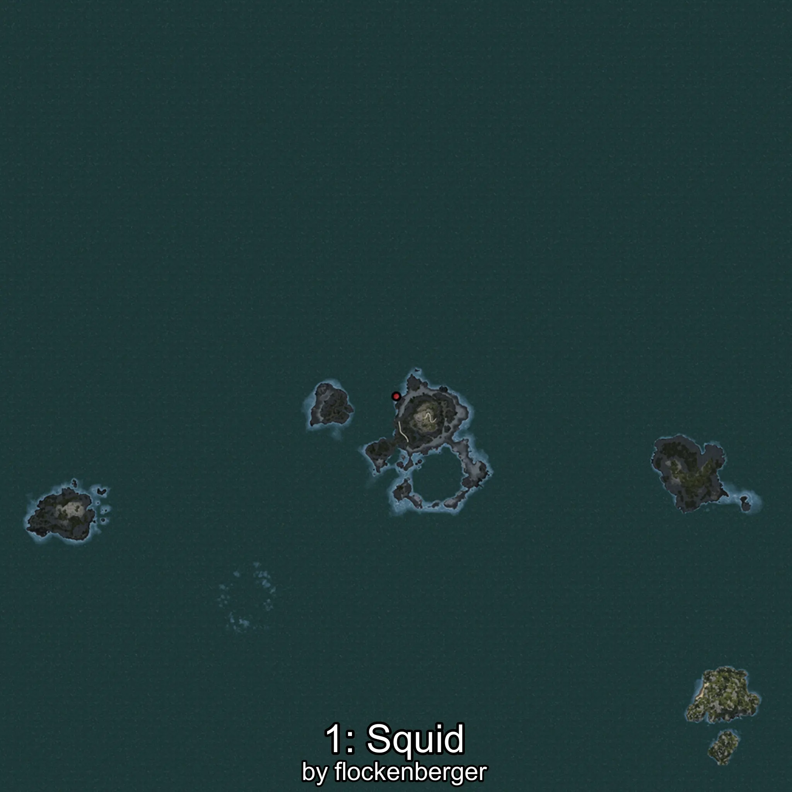
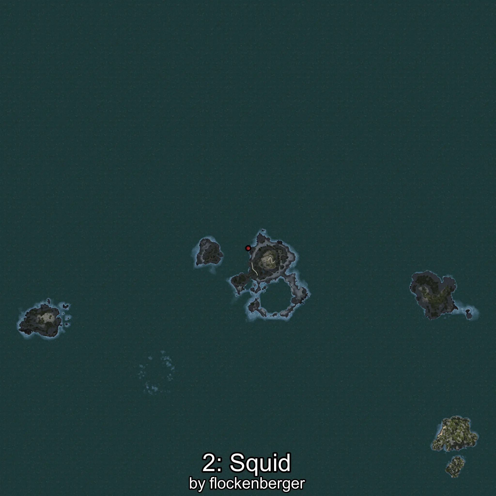

# Calamar
Created by **flockenberger**

## ⚠️ Disclaimer:
Waypoints are generated based on your __**character’s position**__ — __not__ where your fishing float lands.
In ocean spots especially, the direction you cast your rod can place your float in a **different fishing zone**, which may result in catching the wrong type of fish.
This only happens in rare cases — when the position is right on the **edge of a zone** and you cast to the “wrong” side.

- To verify that your float you can use the guide [HERE](https://flockenberger.github.io/bdo-fish-position/)
- Or watch the guide [HERE](https://youtu.be/t-VXcRoNojk)

## Waypoints
```xml
<!--
    Waypoints for: Calamar
    Created by: flockenberger
-->
<WorldmapBookMark>
    <BookMark BookMarkName="0: Calamar" PosX="151357.0" PosY="-7845.0" PosZ="291492.0" />
    <BookMark BookMarkName="1: Calamar" PosX="-105456.32" PosY="-7770.208" PosZ="633819.75" />
    <BookMark BookMarkName="2: Calamar" PosX="-106897.13" PosY="-8162.9336" PosZ="632805.06" />
    <BookMark BookMarkName="3: Calamar" PosX="-1158356.0" PosY="-7660.0" PosZ="903614.0" />
    <BookMark BookMarkName="4: Calamar" PosX="150394.61" PosY="-7669.682" PosZ="224549.9" />
</WorldmapBookMark>
```

     