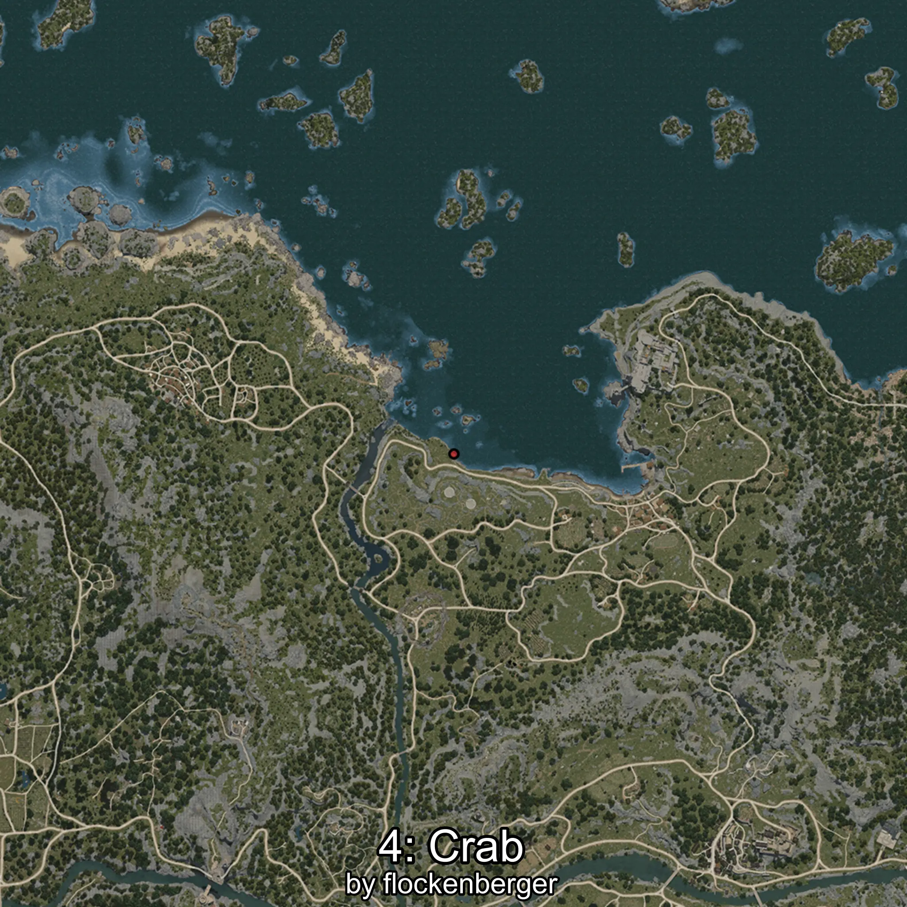

# Cangrejo
Created by **flockenberger**

## ⚠️ Disclaimer:
Waypoints are generated based on your __**character’s position**__ — __not__ where your fishing float lands.
In ocean spots especially, the direction you cast your rod can place your float in a **different fishing zone**, which may result in catching the wrong type of fish.
This only happens in rare cases — when the position is right on the **edge of a zone** and you cast to the “wrong” side.

- To verify that your float you can use the guide [HERE](https://flockenberger.github.io/bdo-fish-position/)
- Or watch the guide [HERE](https://youtu.be/t-VXcRoNojk)

## Waypoints
```xml
<!--
    Waypoints for: Cangrejo
    Created by: flockenberger
-->
<WorldmapBookMark>
    <BookMark BookMarkName="0: Cangrejo" PosX="-51050.0" PosY="-8073.0" PosZ="98710.0" />
    <BookMark BookMarkName="1: Cangrejo" PosX="-46968.0" PosY="-8302.0" PosZ="111535.0" />
    <BookMark BookMarkName="2: Cangrejo" PosX="-47167.0" PosY="-8047.0" PosZ="111163.0" />
    <BookMark BookMarkName="3: Cangrejo" PosX="-52282.0" PosY="-7970.0" PosZ="98816.0" />
    <BookMark BookMarkName="4: Cangrejo" PosX="-50652.0" PosY="-8226.0" PosZ="97593.0" />
</WorldmapBookMark>
```

     