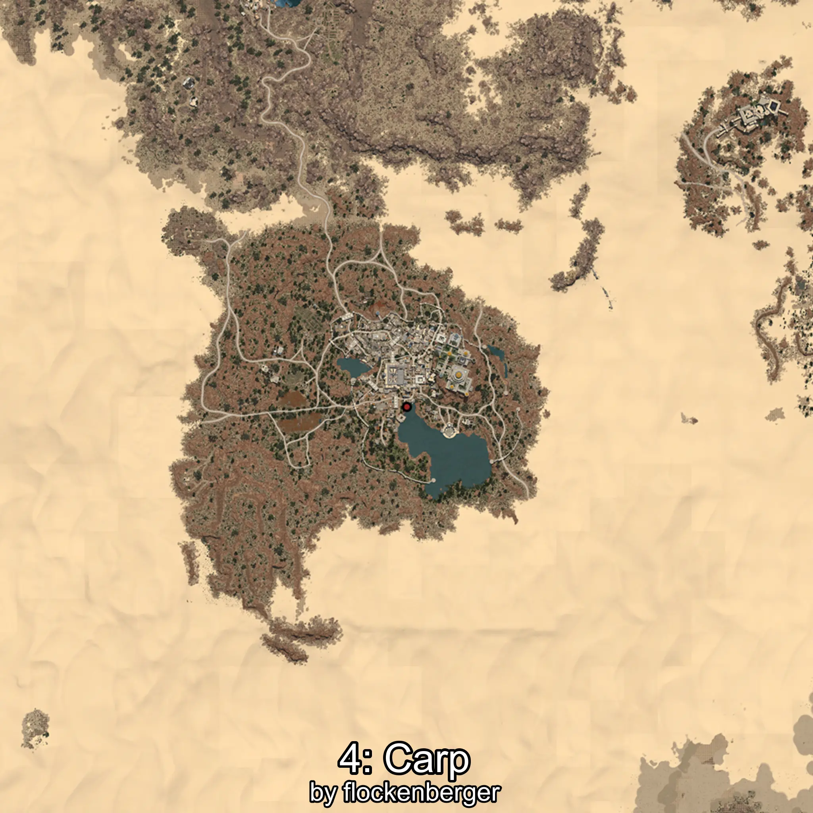

# Carpa
Created by **flockenberger**

## ⚠️ Disclaimer:
Waypoints are generated based on your __**character’s position**__ — __not__ where your fishing float lands.
In ocean spots especially, the direction you cast your rod can place your float in a **different fishing zone**, which may result in catching the wrong type of fish.
This only happens in rare cases — when the position is right on the **edge of a zone** and you cast to the “wrong” side.

- To verify that your float you can use the guide [HERE](https://flockenberger.github.io/bdo-fish-position/)
- Or watch the guide [HERE](https://youtu.be/t-VXcRoNojk)

## Waypoints
```xml
<!--
    Waypoints for: Carpa
    Created by: flockenberger
-->
<WorldmapBookMark>
    <BookMark BookMarkName="0: Carpa" PosX="735033.0" PosY="3242.0" PosZ="201991.0" />
    <BookMark BookMarkName="1: Carpa" PosX="38466.0" PosY="-4026.0" PosZ="-50875.0" />
    <BookMark BookMarkName="2: Carpa" PosX="37036.0" PosY="-3816.0" PosZ="-50769.0" />
    <BookMark BookMarkName="3: Carpa" PosX="1028608.0" PosY="10435.0" PosZ="181603.0" />
    <BookMark BookMarkName="4: Carpa" PosX="1030878.0" PosY="10523.0" PosZ="187597.0" />
</WorldmapBookMark>
```

     