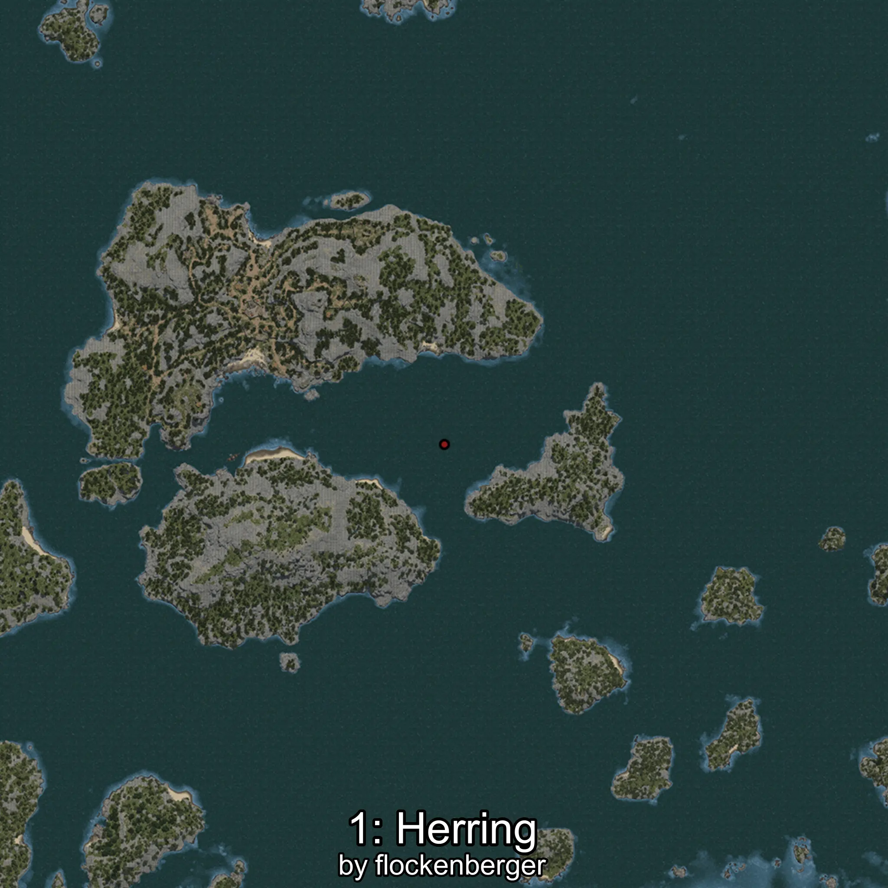
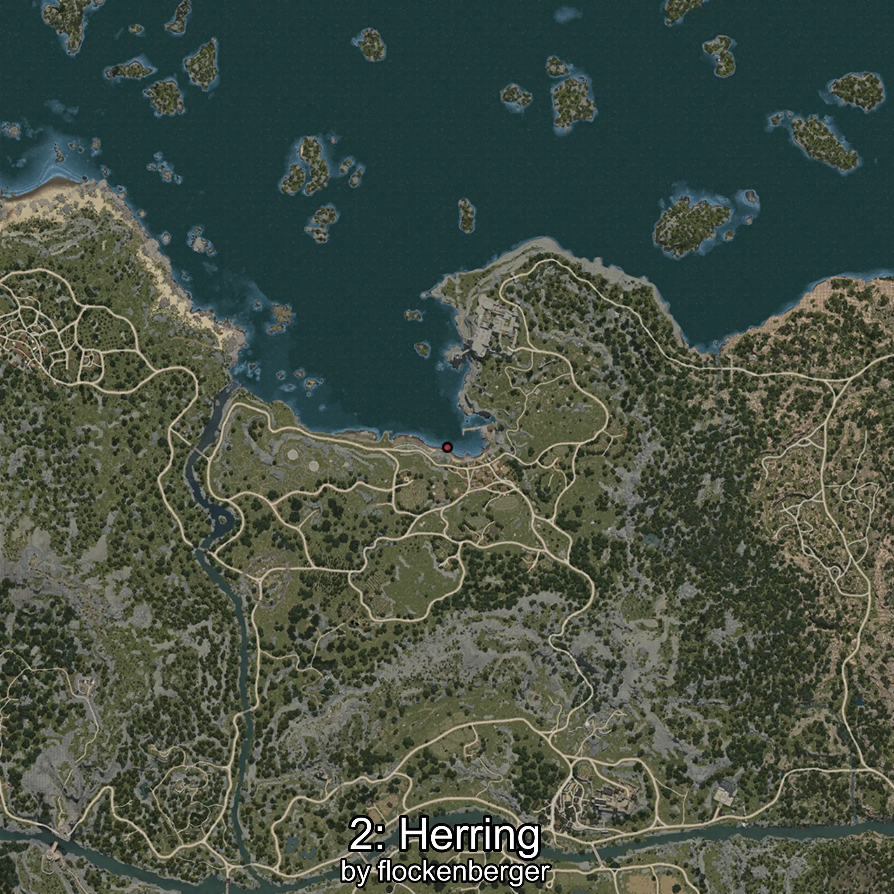

# Clupea
Created by **flockenberger**

## ⚠️ Disclaimer:
Waypoints are generated based on your __**character’s position**__ — __not__ where your fishing float lands.
In ocean spots especially, the direction you cast your rod can place your float in a **different fishing zone**, which may result in catching the wrong type of fish.
This only happens in rare cases — when the position is right on the **edge of a zone** and you cast to the “wrong” side.

- To verify that your float you can use the guide [HERE](https://flockenberger.github.io/bdo-fish-position/)
- Or watch the guide [HERE](https://youtu.be/t-VXcRoNojk)

## Waypoints
```xml
<!--
    Waypoints for: Clupea
    Created by: flockenberger
-->
<WorldmapBookMark>
    <BookMark BookMarkName="0: Clupea" PosX="-4350.0" PosY="-8217.0" PosZ="88244.0" />
    <BookMark BookMarkName="1: Clupea" PosX="-282972.0" PosY="-7909.0" PosZ="348534.0" />
    <BookMark BookMarkName="2: Clupea" PosX="995.0" PosY="-8106.0" PosZ="87109.0" />
    <BookMark BookMarkName="3: Clupea" PosX="-228534.0" PosY="-8108.0" PosZ="171824.0" />
    <BookMark BookMarkName="4: Clupea" PosX="-225572.0" PosY="-7903.0" PosZ="166022.0" />
</WorldmapBookMark>
```

     