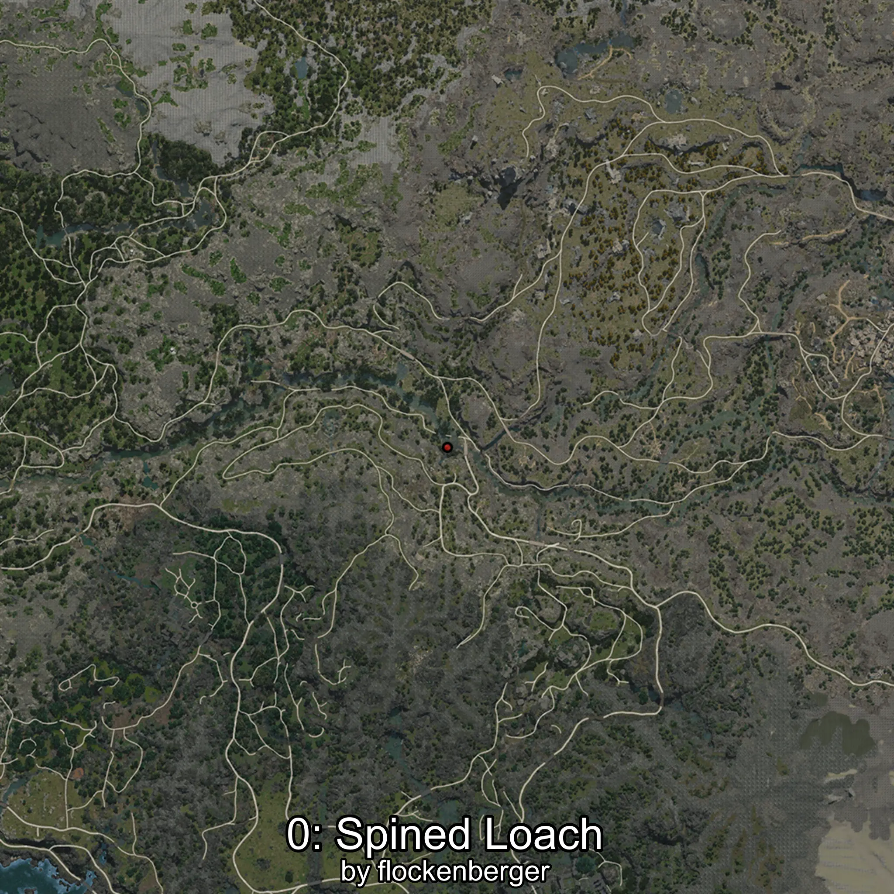
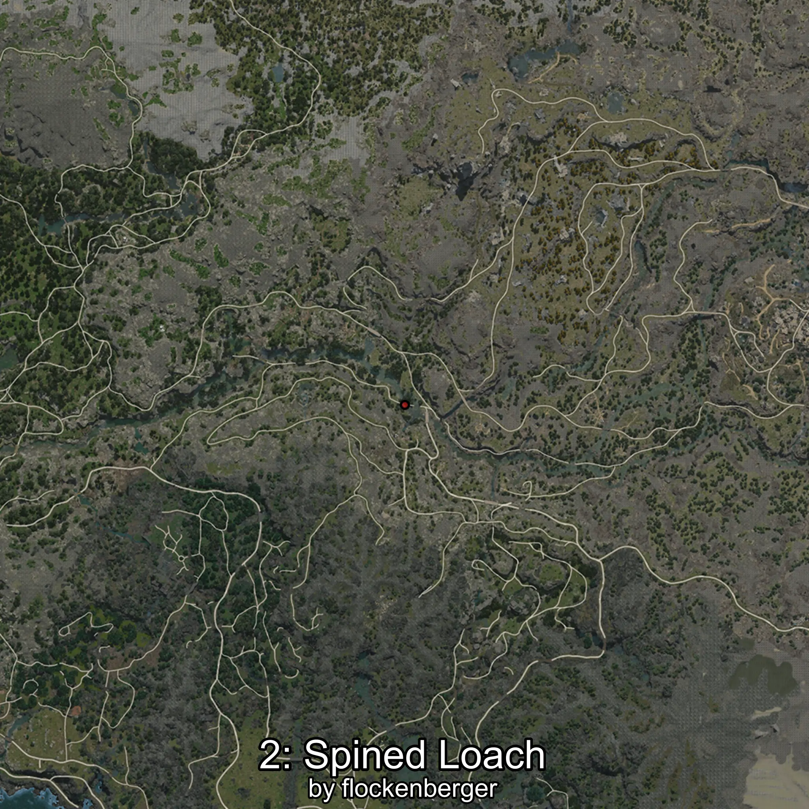

# Cobitis
Created by **flockenberger**

## ⚠️ Disclaimer:
Waypoints are generated based on your __**character’s position**__ — __not__ where your fishing float lands.
In ocean spots especially, the direction you cast your rod can place your float in a **different fishing zone**, which may result in catching the wrong type of fish.
This only happens in rare cases — when the position is right on the **edge of a zone** and you cast to the “wrong” side.

- To verify that your float you can use the guide [HERE](https://flockenberger.github.io/bdo-fish-position/)
- Or watch the guide [HERE](https://youtu.be/t-VXcRoNojk)

## Waypoints
```xml
<!--
    Waypoints for: Cobitis
    Created by: flockenberger
-->
<WorldmapBookMark>
    <BookMark BookMarkName="0: Cobitis" PosX="-198831.0" PosY="6021.0" PosZ="-443569.0" />
    <BookMark BookMarkName="1: Cobitis" PosX="-86634.0" PosY="9567.0" PosZ="-397804.0" />
    <BookMark BookMarkName="2: Cobitis" PosX="-201184.06" PosY="5856.207" PosZ="-439239.84" />
    <BookMark BookMarkName="3: Cobitis" PosX="-116673.0" PosY="5678.0" PosZ="-461748.0" />
    <BookMark BookMarkName="4: Cobitis" PosX="-86518.875" PosY="9823.631" PosZ="-403363.44" />
</WorldmapBookMark>
```

     