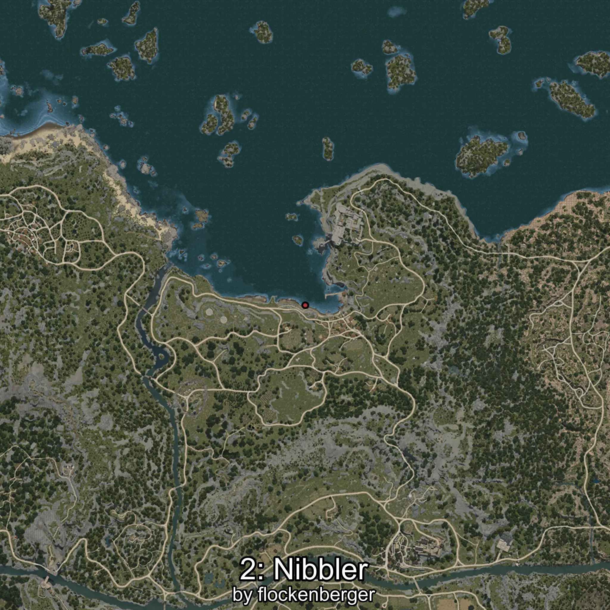
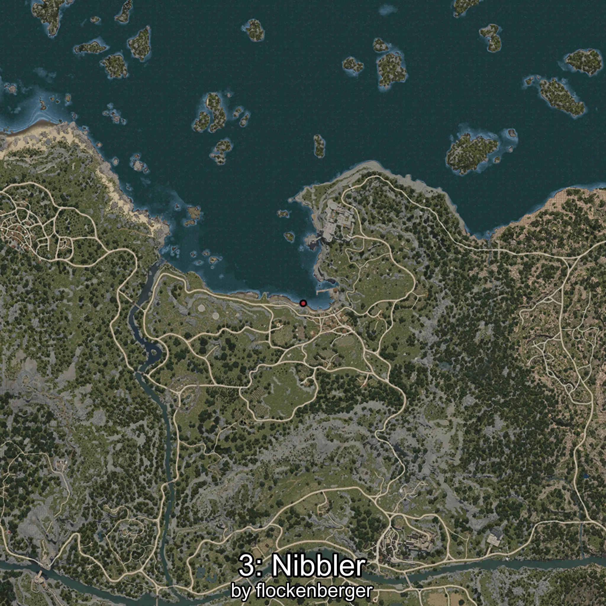

# Girella
Created by **flockenberger**

## ⚠️ Disclaimer:
Waypoints are generated based on your __**character’s position**__ — __not__ where your fishing float lands.
In ocean spots especially, the direction you cast your rod can place your float in a **different fishing zone**, which may result in catching the wrong type of fish.
This only happens in rare cases — when the position is right on the **edge of a zone** and you cast to the “wrong” side.

- To verify that your float you can use the guide [HERE](https://flockenberger.github.io/bdo-fish-position/)
- Or watch the guide [HERE](https://youtu.be/t-VXcRoNojk)

## Waypoints
```xml
<!--
    Waypoints for: Girella
    Created by: flockenberger
-->
<WorldmapBookMark>
    <BookMark BookMarkName="0: Girella" PosX="-32189.0" PosY="-7875.0" PosZ="250932.0" />
    <BookMark BookMarkName="1: Girella" PosX="-1896.0" PosY="-8180.0" PosZ="87852.0" />
    <BookMark BookMarkName="2: Girella" PosX="-3700.0" PosY="-8209.0" PosZ="88122.0" />
    <BookMark BookMarkName="3: Girella" PosX="-580.0" PosY="-8168.0" PosZ="87279.0" />
    <BookMark BookMarkName="4: Girella" PosX="475.0" PosY="-8186.0" PosZ="87025.0" />
</WorldmapBookMark>
```

     