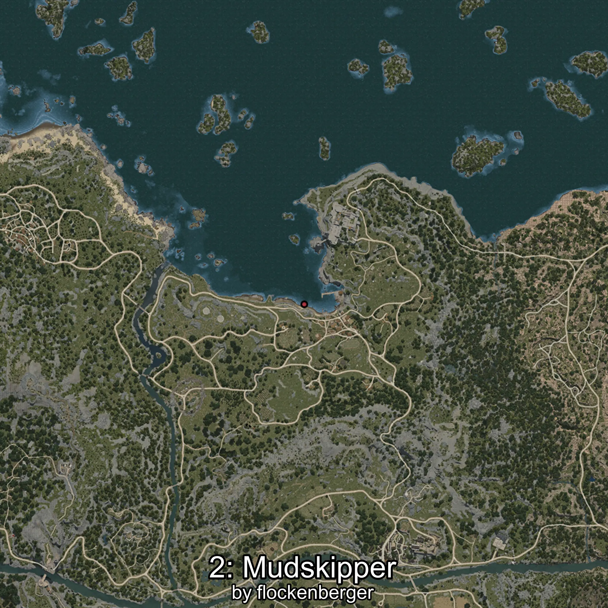

# Gobido
Created by **flockenberger**

## ⚠️ Disclaimer:
Waypoints are generated based on your __**character’s position**__ — __not__ where your fishing float lands.
In ocean spots especially, the direction you cast your rod can place your float in a **different fishing zone**, which may result in catching the wrong type of fish.
This only happens in rare cases — when the position is right on the **edge of a zone** and you cast to the “wrong” side.

- To verify that your float you can use the guide [HERE](https://flockenberger.github.io/bdo-fish-position/)
- Or watch the guide [HERE](https://youtu.be/t-VXcRoNojk)

## Waypoints
```xml
<!--
    Waypoints for: Gobido
    Created by: flockenberger
-->
<WorldmapBookMark>
    <BookMark BookMarkName="0: Gobido" PosX="-225079.0" PosY="-7737.0" PosZ="164253.0" />
    <BookMark BookMarkName="1: Gobido" PosX="-2974.0" PosY="-8190.0" PosZ="87958.0" />
    <BookMark BookMarkName="2: Gobido" PosX="-2509.0" PosY="-8187.0" PosZ="87952.0" />
    <BookMark BookMarkName="3: Gobido" PosX="-105765.0" PosY="-7795.0" PosZ="633581.0" />
    <BookMark BookMarkName="4: Gobido" PosX="-227553.0" PosY="-8289.0" PosZ="167057.0" />
</WorldmapBookMark>
```

     