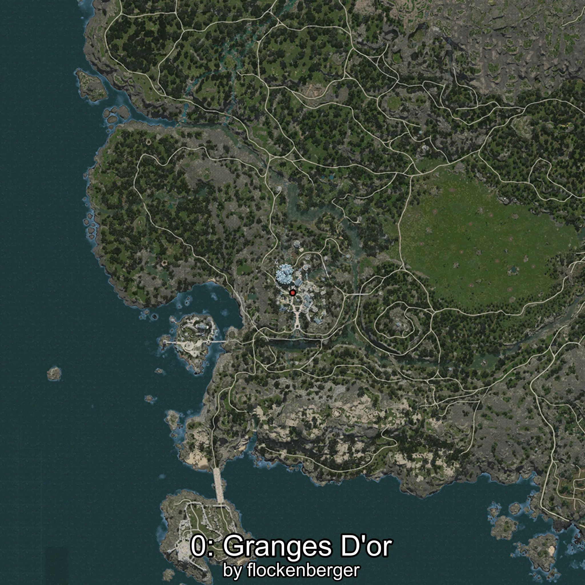
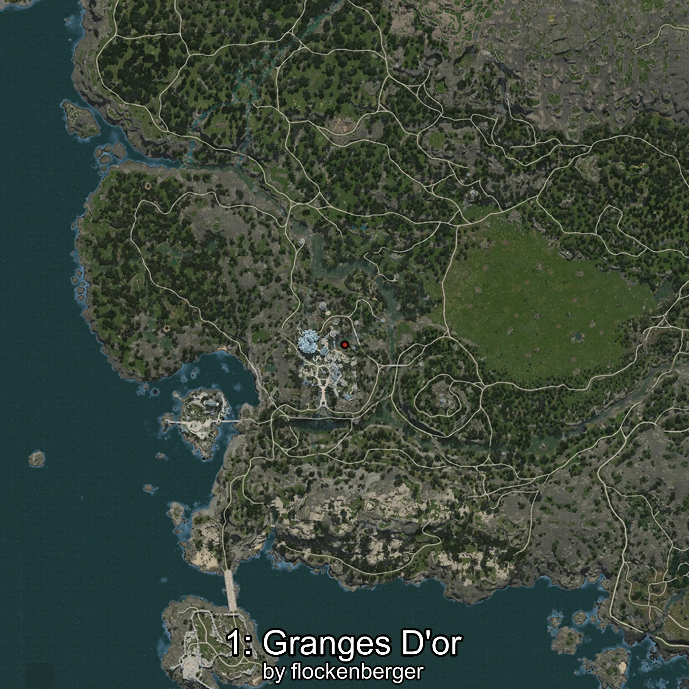
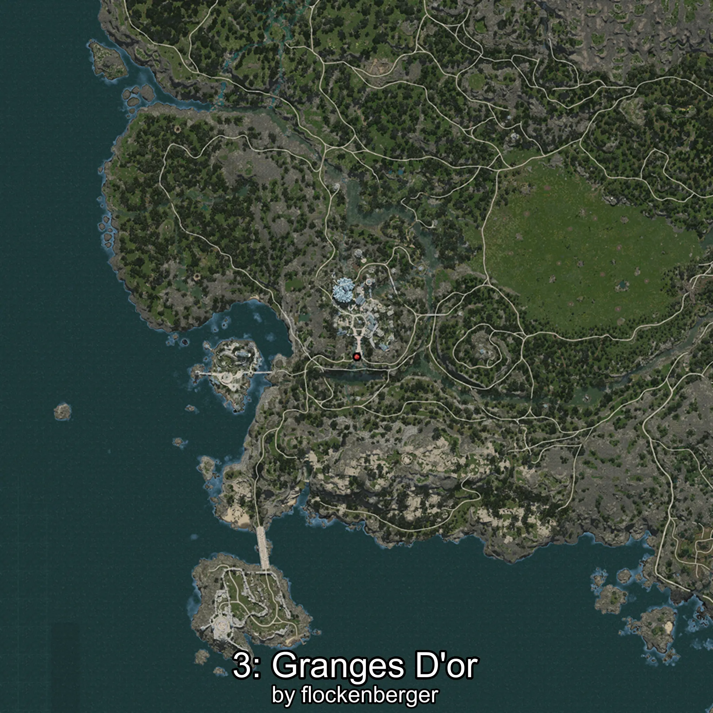
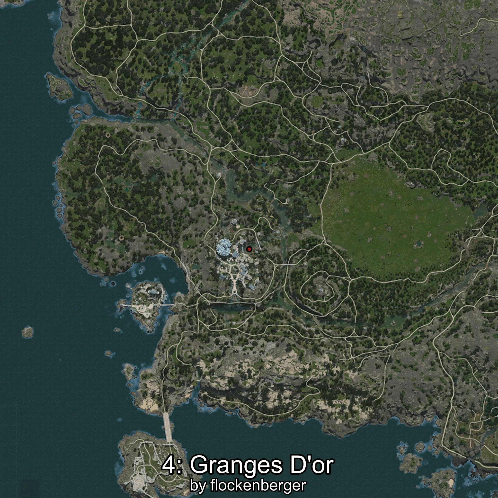

# Grandor
Created by **flockenberger**

## ⚠️ Disclaimer:
Waypoints are generated based on your __**character’s position**__ — __not__ where your fishing float lands.
In ocean spots especially, the direction you cast your rod can place your float in a **different fishing zone**, which may result in catching the wrong type of fish.
This only happens in rare cases — when the position is right on the **edge of a zone** and you cast to the “wrong” side.

- To verify that your float you can use the guide [HERE](https://flockenberger.github.io/bdo-fish-position/)
- Or watch the guide [HERE](https://youtu.be/t-VXcRoNojk)

## Waypoints
```xml
<!--
    Waypoints for: Grandor
    Created by: flockenberger
-->
<WorldmapBookMark>
    <BookMark BookMarkName="0: Grandor" PosX="-507718.6" PosY="8781.576" PosZ="-454995.84" />
    <BookMark BookMarkName="1: Grandor" PosX="-495686.0" PosY="1133.0" PosZ="-446391.0" />
    <BookMark BookMarkName="2: Grandor" PosX="-495057.0" PosY="1197.0" PosZ="-445585.0" />
    <BookMark BookMarkName="3: Grandor" PosX="-506134.0" PosY="5724.0" PosZ="-473882.0" />
    <BookMark BookMarkName="4: Grandor" PosX="-496178.0" PosY="1094.0" PosZ="-446129.0" />
</WorldmapBookMark>
```

     