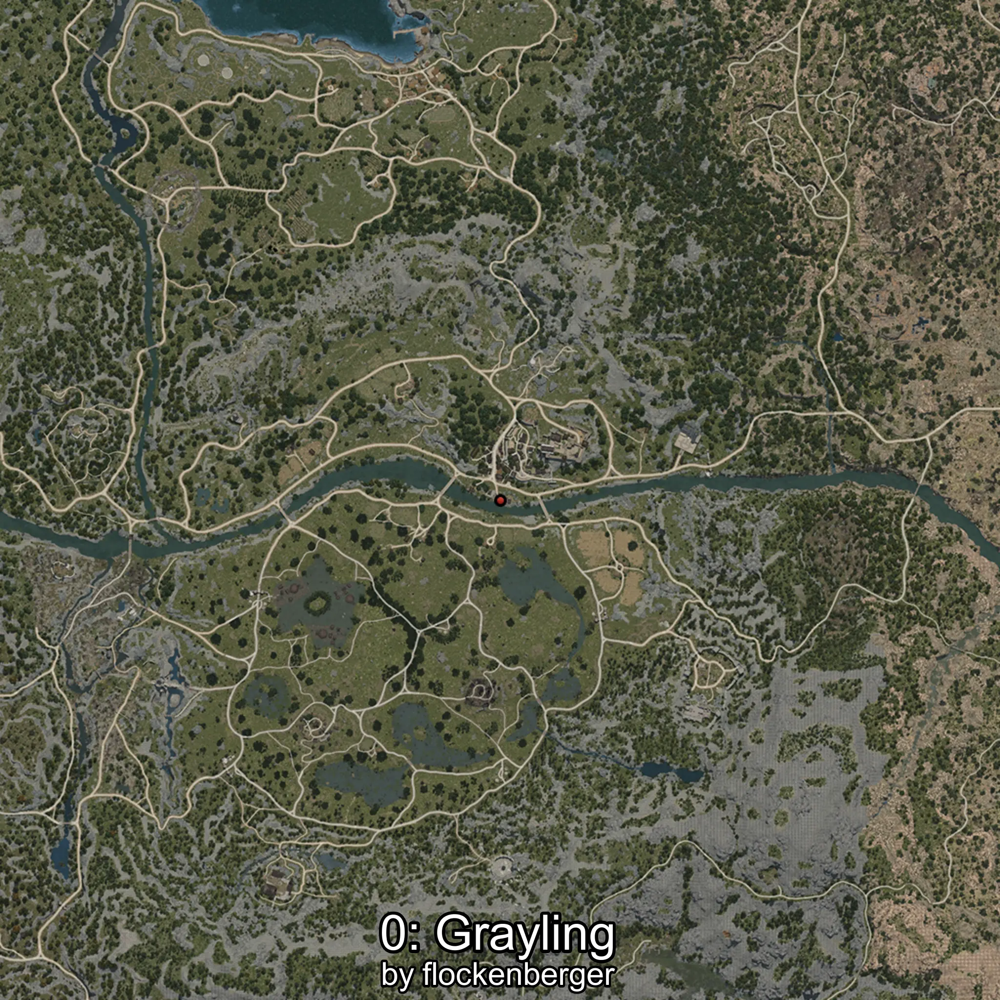

# Grayling
Created by **flockenberger**

## ⚠️ Disclaimer:
Waypoints are generated based on your __**character’s position**__ — __not__ where your fishing float lands.
In ocean spots especially, the direction you cast your rod can place your float in a **different fishing zone**, which may result in catching the wrong type of fish.
This only happens in rare cases — when the position is right on the **edge of a zone** and you cast to the “wrong” side.

- To verify that your float you can use the guide [HERE](https://flockenberger.github.io/bdo-fish-position/)
- Or watch the guide [HERE](https://youtu.be/t-VXcRoNojk)

## Waypoints
```xml
<!--
    Waypoints for: Grayling
    Created by: flockenberger
-->
<WorldmapBookMark>
    <BookMark BookMarkName="0: Grayling" PosX="39210.0" PosY="-3990.0" PosZ="-50947.0" />
    <BookMark BookMarkName="1: Grayling" PosX="40803.0" PosY="-3830.0" PosZ="-52423.0" />
    <BookMark BookMarkName="2: Grayling" PosX="37428.0" PosY="-3956.0" PosZ="-51647.0" />
    <BookMark BookMarkName="3: Grayling" PosX="38187.0" PosY="-4012.0" PosZ="-50720.0" />
    <BookMark BookMarkName="4: Grayling" PosX="38641.0" PosY="-4024.0" PosZ="-50877.0" />
</WorldmapBookMark>
```

     