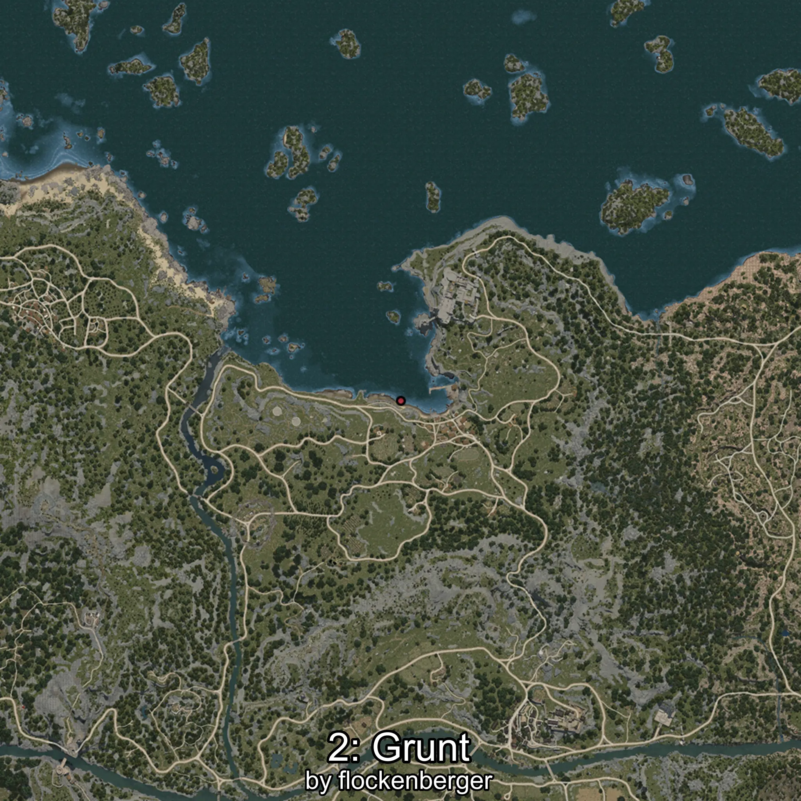
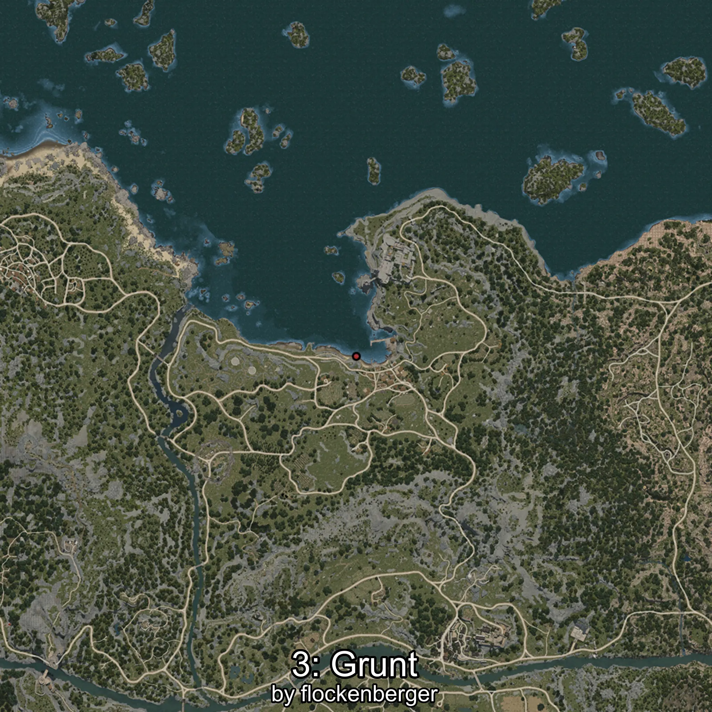

# Grunt
Created by **flockenberger**

## ⚠️ Disclaimer:
Waypoints are generated based on your __**character’s position**__ — __not__ where your fishing float lands.
In ocean spots especially, the direction you cast your rod can place your float in a **different fishing zone**, which may result in catching the wrong type of fish.
This only happens in rare cases — when the position is right on the **edge of a zone** and you cast to the “wrong” side.

- To verify that your float you can use the guide [HERE](https://flockenberger.github.io/bdo-fish-position/)
- Or watch the guide [HERE](https://youtu.be/t-VXcRoNojk)

## Waypoints
```xml
<!--
    Waypoints for: Grunt
    Created by: flockenberger
-->
<WorldmapBookMark>
    <BookMark BookMarkName="0: Grunt" PosX="161261.0" PosY="-8164.0" PosZ="231211.0" />
    <BookMark BookMarkName="1: Grunt" PosX="-5658.0" PosY="-8256.0" PosZ="88765.0" />
    <BookMark BookMarkName="2: Grunt" PosX="-4724.0" PosY="-8266.0" PosZ="88579.0" />
    <BookMark BookMarkName="3: Grunt" PosX="24.0" PosY="-8131.0" PosZ="86974.0" />
    <BookMark BookMarkName="4: Grunt" PosX="-227257.0" PosY="-8065.0" PosZ="164613.0" />
</WorldmapBookMark>
```

     