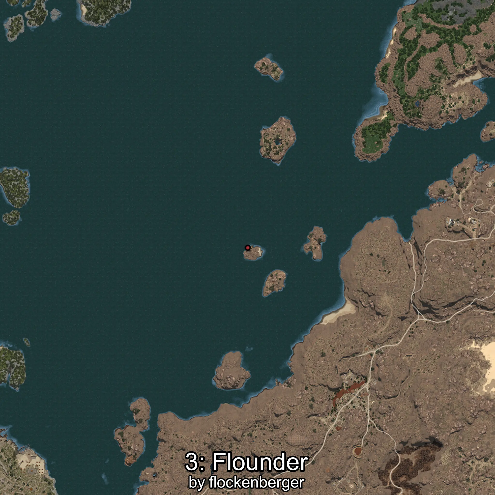

# Halibut
Created by **flockenberger**

## ⚠️ Disclaimer:
Waypoints are generated based on your __**character’s position**__ — __not__ where your fishing float lands.
In ocean spots especially, the direction you cast your rod can place your float in a **different fishing zone**, which may result in catching the wrong type of fish.
This only happens in rare cases — when the position is right on the **edge of a zone** and you cast to the “wrong” side.

- To verify that your float you can use the guide [HERE](https://flockenberger.github.io/bdo-fish-position/)
- Or watch the guide [HERE](https://youtu.be/t-VXcRoNojk)

## Waypoints
```xml
<!--
    Waypoints for: Halibut
    Created by: flockenberger
-->
<WorldmapBookMark>
    <BookMark BookMarkName="0: Halibut" PosX="1405059.0" PosY="-7754.0" PosZ="578991.0" />
    <BookMark BookMarkName="1: Halibut" PosX="1416401.0" PosY="-7731.0" PosZ="192248.0" />
    <BookMark BookMarkName="2: Halibut" PosX="1264632.8" PosY="-8125.076" PosZ="563537.25" />
    <BookMark BookMarkName="3: Halibut" PosX="404194.0" PosY="-7938.0" PosZ="259760.0" />
    <BookMark BookMarkName="4: Halibut" PosX="1264152.0" PosY="-7909.0" PosZ="554328.0" />
</WorldmapBookMark>
```

     