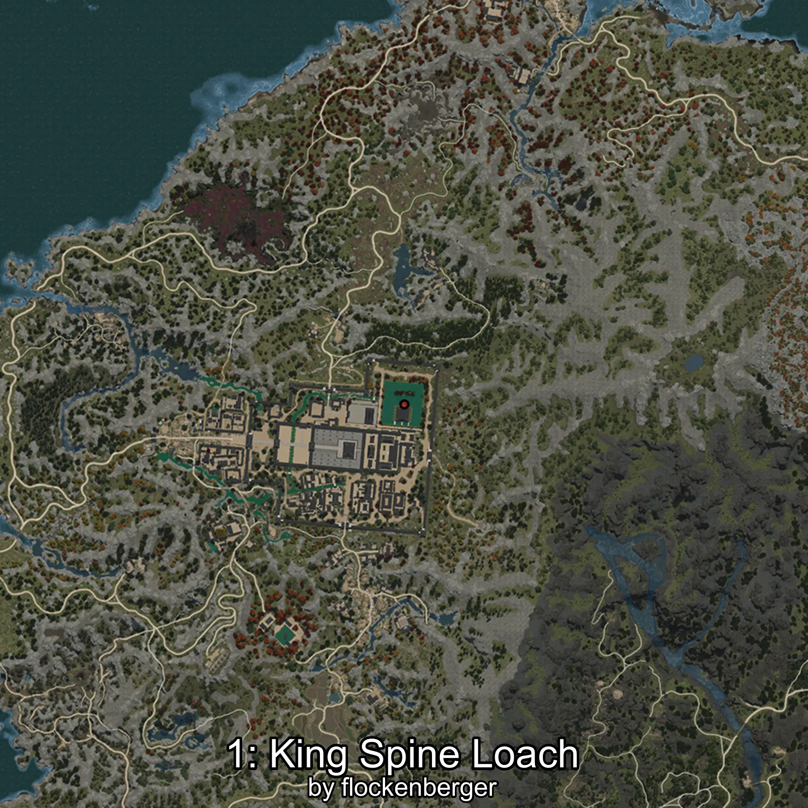

# Iksookimia
Created by **flockenberger**

## ⚠️ Disclaimer:
Waypoints are generated based on your __**character’s position**__ — __not__ where your fishing float lands.
In ocean spots especially, the direction you cast your rod can place your float in a **different fishing zone**, which may result in catching the wrong type of fish.
This only happens in rare cases — when the position is right on the **edge of a zone** and you cast to the “wrong” side.

- To verify that your float you can use the guide [HERE](https://flockenberger.github.io/bdo-fish-position/)
- Or watch the guide [HERE](https://youtu.be/t-VXcRoNojk)

## Waypoints
```xml
<!--
    Waypoints for: Iksookimia
    Created by: flockenberger
-->
<WorldmapBookMark>
    <BookMark BookMarkName="0: Iksookimia" PosX="-1399100.0" PosY="13186.052" PosZ="1350371.0" />
    <BookMark BookMarkName="1: Iksookimia" PosX="-1396304.0" PosY="13027.0" PosZ="1350484.0" />
    <BookMark BookMarkName="2: Iksookimia" PosX="-1396380.0" PosY="13026.0" PosZ="1350500.0" />
    <BookMark BookMarkName="3: Iksookimia" PosX="-1399100.0" PosY="13186.0" PosZ="1350400.0" />
    <BookMark BookMarkName="4: Iksookimia" PosX="-1396325.0" PosY="12983.0" PosZ="1350558.0" />
</WorldmapBookMark>
```

     