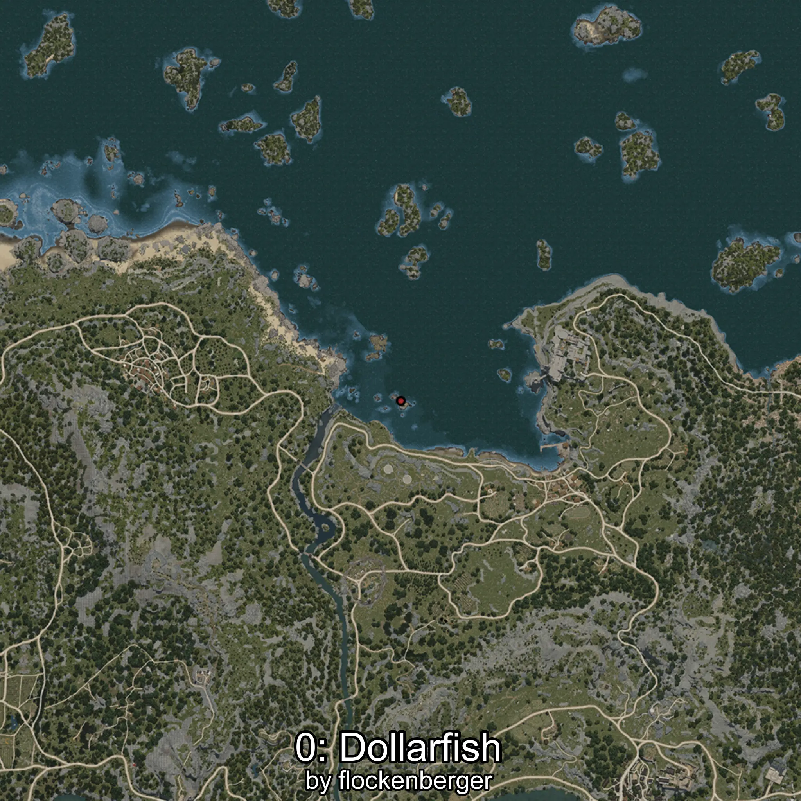
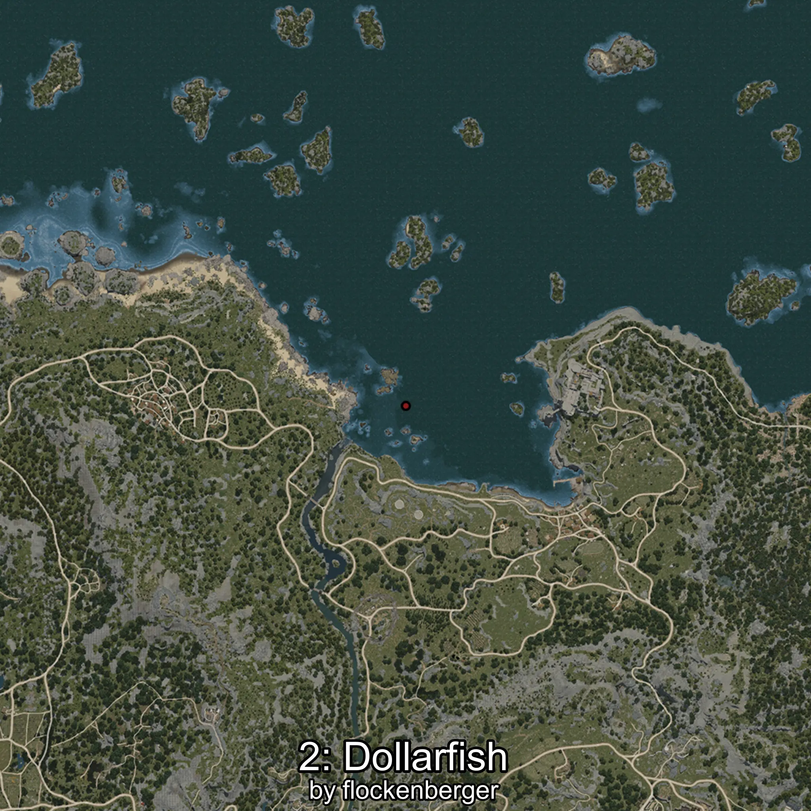

# Japuta
Created by **flockenberger**

## ⚠️ Disclaimer:
Waypoints are generated based on your __**character’s position**__ — __not__ where your fishing float lands.
In ocean spots especially, the direction you cast your rod can place your float in a **different fishing zone**, which may result in catching the wrong type of fish.
This only happens in rare cases — when the position is right on the **edge of a zone** and you cast to the “wrong” side.

- To verify that your float you can use the guide [HERE](https://flockenberger.github.io/bdo-fish-position/)
- Or watch the guide [HERE](https://youtu.be/t-VXcRoNojk)

## Waypoints
```xml
<!--
    Waypoints for: Japuta
    Created by: flockenberger
-->
<WorldmapBookMark>
    <BookMark BookMarkName="0: Japuta" PosX="-47454.0" PosY="-7992.0" PosZ="111006.0" />
    <BookMark BookMarkName="1: Japuta" PosX="-43348.0" PosY="-8099.0" PosZ="101831.0" />
    <BookMark BookMarkName="2: Japuta" PosX="-49726.0" PosY="-7857.0" PosZ="121988.0" />
    <BookMark BookMarkName="3: Japuta" PosX="-43304.0" PosY="-8074.0" PosZ="101865.0" />
    <BookMark BookMarkName="4: Japuta" PosX="-45752.74" PosY="-8016.2935" PosZ="110755.51" />
</WorldmapBookMark>
```

     