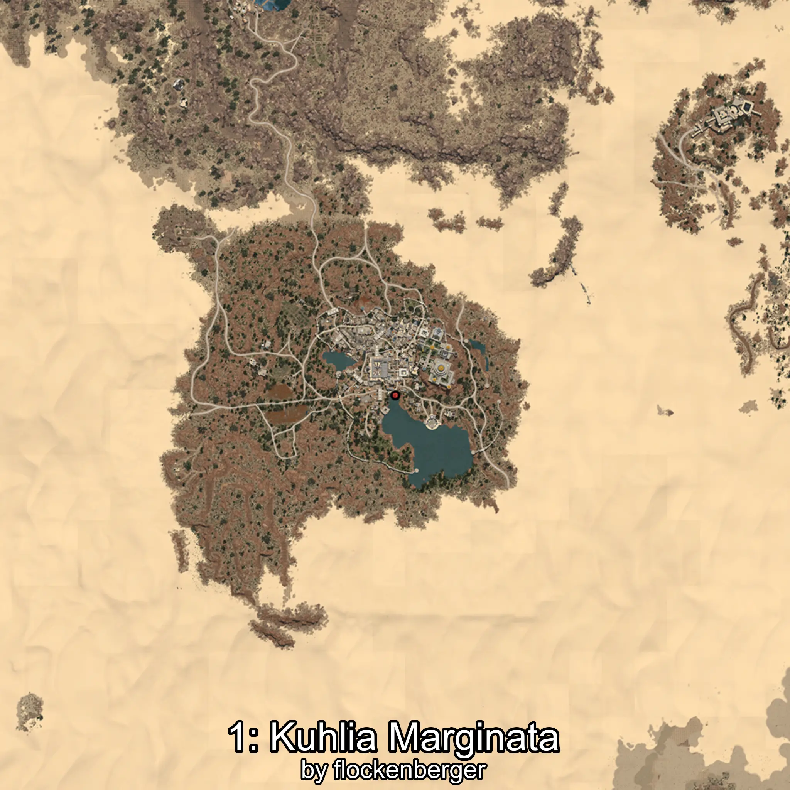
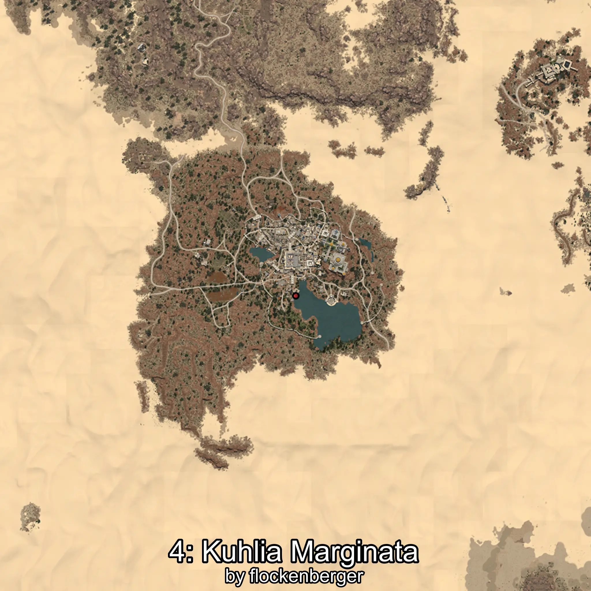

# Kuhlia
Created by **flockenberger**

## ⚠️ Disclaimer:
Waypoints are generated based on your __**character’s position**__ — __not__ where your fishing float lands.
In ocean spots especially, the direction you cast your rod can place your float in a **different fishing zone**, which may result in catching the wrong type of fish.
This only happens in rare cases — when the position is right on the **edge of a zone** and you cast to the “wrong” side.

- To verify that your float you can use the guide [HERE](https://flockenberger.github.io/bdo-fish-position/)
- Or watch the guide [HERE](https://youtu.be/t-VXcRoNojk)

## Waypoints
```xml
<!--
    Waypoints for: Kuhlia
    Created by: flockenberger
-->
<WorldmapBookMark>
    <BookMark BookMarkName="0: Kuhlia" PosX="280791.0" PosY="-7171.0" PosZ="-168379.0" />
    <BookMark BookMarkName="1: Kuhlia" PosX="1032618.0" PosY="10547.0" PosZ="188985.0" />
    <BookMark BookMarkName="2: Kuhlia" PosX="304953.0" PosY="-7229.0" PosZ="-176626.0" />
    <BookMark BookMarkName="3: Kuhlia" PosX="1028195.0" PosY="10632.0" PosZ="180937.0" />
    <BookMark BookMarkName="4: Kuhlia" PosX="1028360.0" PosY="10711.0" PosZ="180956.0" />
</WorldmapBookMark>
```

     