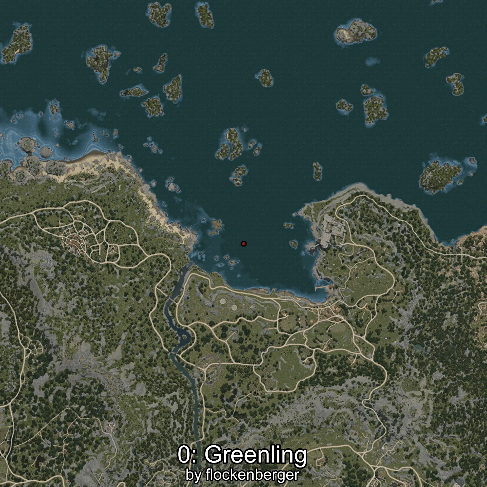
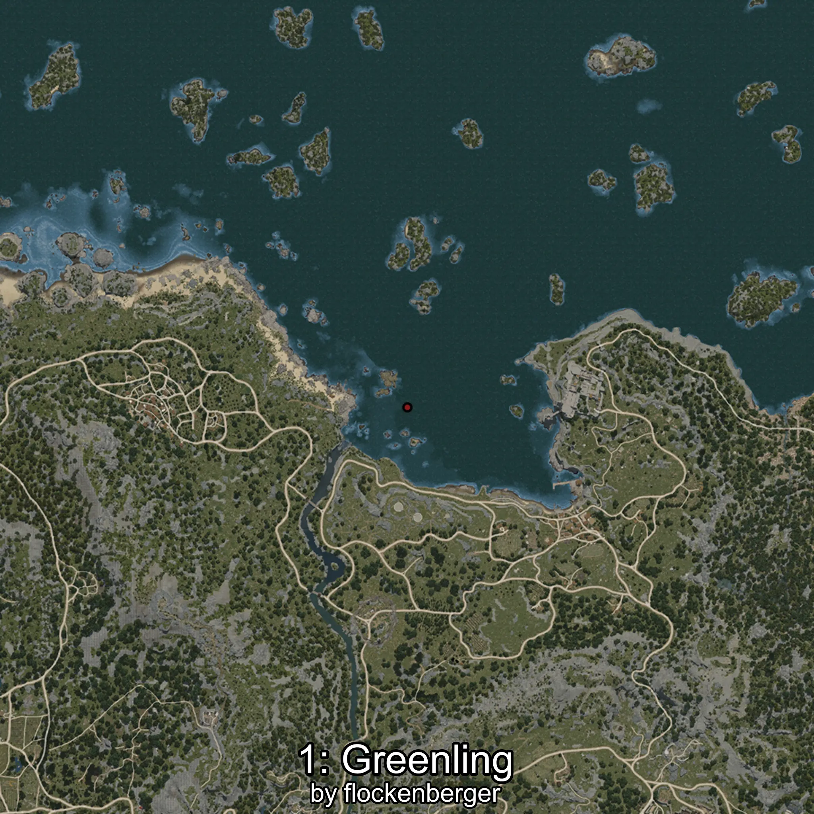

# Lorcha
Created by **flockenberger**

## ⚠️ Disclaimer:
Waypoints are generated based on your __**character’s position**__ — __not__ where your fishing float lands.
In ocean spots especially, the direction you cast your rod can place your float in a **different fishing zone**, which may result in catching the wrong type of fish.
This only happens in rare cases — when the position is right on the **edge of a zone** and you cast to the “wrong” side.

- To verify that your float you can use the guide [HERE](https://flockenberger.github.io/bdo-fish-position/)
- Or watch the guide [HERE](https://youtu.be/t-VXcRoNojk)

## Waypoints
```xml
<!--
    Waypoints for: Lorcha
    Created by: flockenberger
-->
<WorldmapBookMark>
    <BookMark BookMarkName="0: Lorcha" PosX="-39003.0" PosY="-7913.0" PosZ="121106.0" />
    <BookMark BookMarkName="1: Lorcha" PosX="-48917.652" PosY="-7926.0405" PosZ="122382.96" />
    <BookMark BookMarkName="2: Lorcha" PosX="-45098.0" PosY="-8082.0" PosZ="110550.0" />
    <BookMark BookMarkName="3: Lorcha" PosX="-51350.0" PosY="-8128.0" PosZ="98950.0" />
    <BookMark BookMarkName="4: Lorcha" PosX="-51264.0" PosY="-8126.0" PosZ="98904.0" />
</WorldmapBookMark>
```

     